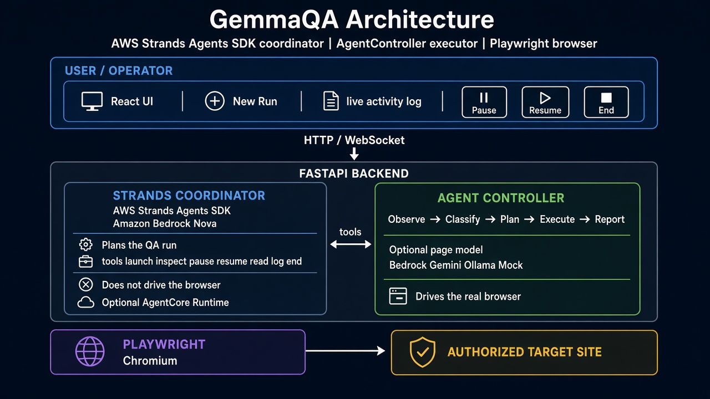

# GemmaQA Architecture

## System Overview

GemmaQA is an autonomous QA testing agent for **QA and development teams**. It supports **exploratory testing**, **retesting** after a fix, and **regression** smoke passes on the same authorized web app. It is built with AWS Strands Agents SDK. The system uses a coordinator-executor pattern: a Strands agent orchestrates the run while Agent Controller handles browser automation. It does not replace a scripted regression suite or a full QA strategy.

---

## Architecture Diagram



```
┌─────────────────────────────────────────────────────────────────┐
│                        User Interface                            │
│                   (React + Vite Frontend)                        │
│                                                                   │
│  • Create QA runs                                                │
│  • View real-time activity logs                                  │
│  • Review test reports                                           │
│  • Configure testing parameters                                  │
└───────────────────────────┬─────────────────────────────────────┘
                            │
                            │ HTTP/REST API
                            │
                            ▼
┌─────────────────────────────────────────────────────────────────┐
│                      FastAPI Backend                             │
│                      (Python, Port 8000)                         │
│                                                                   │
│  ┌───────────────────────────────────────────────────────────┐  │
│  │         Strands Coordinator Agent                         │  │
│  │         (AWS Strands SDK + Amazon Bedrock)                │  │
│  │                                                            │  │
│  │  • Analyzes target application                            │  │
│  │  • Plans QA testing strategy                              │  │
│  │  • Coordinates test execution                             │  │
│  │  • Makes high-level decisions                             │  │
│  │  • Generates test reports                                 │  │
│  │                                                            │  │
│  │  Tools:                                                    │  │
│  │   - launch_authorized_qa_run()                            │  │
│  │   - inspect_qa_run_status()                               │  │
│  │   - read_qa_activity_log()                                │  │
│  │   - pause_authorized_qa_run()                             │  │
│  │   - resume_authorized_qa_run()                            │  │
│  │   - end_authorized_qa_run()                               │  │
│  └─────────────────────────┬─────────────────────────────────┘  │
│                            │                                      │
│                            │ HTTP Tool Calls                      │
│                            │                                      │
│  ┌─────────────────────────▼─────────────────────────────────┐  │
│  │              Agent Controller                             │  │
│  │              (Page-by-Page QA Engine)                     │  │
│  │                                                            │  │
│  │  Core Loop:                                                │  │
│  │    1. Observe → Extract page information                  │  │
│  │    2. Classify → Categorize page type                     │  │
│  │    3. Plan → Decide what actions to take                  │  │
│  │    4. Execute → Perform actions via Playwright            │  │
│  │    5. Report → Log findings and evidence                  │  │
│  │                                                            │  │
│  │  Features:                                                 │  │
│  │   - Form detection and testing                            │  │
│  │   - Navigation discovery                                  │  │
│  │   - Bug detection                                          │  │
│  │   - Screenshot capture                                     │  │
│  │   - Activity logging                                       │  │
│  └─────────────────────────┬─────────────────────────────────┘  │
│                            │                                      │
└────────────────────────────┼──────────────────────────────────────┘
                             │
                             │ Playwright API
                             │
                             ▼
                  ┌──────────────────────┐
                  │     Playwright       │
                  │  (Browser Automation)│
                  │                      │
                  │  • Chromium Driver   │
                  │  • Page Interaction  │
                  │  • Screenshot Tool   │
                  └──────────┬───────────┘
                             │
                             │ Browser Protocol
                             │
                             ▼
                  ┌──────────────────────┐
                  │   Target Website     │
                  │   (Under Test)       │
                  │                      │
                  │  • Forms             │
                  │  • Pages             │
                  │  • Navigation        │
                  └──────────────────────┘
```

---

## Component Details

### 1. Frontend (React + Vite)

**Technology Stack:**
- React 18 with TypeScript
- Vite for build tooling
- TailwindCSS for styling

**Key Features:**
- Create and configure QA runs
- Real-time activity log streaming
- Test report visualization
- Provider selection (Bedrock, Gemini, Ollama)

**Communication:**
- REST API calls to FastAPI backend
- Real-time updates via polling

---

### 2. FastAPI Backend

**Technology Stack:**
- Python 3.10+
- FastAPI for REST API
- Pydantic for data validation

**API Endpoints:**
- `POST /api/runs` - Create new QA run
- `GET /api/runs/{id}` - Get run status
- `GET /api/runs/{id}/activity` - Get activity log
- `POST /api/runs/{id}/pause` - Pause run
- `POST /api/runs/{id}/resume` - Resume run
- `POST /api/runs/{id}/end` - End run

---

### 3. Strands Coordinator Agent

**Technology Stack:**
- AWS Strands Agents SDK
- Amazon Bedrock (Nova models)
- HTTP-based tools

**Responsibilities:**
1. **Strategic Planning**
   - Analyze target application
   - Define testing objectives
   - Create test plan

2. **Orchestration**
   - Launch QA runs
   - Monitor progress
   - Handle errors
   - Coordinate with Agent Controller

3. **Decision Making**
   - Determine when to pause/resume
   - Decide when testing is complete
   - Prioritize testing areas

4. **Reporting**
   - Aggregate findings
   - Generate comprehensive reports
   - Provide actionable insights

**Key Design:**
- Stateless HTTP tools for cloud deployment
- Designed for Amazon Bedrock AgentCore Runtime
- Production-ready architecture

---

### 4. Agent Controller

**Technology Stack:**
- Python
- Playwright
- LLM integration (Bedrock/Gemini/Ollama)

**Core QA Loop:**

```python
while not done:
    # 1. OBSERVE
    page_info = extract_page_information()
    
    # 2. CLASSIFY
    page_type = classify_page(page_info)
    
    # 3. PLAN
    actions = plan_qa_actions(page_type, page_info)
    
    # 4. EXECUTE
    results = execute_actions(actions)
    
    # 5. REPORT
    log_activity_and_findings(results)
    
    # Navigate to next page
    next_page = discover_navigation()
```

**Capabilities:**
- Form field detection and testing
- Input validation testing
- Navigation link discovery
- Screenshot capture for evidence
- Bug detection and reporting
- Activity logging

---

### 5. Browser Automation (Playwright)

**Technology Stack:**
- Playwright (Python)
- Chromium browser

**Capabilities:**
- Page navigation
- Element interaction
- Form filling
- Screenshot capture
- DOM inspection
- Network monitoring

---

## Data Flow

### Creating a QA Run

```
User → Frontend → POST /api/runs → Backend
                                      ↓
                              Store run metadata
                                      ↓
                         Launch Strands Coordinator
                                      ↓
                    Coordinator calls launch_authorized_qa_run()
                                      ↓
                              Agent Controller starts
                                      ↓
                              Playwright opens browser
                                      ↓
                         Begin QA testing loop
```

### During QA Execution

```
Agent Controller
    ↓
Observe page → Classify → Plan → Execute (Playwright)
    ↓                                ↓
Log activity ← ← ← ← ← ← ← Report findings
    ↓
Store in database
    ↓
Frontend polls for updates
    ↓
Display in activity log
```

### Completing a QA Run

```
Agent Controller detects completion
    ↓
Notify Strands Coordinator
    ↓
Coordinator calls end_authorized_qa_run()
    ↓
Generate final report
    ↓
Store results
    ↓
Frontend displays report
```

---

## Key Design Decisions

### 1. Coordinator-Executor Pattern

**Why:**
- Separation of concerns (strategy vs. execution)
- Strands agent focuses on high-level decisions
- Agent Controller handles low-level browser automation
- Enables independent scaling

### 2. HTTP-Based Tools

**Why:**
- Cloud-ready architecture
- Supports AgentCore Runtime deployment
- Backend can run separately from coordinator
- Enables distributed deployment

### 3. Stateless Operations

**Why:**
- Scalability
- Fault tolerance
- Easy to deploy on serverless platforms
- No complex state management

### 4. Multi-Provider LLM Support

**Why:**
- Flexibility in model selection
- Cost optimization (local Ollama for development)
- Production readiness (Bedrock for deployment)
- Experimentation (Gemini as alternative)

---

## Deployment Options

### Option 1: Local Development
```
Frontend (localhost:5173) ← → Backend (localhost:8000)
                                    ↓
                          Strands + AgentController (in-process)
                                    ↓
                                Playwright → Chromium
```

### Option 2: AgentCore Runtime (Production)
```
Frontend (Vercel/Netlify)
    ↓
Backend API (Cloud Run/ECS)
    ↓
Agent Controller + Playwright
    ↑
AgentCore Runtime (AWS)
    ↓
Strands Coordinator (Bedrock)
```

---

## Security Considerations

1. **Credential Management**
   - API keys stored in environment variables
   - Never committed to repository
   - Credentials sent once, never stored in browser

2. **Testing Authorization**
   - User confirms system ownership
   - Explicit consent before testing
   - Respects robots.txt and legal notices

3. **Data Privacy**
   - Test data generated, not real user data
   - Screenshots stored locally
   - No external data transmission without consent

---

## Scalability

### Horizontal Scaling
- Backend API can scale independently
- Multiple Agent Controllers can run in parallel
- Strands coordinator can orchestrate multiple runs

### Vertical Scaling
- Playwright supports parallel browser contexts
- Agent Controller can handle multiple pages concurrently

### Cost Optimization
- Local LLM support (Ollama) for development
- Bedrock pay-per-use for production
- Browser instances cleaned up automatically

---

## Technology Stack Summary

| Layer | Technology | Purpose |
|-------|-----------|---------|
| Frontend | React + TypeScript + Vite | User interface |
| Backend | Python + FastAPI | REST API |
| Orchestration | AWS Strands SDK | Agent coordination |
| LLM | Amazon Bedrock Nova | Reasoning and planning |
| Automation | Playwright | Browser control |
| Runtime | Chromium | Browser execution |
| Optional | Gemini/Ollama | Alternative LLM providers |

---

## Future Enhancements

1. **API Testing Support**
   - REST API endpoint testing
   - GraphQL query testing
   - Authentication flow testing

2. **Visual Regression Testing**
   - Screenshot comparison
   - Visual diff detection
   - Responsive design validation

3. **Performance Testing**
   - Load time monitoring
   - Resource usage tracking
   - Performance regression detection

4. **Collaboration Features**
   - Team dashboards
   - Shared test reports
   - Bug tracking integration

5. **CI/CD Integration**
   - GitHub Actions support
   - GitLab CI integration
   - Automated test triggers

---

## Built With

- **AWS Strands Agents SDK** - Agent orchestration framework
- **Amazon Bedrock** - LLM reasoning and decision-making
- **Playwright** - Browser automation
- **FastAPI** - Backend REST API
- **React** - Frontend user interface
- **Python** - Backend implementation
- **TypeScript** - Frontend type safety

---

## License

MIT License - See LICENSE file for details

---

## Author

Muhammad Ilyas  
Built for AWS Agents for Humans Hackathon 2026
