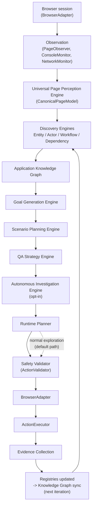

# GemmaQA Architecture

**Status:** Authoritative architectural description, derived from repository inspection.
**Verified baseline:** 1133 tests passed, 1 skipped, 0 failed (full backend suite).
**Scope:** `D:\GemmaQA\gemmaqa\backend\` (Python/FastAPI backend) and `frontend/` (not covered in depth — this suite documents the QA system itself). The default development/test target is `https://thinking-tester-contact-list.herokuapp.com/`.

---

## 1. Executive overview

GemmaQA is an autonomous, application-neutral web-application understanding and QA investigation system. Given an authorized URL, it opens a real browser, observes the running application, builds a structured, evidence-backed model of what the application actually is (its entities, actors, workflows, and business dependencies), reasons about what remains unverified, and — optionally — drives the browser itself to investigate specific hypotheses, collecting evidence and reporting supported/contradicted/inconclusive outcomes.

It is **not** a generic RPA (robotic process automation) bot, a scripted test runner, or a system that "lets an AI click around unsupervised." Every claim GemmaQA makes is traceable to either:

1. **Deterministic code** — page structure extraction, confidence scoring, safety classification, priority ranking, schema validation — none of which calls a language model, or
2. **Model-advisory reasoning** — a small, explicitly bounded set of call sites (goal ranking, candidate tie-breaking, next-action proposal, visual element description, bug-classification assistance, report-wording polish) where a language model may suggest or phrase something, but can never override a deterministic safety decision, invent a fact with no supporting evidence, or select an action outside a pre-computed, already-validated candidate set.

This distinction — reasoning and execution are separate, and only execution ever touches the browser — is the single most important architectural fact about the system, and every document in this suite reinforces it.

The problem GemmaQA addresses: understanding and testing an unfamiliar web application currently requires a human to manually explore it, infer its data model and workflows, and design test scenarios by hand. GemmaQA automates the *understanding* step completely and deterministically, and offers an **opt-in**, safety-gated mechanism for automating a bounded slice of the *investigation* step — always through the same execution pipeline a human-supervised exploration run already uses.

---

## 2. Architectural principles

Each principle below is stated only to the extent the code actually demonstrates it.

| Principle | Evidence in code |
|---|---|
| **Separation of reasoning and execution** | `app/intelligence/*` packages (perception through autonomous investigation) never import `playwright`, `BrowserAdapter`, or `ActionExecutor` — confirmed by repository-wide search — except `app/perception/`, which *is* the observation layer by design. The Autonomous Investigation Engine, the one package that drives execution, does so exclusively by calling the *existing* `Planner.plan_by_priority()`, never a new browser call. |
| **Evidence-first operation** | Every discovered record (`EntityRecord`, `ActorRecord`, `WorkflowDescriptor`, `DependencyDescriptor`, knowledge-graph nodes/edges) carries an `evidence`/`supporting_evidence` list of typed, sourced observations and a `confidence` score derived from evidence diversity — never an assumed or hardcoded fact. |
| **Deterministic safety enforcement** | `ActionValidator` (`backend/app/safety/validator.py`) is a plain Python rule engine — pattern matching, budget checks, scope checks — with no model call inside it. Every `BrowserAction`, regardless of source (LLM-proposed, deterministic-fallback-proposed, or Autonomous-Investigation-proposed), passes through it before `ActionExecutor.execute()` is ever called. |
| **Semantic planning** | `ScenarioStep` (Scenario Planning's output) contains only semantic/graph references (`entity_ids`, `workflow_id`, `permission_id`, `semantic_action`) — never a CSS selector, XPath, or literal element id. Concrete targeting is deferred entirely to the Planner/frontier at execution time. |
| **Application-neutral design** | Entity/Actor/Workflow/Dependency Discovery contain zero business-vocabulary string literals in their own source — enforced by an AST-walking contract test in each engine's test file (`test_entity_discovery.py`, `test_actor_discovery.py`, `test_workflow_discovery.py`, `test_dependency_discovery.py`). All discovered names come from the target application's own observed text. |
| **Stable identities** | Every reasoning-engine schema after the Goal Generation milestone uses deterministic ids derived from content (e.g. `candidate_id = f"candidate:{scenario_id}"`, `investigation_id = f"investigation:{candidate_id}:{attempt}"`) rather than random UUIDs — a discipline adopted specifically after random ids were found to break idempotent regeneration (documented as a "live verification finding" in `docs/GOAL_GENERATION_ENGINE.md` and repeated/reinforced in later engines' own docs). |
| **Idempotent generation** | Each reasoning engine's memory (`GoalMemory`, `ScenarioMemory`, `StrategyMemory`, `KnowledgeGraphMemory`) uses a `begin_pass()`/`end_pass()` bracket with content-diff comparison; re-running `generate()`/`synchronize()` against unchanged input leaves `created_at`/`observation_count` untouched and does not bump the version counter. |
| **Non-fatal intelligence hooks** | Every engine's controller-side call (`_run_perception_engine`, `_run_workflow_engine`, `_run_dependency_engine`, `_run_knowledge_graph_sync`, `_run_goal_generation`, `_run_scenario_planning`, `_run_qa_strategy`, `_run_autonomous_investigation`) wraps its engine call in its own `try/except`, logging a warning on failure — a failure in any reasoning engine never terminates the browser loop. |
| **Authoritative memory** | `RunMemory` (`backend/app/agent/memory.py`) is the single object every engine attaches to and every query reads from; the report builder, API layer, and Planner all read state through it rather than maintaining parallel copies. |
| **Explicit confidence and provenance** | Confidence is a first-class, always-clamped `[0,1]` field on nearly every discovered/reasoned record, computed via named, inspectable weight tables (e.g. `SOURCE_KIND_WEIGHTS` in each discovery engine's confidence module) — never a single opaque model score. |
| **Opt-in autonomous execution** | `RunConfiguration.enable_autonomous_investigation` defaults to `False` (verified in `backend/app/schemas.py`). Every existing exploration run's behavior is unchanged unless a caller explicitly sets this flag. |

---

## 3. High-level architecture

Notes on this diagram:
- The **default path** (no autonomous investigation) is: Browser → Observation → Perception → Discovery → Knowledge Graph → Goal Generation → Scenario Planning → QA Strategy, running every iteration as non-fatal, read-only "bookkeeping" hooks, while the Planner independently selects the next exploratory action via its own frontier/priority system.
- The **investigation path** (opt-in) additionally lets the Autonomous Investigation Engine supply the Planner-facing action for a given iteration, still through the identical Safety Validator → BrowserAdapter → ActionExecutor pipeline.
- The loop closes because Entity/Actor/Workflow/Dependency Discovery and Knowledge Graph synchronization already run on *every* action's resulting observation, regardless of whether that action came from normal exploration or an in-flight investigation.

---

## 4. Architectural layers

| Layer | Responsibility | Representative components |
|---|---|---|
| **Browser interaction layer** | Talk to a real browser engine | `BrowserAdapter` (ABC), `DirectPlaywrightAdapter`, `PlaywrightMCPAdapter`, `BrowserManager` |
| **Observation and perception layer** | Turn live browser/DOM state into structured, typed data | `PageObserver`, `ConsoleMonitor`, `NetworkMonitor`, `fingerprint_page_state`, `PerceptionEngine` (`CanonicalPageModel`) |
| **Discovery layer** | Infer application-neutral business meaning from structure | `EntityDiscoveryEngine`, `ActorDiscoveryEngine`, `WorkflowDiscoveryEngine`, `DependencyDiscoveryEngine` |
| **Knowledge representation layer** | Unify all discovery output into one queryable graph | `ApplicationKnowledgeGraph` (`backend/app/intelligence/knowledge_graph/`) |
| **Investigation intelligence layer** | Decide what is worth investigating and how | `GoalGenerationEngine`, `ScenarioPlanningEngine` |
| **Strategy layer** | Decide which investigation runs first, in what order/batch | `QAStrategyEngine` |
| **Execution orchestration layer** | Actually drive one investigation through the browser | `AutonomousInvestigationEngine` |
| **Safety layer** | Gate every action, regardless of source | `ActionValidator`, `SafetyPolicy`, `url_guard`, `sensitive` pattern matching |
| **Evidence and verification layer** | Capture proof and evaluate assertions | `EvidenceCollector`, `assertion_verifier.py` |
| **Memory and state layer** | Single source of truth for a run | `RunMemory` |
| **Reporting and observability layer** | Structured output + tracing | `ReportBuilder`/`ReportExporter`, `exploration_trace`/`auth_trace` structured tracing, `EventStore` |

---

## 5. Major components

For each component: responsibility, inputs/outputs, key schemas, dependencies, browser/mutation/LLM behavior, failure behavior, source path, and related tests.

### Runtime Planner (`Planner`)
- **Responsibility:** Select the next `BrowserAction` during normal exploration (frontier scoring + optional LLM tie-break), or resolve a semantic investigation step when called by the Autonomous Investigation Engine.
- **Inputs:** `PageState`, `RunMemory`, a `context` dict (budgets, flags, and — when investigation-driven — a `testing_objective` hint).
- **Outputs:** One `BrowserAction`.
- **Key schemas:** `BrowserAction`, `FrontierCandidate`, `PriorityDecision`.
- **Dependencies:** `FrontierBuilder`, `PriorityEngine`, `AuthenticationStrategy`, optionally `GemmaProvider`.
- **Mutates state:** No (read-only decision). **Browser access:** No (produces an action; does not execute it). **Calls an AI model:** Optionally, advisory only (`generate_action`, `rank_goals`, `rank_candidates`).
- **Failure behavior:** Falls back to `plan_by_priority()` (fully deterministic) if the LLM path fails or repeats.
- **Source:** `backend/app/agent/planner.py`. **Tests:** `tests/test_priority_engine.py`, `tests/test_frontier_navigation_priority.py`, `tests/test_goal_ranking.py`.

### Safety Validator (`ActionValidator`)
- **Responsibility:** The single per-action safety gate.
- **Inputs:** A `BrowserAction`, current `PageState`, run counters (actions/pages/screenshots/retries/runtime).
- **Outputs:** `ValidationResult` (`allowed`, `reason`, `sanitized_action`, `action_level`, `safety_decision`, `execution_decision`).
- **Key schemas:** `ValidationResult`, `ActionLevel`, `SafetyPolicy`.
- **Dependencies:** `action_levels.py`, `policies.py`, `sensitive.py`, `url_guard.py`.
- **Mutates state:** No. **Browser access:** No. **Calls an AI model:** No (confirmed — the only "Gemma" reference in this file is a docstring noting it gates Gemma-*proposed* actions).
- **Failure behavior:** N/A (pure function); any rejection blocks the action before execution and is recorded via `safety_audit`.
- **Source:** `backend/app/safety/validator.py` (+ `action_levels.py`, `policies.py`, `sensitive.py`, `url_guard.py`, `audit.py`). **Tests:** `tests/test_safety_and_parser.py`, `tests/test_security_hardening.py`.

### BrowserAdapter
- **Responsibility:** Abstract execution gateway between `ActionExecutor` and a concrete browser engine.
- **Implementations:** `DirectPlaywrightAdapter` (in-process Playwright Chromium), `PlaywrightMCPAdapter` (Playwright MCP protocol, stdio/HTTP).
- **Mutates state:** Yes, by design (this is the execution boundary). **Browser access:** Yes. **Calls an AI model:** No.
- **Failure behavior:** `PlaywrightMCPAdapter` explicitly refuses silent fallback to Direct Playwright on connection failure (raises `RuntimeError`).
- **Source:** `backend/app/browser/adapters/` (`base.py`, `direct.py`, `mcp.py`, `types.py`). **Tests:** `tests/test_adapter_execution.py`.

### ActionExecutor
- **Responsibility:** Execute one already-validated `BrowserAction` via a `BrowserAdapter` (preferred) or a legacy Playwright `Page`, capturing before/after evidence.
- **Inputs:** A validated `BrowserAction`, `PageState`.
- **Outputs:** `ActionResult`.
- **Mutates state:** Yes (this is the sanctioned mutation point). **Browser access:** Yes. **Calls an AI model:** No.
- **Failure behavior:** Catches exceptions per-action, returns `ActionResult(success=False, error=...)` rather than raising; capability-gates unsupported actions per adapter (`AdapterCapabilities`).
- **Source:** `backend/app/browser/executor.py`. **Tests:** `tests/test_browser_layer.py`, `tests/test_adapter_execution.py`.

### RunMemory
- **Responsibility:** The single authoritative, in-process state object for one run — every engine attaches to it, every query reads from it.
- **Key fields:** `entity_registry`, `actor_registry`, `workflow_registry`, `dependency_registry`, `knowledge_graph`, `goal_engine`, `scenario_engine`, `strategy_engine`, `investigation_engine`, plus legacy exploration state (`goals`, `gaps`, `app_store`, `auth_strategy`, budgets, `stop_reason`).
- **Mutates state:** Is the state. **Browser access:** No. **Calls an AI model:** No.
- **Failure behavior:** N/A (plain dataclass); every query method degrades to `None`/`[]` when an engine was never attached, so callers never need their own `None`-guards.
- **Source:** `backend/app/agent/memory.py`. **Tests:** integration-tested across nearly every engine's own test file (each has a `TestMemoryAndController`-style class).

*(Engine-specific components are documented in Section 6; runtime infrastructure components not repeated above are documented in Section 7.)*

---

## 6. Engine-by-engine architecture

### Universal Page Perception Engine
- **Package:** `backend/app/perception/`
- **Orchestrator:** `PerceptionEngine`, methods `observe()` (direct Playwright path) and `observe_adapter()` (adapter-agnostic path).
- **Output:** `CanonicalPageModel` — regions, navigation, headings, forms, tables, images, dialogs, interactive elements, unknown components, and an optional bounded `VisualEvidence` layer.
- **Browser access:** Yes (this package alone performs the `page.evaluate()` DOM extraction pass).
- **AI model calls:** Only the optional visual layer (`VisualAnalyzer.analyze()` → `GemmaProvider.analyze_visual_elements()`), gated by a deterministic `VisualObservationPolicy` decision and never required for the core model.
- **Wired into controller:** `_run_perception_engine`, called from every `_observe()` cycle.
- **Docs:** `docs/PERCEPTION_ENGINE.md`, `docs/CANONICAL_PAGE_MODEL.md`, `docs/VISUAL_OBSERVATION_POLICY.md`, `docs/PAGE_PERCEPTION_AUDIT.md`. **Note:** `PERCEPTION_ENGINE.md`'s own architecture file list predates the visual layer and does not mention `visual_analyzer.py`/`visual_policy.py`/`screenshot_utils.py` — treat `VISUAL_OBSERVATION_POLICY.md` as the current source for that sub-layer.
- **Tests:** `tests/test_perception_engine.py` (78), `tests/test_canonical_page_model.py` (41), `tests/test_visual_observation.py` (49), `tests/test_frontier_canonical_integration.py` (25).

### Entity Discovery Engine
- **Package:** `backend/app/intelligence/entity_discovery/`
- **Orchestrator:** `EntityDiscoveryEngine.observe(model, *, iteration)`.
- **Output:** `EntityRecord` entries in `EntityRegistry` (statuses: `candidate, confirmed, incomplete, stale`).
- **Browser/LLM access:** Neither (confirmed via grep).
- **Wired into controller:** Inside `_run_perception_engine`, per observation.
- **Docs:** `docs/ENTITY_DISCOVERY_ENGINE.md` (current, matches code). **Tests:** `tests/test_entity_discovery.py` (contains an AST-walking neutrality contract test).

### Actor Discovery Engine
- **Package:** `backend/app/intelligence/actor_discovery/`
- **Orchestrator:** `ActorDiscoveryEngine.observe(model, *, iteration, authenticated, login_method, entity_registry)`.
- **Output:** `ActorRecord` entries in `ActorRegistry` (statuses: `candidate, unverified, confirmed, incomplete, stale`), plus `PermissionCandidate`/`ActorSession` records.
- **Browser/LLM access:** Neither.
- **Wired into controller:** Inside `_run_perception_engine`, right after entity discovery.
- **Docs:** `docs/ACTOR_DISCOVERY_ENGINE.md` (current). **Tests:** `tests/test_actor_discovery.py`.

### Workflow Discovery Engine
- **Package:** `backend/app/intelligence/workflow_discovery/`
- **Orchestrator:** `WorkflowDiscoveryEngine.observe(*, before_model, after_model, executed_element_id, action_succeeded, iteration, ...)` — needs a before/after `CanonicalPageModel` pair, so it runs once per *executed action*, not per raw observation.
- **Output:** `WorkflowDescriptor` entries in `WorkflowRegistry`, each with steps/transitions/branches/prerequisites/outcomes and a `status` (`candidate, partial, confirmed, contradicted, stale`).
- **Browser/LLM access:** Neither.
- **Wired into controller:** `_run_workflow_engine`, called directly from the main loop after the post-action re-observation.
- **Docs:** `docs/WORKFLOW_DISCOVERY_ENGINE.md` (current). **Tests:** `tests/test_workflow_discovery.py`.

### Business Dependency Discovery Engine
- **Package:** `backend/app/intelligence/dependency_discovery/`
- **Orchestrator:** `DependencyDiscoveryEngine.observe(*, before_model, after_model, executed_element_id, action_succeeded, iteration, entity_registry, actor_registry, workflow_registry, ...)`.
- **Output:** `DependencyDescriptor` entries in `DependencyRegistry` — links a visible output (KPI/counter/chart/etc., `DerivedOutputDescriptor`) to the entity/workflow/actor believed to produce it, with a `status` (`observed, partially_observed, inferred, candidate, verified, contradicted, blocked, stale`) that can only reach `verified` via `DependencyCorrelator`'s before/after correlation.
- **Browser/LLM access:** Neither.
- **Wired into controller:** `_run_dependency_engine`, called immediately after workflow discovery, same before/after pair.
- **Docs:** `docs/BUSINESS_DEPENDENCY_DISCOVERY_ENGINE.md` (current). **Tests:** `tests/test_dependency_discovery.py` (72 tests, the largest discovery-engine suite).

### Application Knowledge Graph
- **Package:** `backend/app/intelligence/knowledge_graph/`
- **Orchestrator:** `ApplicationKnowledgeGraph.synchronize(*, entity_registry, actor_registry, workflow_registry, dependency_registry, iteration)` — the ONLY entry point other code uses; internally runs synchronization → bounded inference → consistency checking → gap analysis as one version-tracked pass.
- **Output:** Nodes/edges with stable ids, `GraphStatistics`, `GraphVersion` history, bounded query/traversal API, context-projection API.
- **Browser/LLM access:** Neither — this is a pure projection of the four registries above, never an independent rediscovery.
- **Wired into controller:** `_run_knowledge_graph_sync`, runs last in the per-action intelligence pipeline (after all four registries have updated).
- **Docs:** `docs/APPLICATION_KNOWLEDGE_GRAPH.md`. **Tests:** `tests/test_knowledge_graph.py` (105 tests, the largest single test file in the repository).

### Goal Generation Engine
- **Package:** `backend/app/intelligence/goal_generation/`
- **Orchestrator:** `GoalGenerationEngine.generate(graph, *, iteration)`.
- **Output:** `InvestigationGoal` records — evidence-backed, prioritized "what should we investigate next" hypotheses. **Not to be confused with** the unrelated, older `ExplorationGoal` system (`app/agent/goals.py`) that drives default frontier-based exploration.
- **Browser/LLM access:** Neither.
- **Wired into controller:** `_run_goal_generation`, immediately after the graph sync.
- **Docs:** `docs/GOAL_GENERATION_ENGINE.md`. **Tests:** `tests/test_goal_generation.py` (53 tests).

### Scenario Planning Engine
- **Package:** `backend/app/intelligence/scenario_planning/`
- **Orchestrator:** `ScenarioPlanningEngine.generate(goal_engine, graph, *, iteration)`.
- **Output:** `InvestigationScenario` records — a declarative, browser-independent sequence of `ScenarioStep`s (semantic only: `step_type`, `semantic_action`, `entity_ids`, `workflow_id`, `permission_id`, `safety_class`, `mutation_type` — never a selector), plus feasibility/risk assessments, dependencies, conflicts, and gaps.
- **Browser/LLM access:** Neither. Never invokes `BrowserAdapter`/`ActionExecutor`.
- **Wired into controller:** `_run_scenario_planning`, immediately after goal generation.
- **Docs:** `docs/SCENARIO_PLANNING_ENGINE.md`. **Tests:** `tests/test_scenario_planning.py` (107 tests, the second-largest test file).

### QA Strategy Engine
- **Package:** `backend/app/intelligence/qa_strategy/`
- **Orchestrator:** `QAStrategyEngine.generate(scenario_engine, goal_engine, graph, *, policy_id, weight_overrides)`.
- **Output:** `ExecutionCandidate` per scenario, assigned to one of 10 named queues (Immediate, Deferred, Blocked, Read-only, Mutation, Cross-Actor, Cleanup, Exploration, Regression, Unknown), grouped into `ExecutionBatch`es, plus dependency projection, conflict detection, coverage/confidence/risk forecasts, and 10 named priority policies.
- **Browser/LLM access:** Neither. Never executes a scenario itself.
- **Wired into controller:** `_run_qa_strategy`, immediately after scenario planning.
- **Docs:** `docs/QA_STRATEGY_ENGINE.md`. **Tests:** `tests/test_qa_strategy.py` (34 tests).

### Autonomous Investigation Engine
- **Package:** `backend/app/intelligence/autonomous_investigation/`
- **Orchestrator:** `AutonomousInvestigationEngine`, two entry points: `next_action(page_state, run_memory, context, *, planner)` (PLAN-phase hook) and `observe_step_result(*, before_state, after_state, result, run_memory, action)` (post-action hook).
- **Output:** `InvestigationResult` records (outcome: `completed, blocked, failed, cancelled, paused`), each with an `ExecutionTrace`, `VerificationResult`, `EvidenceBundle`, `KnowledgeUpdates`, `CoverageUpdates`, `ConfidenceUpdates`, `NextGoals`.
- **Browser access:** Indirect only — every browser-driving step delegates to `Planner.plan_by_priority()`; this package never imports `BrowserAdapter`/`ActionExecutor`/Playwright.
- **Mutates state:** Yes, but only through the *same* validated action pipeline every other action uses — never a direct graph/registry write.
- **AI model calls:** None directly (it reuses the Planner, which may itself consult an LLM advisory).
- **Opt-in:** `RunConfiguration.enable_autonomous_investigation`, default `False`.
- **Wired into controller:** PLAN-phase check (before the normal frontier path) + `_run_autonomous_investigation`, immediately after `_run_qa_strategy`.
- **Docs:** `docs/AUTONOMOUS_INVESTIGATION_ENGINE.md`. **Tests:** `tests/test_autonomous_investigation.py` (48 tests).

---

## 7. Runtime infrastructure

| Component | Source | Role |
|---|---|---|
| **Runtime Planner** | `backend/app/agent/planner.py` | Frontier-based + advisory-LLM next-action selection; the sole entry point the Autonomous Investigation Engine reuses. |
| **Unified Frontier** | `backend/app/agent/frontier.py` (`FrontierBuilder`, `FrontierCandidate`) | The single generator of every next-action candidate (auth, safe-write, form/table inspection, navigation, images, dialogs, unknown components, URLs) — nothing downstream derives its own separate candidate set. |
| **PriorityEngine** | `backend/app/agent/priority_engine.py` | Deterministic, transparent additive scoring over `FrontierCandidate`s (11 positive + 10 negative named weight factors); optional LLM tie-break only among near-tied top candidates. |
| **Safety Validator** | `backend/app/safety/` | See Section 5. |
| **BrowserAdapter** | `backend/app/browser/adapters/` | See Section 5. |
| **ActionExecutor** | `backend/app/browser/executor.py` | See Section 5. |
| **AuthenticationStrategy** | `backend/app/agent/auth_strategy.py` | Generic login/registration/password-reset detection and workflow construction; the only mechanism that establishes or recognizes an authenticated session. |
| **EvidenceCollector** | `backend/app/browser/evidence.py` | Screenshots, trace pointers, JSON metadata sidecars; every `evidence_id` is a UUID reference to a record whose payload lives on disk. |
| **Comparison pipeline** | `PageObserver` (`backend/app/browser/observer.py`) + `fingerprint_page_state` (`fingerprint.py`) | Before/after `PageState` construction and a de-noised SHA-256 state fingerprint (volatile counters/timestamps normalized out) used for change detection and revisit avoidance. |
| **Controller** | `backend/app/agent/controller.py` (`AgentController`) | The orchestrator tying every layer together — see Section 9 and the Technical/Communication-Flow documents for the exact per-iteration sequence. |
| **RunMemory** | `backend/app/agent/memory.py` | See Section 5. |

---

## 8. Data architecture

| Data kind | Representative schema(s) | Source |
|---|---|---|
| Canonical page state | `CanonicalPageModel`, `PageState` | `app/perception/models.py`, `app/schemas.py` |
| Discovery registries | `EntityRecord`, `ActorRecord`, `WorkflowDescriptor`, `DependencyDescriptor` | each `*_discovery/schemas.py` |
| Graph nodes/edges | `KnowledgeNode`, `KnowledgeEdge`, `GraphStatistics`, `GraphVersion` | `app/intelligence/knowledge_graph/schemas.py` |
| Goals | `InvestigationGoal`, `GoalStatistics` | `app/intelligence/goal_generation/schemas.py` |
| Scenarios | `InvestigationScenario`, `ScenarioStep`, `ScenarioAssertion`, `ScenarioPlanningResult` | `app/intelligence/scenario_planning/schemas.py` |
| Strategy candidates | `ExecutionCandidate`, `ExecutionQueue`, `ExecutionBatch`, `StrategyResult` | `app/intelligence/qa_strategy/schemas.py` |
| Investigations | `InvestigationResult`, `ExecutionTrace`, `AssertionResult`, `EvidenceBundle` | `app/intelligence/autonomous_investigation/schemas.py` |
| Evidence references | `EvidenceItem` (UUID + disk path) | `app/schemas.py`, `app/browser/evidence.py` |
| Coverage | `CoverageRecord`, `CoverageDimension` (legacy exploration coverage) | `app/schemas.py`, `app/application/coverage.py` |
| Confidence/provenance | `ConfidenceScore`-style clamped floats + evidence lists on nearly every record above | throughout |
| Versioning | Per-engine pass-scoped version counters (`graph_version`, `goal_generation_count`/equivalent, `scenario_plan_version`, `strategy_version`) | each engine's memory module |

**Important distinction:** GemmaQA has **two separate coverage notions** that must not be conflated: (1) the legacy, exploration-time `CoverageRecord`/`CoverageDimension` model (`app/application/coverage.py`) computed from the `ApplicationModel`/page-visit data and surfaced in the exported report; and (2) the reasoning-engine notion of "coverage" used internally by QA Strategy/Autonomous Investigation, which is a diff of `GraphStatistics`/`ScenarioStatistics` (gap counts, feasible-scenario counts) before and after an investigation. As of this audit, the reasoning-engine coverage/confidence diffs are **not yet exported into the structured report** — see Section 13.

---

## 9. Control architecture

| Decision | Who controls it |
|---|---|
| Observation | `PageObserver`/`PerceptionEngine`, triggered by the controller's `_observe()` closure on every initial load and post-action cycle |
| Reasoning (what is true about the app) | The four discovery engines + Knowledge Graph, purely deterministic |
| Reasoning (what to investigate) | Goal Generation → Scenario Planning → QA Strategy, purely deterministic |
| Action selection (normal exploration) | `Planner` (frontier + `PriorityEngine`, with optional bounded LLM tie-break) |
| Action selection (investigation-driven) | `AutonomousInvestigationEngine.next_action()`, which itself calls `Planner.plan_by_priority()` |
| Safety approval | `ActionValidator`, unconditionally, for every action regardless of source |
| Browser execution | `ActionExecutor` via `BrowserAdapter`, only after validator approval |
| Verification | `assertion_verifier.py` (Autonomous Investigation) for investigation-driven work; `BugAnalyzer` for general defect detection |
| Graph updates | `ApplicationKnowledgeGraph.synchronize()`, deterministically projected from registries updated by discovery engines |
| Stopping | `RunMemory.should_stop()` (run-level: budgets, navigation-loop detection) and, independently, `AutonomousInvestigationEngine.stop_reason()` (investigation-level: budget/repeated-failure/no-executable-scenarios/user-cancellation) |

---

## 10. Deployment and runtime modes

Only modes verified in code:

- **Browser adapter mode** — `RunConfiguration`/`Settings.browser_adapter`: `direct_playwright` (default) or `playwright_mcp`. Selected via `create_browser_adapter()` factory (`app/browser/adapters/__init__.py`).
- **Gemma/LLM provider mode** — `Settings.gemma_provider`: `mock` (default; deterministic, no model loaded), `openai_compatible` (Ollama/LM Studio/vLLM/hosted API), `transformers` (local Hugging Face weights).
- **Safe mode** — `RunConfiguration.safe_mode` (default `True`); combined with `allow_controlled_writes`/`allow_safe_test_data_creation` to gate any write action.
- **Autonomous investigation mode** — `RunConfiguration.enable_autonomous_investigation` (default **`False`**, confirmed directly in `backend/app/schemas.py`). When enabled, `AutonomousInvestigationEngine` is instantiated and its two hooks become active; when disabled, `RunMemory.investigation_engine` stays `None` and every investigation query method degrades to `None`/`[]`.
- **Headless mode** — `RunConfiguration.headless` (default `True`).

No other deployment modes (e.g. distributed/multi-node execution, persistent cross-run learning) are implemented — see Section 13.

---

## 11. Reliability and safety

- **Non-fatal engine hooks:** every reasoning-engine controller call is wrapped in `try/except Exception as exc: logger.warning(...)`. Confirmed for all seven hooks (`_run_workflow_engine` through `_run_autonomous_investigation`).
- **Schema validation:** every reasoning-engine schema uses Pydantic `field_validator`s against closed vocabularies (frozensets) — an invalid enum-like string raises immediately at construction rather than propagating silently.
- **Safety validation:** see Sections 5, 9. No code path calls `ActionExecutor.execute()` without a preceding `ActionValidator.validate()` call on the same action object (confirmed: exactly one `executor.execute()` call site in the entire backend, `controller.py`, reached only after the validation branch).
- **Prohibited operations:** `PROHIBITED_INTENT_PATTERNS` (29 patterns: delete, payment, purchase, checkout, transfer funds, invite user, bulk delete, production config, etc.) plus destructive-action pattern matching (delete/destroy/purge/wipe), enforced regardless of model output.
- **Retries:** bounded per-action (`SafetyPolicy.max_retries`, default 3) at the exploration level; bounded per-step (`MAX_RETRIES_PER_STEP = 2`) inside the Autonomous Investigation Engine's own recovery logic — never unbounded.
- **Limits:** `max_actions` (default 50), `max_pages` (default 20), `max_runtime_seconds` (default 900), `max_screenshots` (default 200) — all enforced by `ActionValidator`.
- **Stop conditions:** run-level (`RunMemory.should_stop`) and investigation-level (`AutonomousInvestigationEngine.stop_reason`) — see Section 9.
- **Deterministic behavior:** every reasoning engine's scoring/ordering is a pure function of its inputs; verified by dedicated determinism/idempotency test classes in each engine's test file.
- **Idempotency:** see Section 2 (principles) and Section 8.
- **Recovery:** `recovery.py` (Autonomous Investigation) classifies failures (`timeout`, `missing_element`, `session_expiry`, `navigation_failure`, `network_interruption`, `stale_dom`, etc.) and decides a bounded recovery action (`retry`, `retry_with_backoff`, `skip_step`, `abort_scenario`) — `session_expiry` is deliberately never retried by this engine (re-authentication is `AuthenticationStrategy`'s job, reached again only on the next investigation attempt).

---

## 12. Testing and verification

- **Current baseline (this audit, rerun directly):** **1133 passed, 1 skipped, 0 failed**, full backend suite (`pytest.ini` at repo root; `asyncio_mode = auto`).
- **Test inventory:** 38 files under top-level `tests/`. The five newest/largest reasoning-engine suites: `test_knowledge_graph.py` (105), `test_scenario_planning.py` (107), `test_goal_generation.py` (53), `test_dependency_discovery.py` (72), `test_autonomous_investigation.py` (48), `test_qa_strategy.py` (34).
- **Synthetic fixtures:** every reasoning engine's test suite builds its own minimal, in-memory Entity/Actor/Workflow/Dependency registry fixtures (e.g. `_single_transition_fixture()`, `_multi_actor_fixture()`) and runs the real pipeline (graph → goals → scenarios → strategy → investigation) against them — not mocked engine internals.
- **Live verification applications actually available in this environment:**
  - **SauceDemo** (`https://www.saucedemo.com/`) — public, always reachable.
  - **Thinking Tester Contact List** (`https://thinking-tester-contact-list.herokuapp.com/`) — current default development/test target.
  - **ServiceFlow** — historical live-verification target; the application is no longer bundled.
- **Live verification application referenced but NOT available:** **InsightBoard** — referenced in `evidence/live_*_insightboard.json` capture files and in several engines' documentation/tests as a third live-verification target from earlier work, but **no InsightBoard application source exists anywhere in this repository**. Treat any InsightBoard-specific claim in older docs as historical, not currently reproducible in this environment.
- **Live-capture harnesses:** `backend/scripts/*_live_capture.py` (one per major engine — `knowledge_graph_`, `goal_generation_`, `scenario_planning_`, `qa_strategy_`, `autonomous_investigation_`, `workflow_`, `dependency_`), each running a full `AgentController` against a real URL with only the LLM mocked, writing a JSON evidence file under `evidence/`.

---

## 13. Architectural limitations

Stated plainly, without hedging:

- **Semantic-to-runtime translation limitations.** A `ScenarioStep` never contains a selector; the Autonomous Investigation Engine resolves it by nudging the Planner's own frontier-based candidate selection with a semantic objective string. On a busy or ambiguous page, the Planner may select a different, merely-plausible action rather than the exact one the step's author intended. This is a deliberate reuse-over-invention trade-off, documented as a limitation in `docs/AUTONOMOUS_INVESTIGATION_ENGINE.md`.
- **Actor/session limitations.** Actor switching is never automated — `AuthenticationStrategy` establishes one session per run; a scenario requiring a second actor's session is marked as cross-actor and either deferred or requires a fresh run with different credentials.
- **Application-specific uncertainty.** Discovery confidence is corroboration-based, not guaranteed — a term seen from only one evidence source stays a "candidate," never silently promoted to "confirmed."
- **Dependence on observed evidence.** Nothing is inferred about parts of the application never navigated to; gap analysis reports what is *unknown*, it does not fill it in.
- **Model uncertainty.** Wherever an LLM is consulted (see Section 1), its output is either advisory-only (can reorder, never introduce or bypass safety) or explicitly bounded (visual description, wording polish) — but a poorly-performing or misconfigured model can still degrade *exploration efficiency* (e.g., worse tie-break choices), even though it cannot compromise safety.
- **Incomplete graph context.** `ApplicationKnowledgeGraph` only reflects what the four discovery engines have observed by that point in the run; early-run reasoning necessarily operates on a sparse graph.
- **Selector reliability.** `ActionExecutor`'s element resolution falls back through several strategies (registry → selector hint → semantic role/name → `data-gemmaqa-id` tag) but is not immune to a genuinely dynamic or non-standard UI.
- **Real-world environment risks.** Live browser automation against a real application can hit network flakiness, session expiry, unexpected dialogs, or page crashes — `recovery.py` and `BrowserManager`'s crash handling mitigate but do not eliminate these.
- **Current persistence limits.** Cross-run learning does not exist: every `RunMemory` (and every reasoning engine's own memory) is per-run and in-process; nothing persists to the database except run metadata, action/page/bug/evidence/event logs, and JSON snapshots of the legacy report (`QARun.report_json`/`application_json`). The five newer reasoning engines' rich output (goals, scenarios, strategy, investigations) is **not** currently written to the database or the exported report — it exists only in the live `RunMemory` for the duration of the run (queryable via API-exposed passthroughs where wired, otherwise only via the in-process object).
- **Opt-in/experimental parts.** `enable_autonomous_investigation` (default off), `presentation_mode` (a fixed scripted demo, not general-purpose), and the optional visual-perception layer (`gemma_supports_images`, off by default) are all explicitly non-default behavior.

---

## 14. Future architectural opportunities

**The following are explicitly NOT implemented today — they are documented here only as plausible next steps, based on the natural continuation of the existing pipeline, and must not be read as current capabilities:**

- Exporting the five newer reasoning engines' output (goals, scenarios, strategy, investigation results) into the structured report and database, so they survive beyond a single run's in-process memory.
- Cross-run learning — reusing a previous run's Knowledge Graph as a warm start for a new run against the same application.
- A more precise semantic-step-to-element targeting mechanism that reduces reliance on the general-purpose frontier when a scenario step names a specific graph node.
- Automated multi-actor session orchestration for cross-role scenario execution within a single run.
- A structured metric-value extraction subsystem for assertion verification, replacing the current heuristic before/after text comparison (explicitly named as a limitation in `docs/AUTONOMOUS_INVESTIGATION_ENGINE.md`).
- Formal coverage-target-based stopping (currently implied only via budget/no-executable-scenarios signals).
