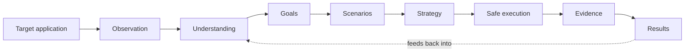
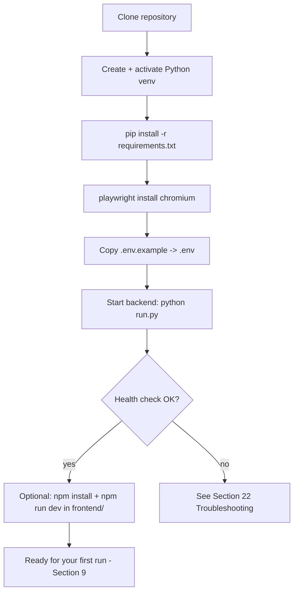
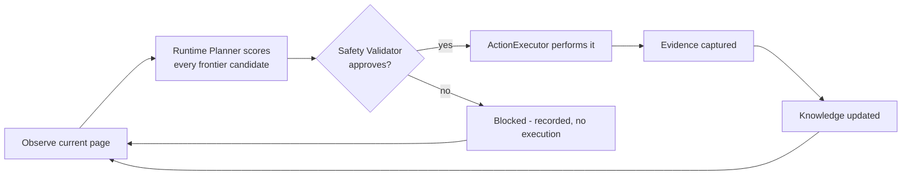
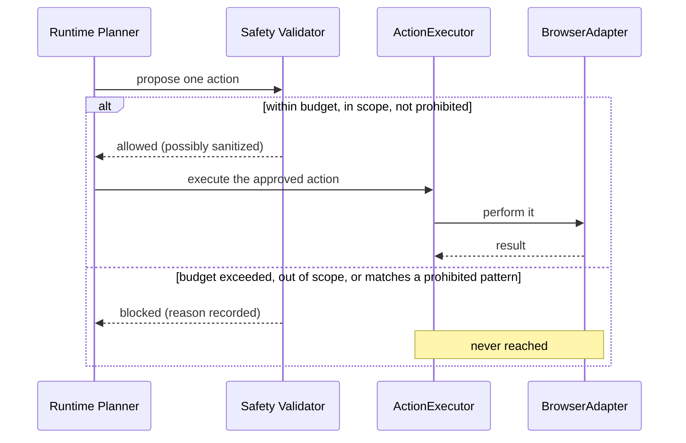
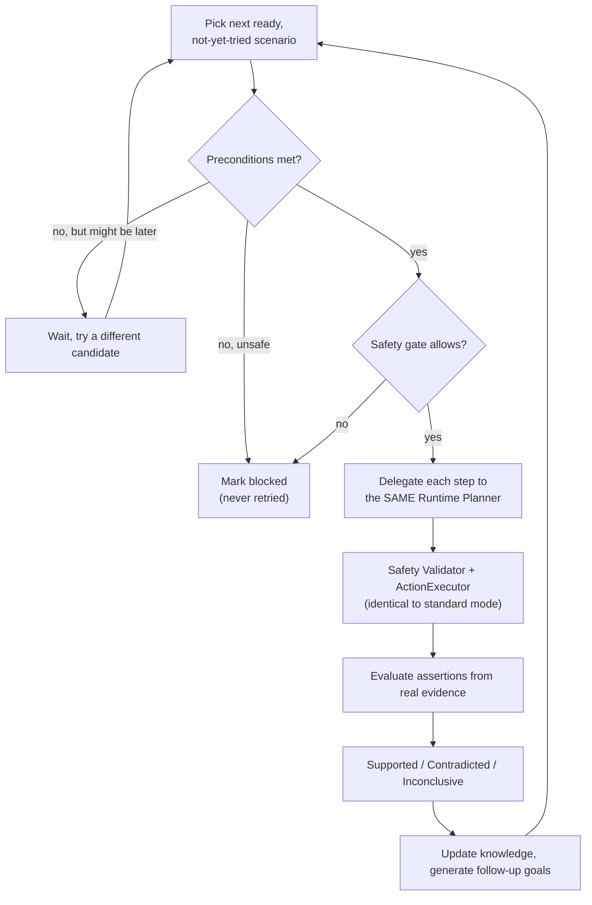
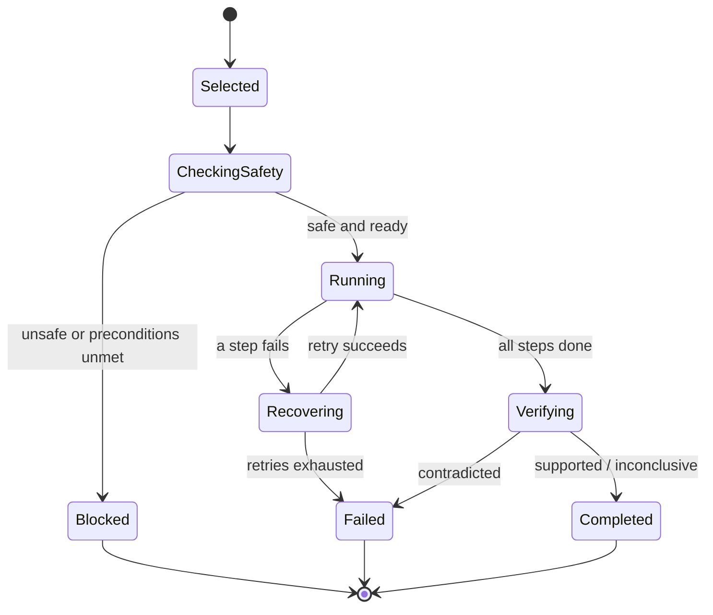
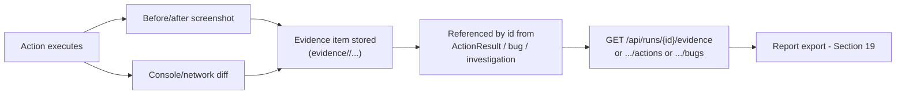
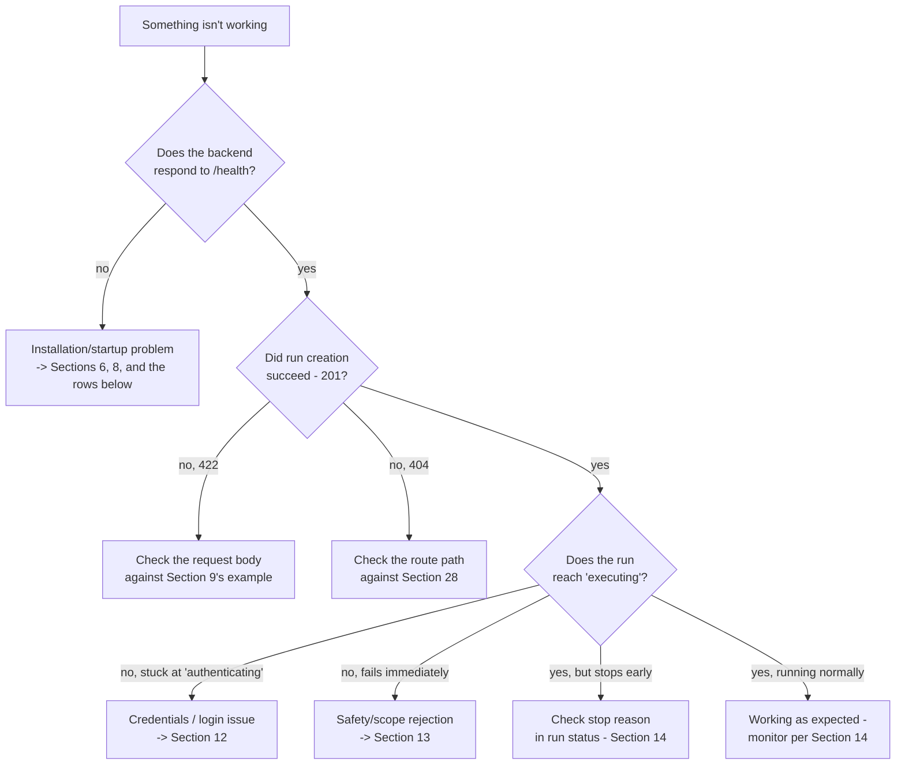

# GemmaQA User Guide

**This is the starting document for anyone installing or operating GemmaQA for the first time.**
**Verified baseline at the time of writing:** 1133 tests passed, 1 skipped, 0 failed (full backend suite, rerun directly before publishing this guide).

---

## 1. About This Guide

**Who should use it:** anyone installing, configuring, running, or operating GemmaQA for the first time — including people with no prior background in Python backends, browser automation, or QA terminology.

**What it covers:** installing every component, configuring the environment, starting all services, running GemmaQA in both of its modes, monitoring a run, inspecting what it discovered, finding your evidence and reports, stopping/cancelling a run, troubleshooting common problems, and using the system safely.

**What it does not cover:** the internal design of each reasoning engine, the exact algorithms behind confidence scoring, or how to extend GemmaQA's code. For that, see the deeper technical documents linked throughout this guide and indexed in [`DOCUMENTATION_INDEX.md`](DOCUMENTATION_INDEX.md).

**Where advanced documentation lives:**
- [`HOW_GEMMAQA_WORKS.md`](HOW_GEMMAQA_WORKS.md) — a plain-language explanation of what happens conceptually during a run.
- [`GEMMAQA_ARCHITECTURE.md`](GEMMAQA_ARCHITECTURE.md) — the authoritative architecture description.
- [`TECHNICAL_SYSTEM_DOCUMENTATION.md`](TECHNICAL_SYSTEM_DOCUMENTATION.md) — the deepest implementation reference, including a full configuration table.
- [`USE_CASES.md`](USE_CASES.md) — 49 detailed use cases.
- Each intelligence engine also has its own document directly under `docs/` (e.g. `docs/QA_STRATEGY_ENGINE.md`).

---

## 2. What GemmaQA Is

GemmaQA opens a real web browser, points it at an authorized web application, and works out what that application actually does — without being told in advance. It notices the "things" the application manages, who is allowed to do what, what processes exist, and how dashboard numbers relate to user actions. It can then, optionally, go further and safely investigate a specific hypothesis on its own, always through the same safety-gated pipeline used for its ordinary browsing.



GemmaQA does **not** require your application's source code, does **not** guarantee complete test coverage, and does **not** replace a human-designed QA strategy. It is a tool that builds understanding and, optionally, acts on it safely.

---

## 3. Important Concepts

Read this section once before continuing — every later section assumes you know these terms.

| Term | Plain-language definition |
|---|---|
| **Application under test** | The web application you point GemmaQA at. GemmaQA never modifies its source code — it only interacts with it through a browser, the same way a person would. |
| **Run** | One complete session of GemmaQA against one application, from start to finish. Each run has a unique `run_id`. |
| **Observation** | One structured snapshot of whatever the browser currently shows. |
| **Page state** | The structured data (headings, buttons, forms, errors) captured by one observation. |
| **Entity** | A "thing" the application manages (whatever it turns out to be — GemmaQA never assumes in advance). |
| **Actor** | A role or identity inside the application under test (e.g. an admin user). Never confuse this with the person operating GemmaQA. |
| **Workflow** | A business process GemmaQA reconstructed by watching a real action change the application. |
| **Dependency** | A connection GemmaQA believes exists between an action/workflow and a number or summary shown somewhere in the application. |
| **Knowledge Graph** | GemmaQA's unified, evolving map connecting everything it has learned about the application. |
| **Investigation goal** | A specific, prioritized "this is worth checking" hypothesis GemmaQA generates from the Knowledge Graph. |
| **Scenario** | A safe, step-by-step, plain-language investigation plan for one goal — never a list of raw clicks or selectors. |
| **Strategy candidate** | One scenario, ranked and grouped for possible execution. |
| **Execution queue** | One of ten named buckets a strategy candidate is sorted into (e.g. "ready now," "blocked," "needs cleanup"). |
| **Investigation** | One actual, autonomous attempt to carry out a scenario — only happens if Autonomous Investigation mode is turned on. |
| **Evidence** | Screenshots, error logs, and other captured proof, referenced by an id rather than copied everywhere. |
| **Coverage** | A measurement of how much of the application has actually been observed/tested. |
| **Confidence** | A transparent, evidence-based score reflecting how sure GemmaQA is about a given fact — never a guarantee. |
| **Safety validation** | The mandatory check every single action passes through before it is ever allowed to happen in the browser. |
| **BrowserAdapter** | The internal component that actually talks to the browser (you never interact with this directly). |
| **Runtime Planner** | The internal component that decides the next concrete action to try. |
| **ActionExecutor** | The internal component that actually performs a validated action in the browser. |

---

## 4. System Requirements

| Requirement | Status | Detail |
|---|---|---|
| Operating system | Confirmed — Windows, macOS, Linux all supported | The repository ships both PowerShell (`.ps1`) and POSIX shell (`.sh`) versions of every setup/startup script. |
| Python | **Confirmed:** 3.11+ | Stated in `README.md` and reflected in the backend's dependency requirements. |
| Node.js | **Confirmed:** 18+ | Stated in `README.md`; required for the frontend. |
| Package managers | `pip` (Python), `npm` (Node.js) | Both are standard; no alternative package manager is used in this repository. |
| Browser | Chromium, installed automatically by Playwright | You do not need to install Chrome/Chromium yourself — the `playwright install chromium` step (Section 6.4) downloads a managed copy. |
| Database | SQLite (file-based) | Confirmed default: `sqlite+aiosqlite:///./gemmaqa.db`, created automatically on first backend start. No separate database server is required. |
| Model provider | Optional | Default is a deterministic **mock** provider — no external model, no API key, no GPU required to get started. Real providers (Ollama, a hosted OpenAI-compatible endpoint, or local Hugging Face weights) are opt-in (Section 7). |
| Ports used | 8000 (backend), 5173 (frontend) | Confirmed in `README.md` and `docker-compose.yml`. |
| Disk/memory | **Recommendation, not a hard-verified requirement** — a few hundred MB for Playwright's Chromium download, plus normal headroom for a browser session (typically several hundred MB of RAM). | Not explicitly documented in the repository; stated here as a reasonable operating expectation. |
| Network | Outbound access to whatever URL you target, plus (if using a hosted model provider) outbound access to that provider's endpoint. | — |
| Optional dependencies | `transformers` + `torch` (only if you choose the local Hugging Face provider) | Confirmed in `README.md`: "Install only if needed: `pip install transformers torch`." |

---

## 5. Repository Overview for New Users

You do not need to understand every file — only these top-level directories:

```
gemmaqa/
  backend/          The Python service that does everything (browser control, reasoning, API)
  frontend/         The React web dashboard (optional — you can also use the API directly)
  docs/             All documentation, including this guide (under docs/system/)
  scripts/          Setup/startup helper scripts at the repo root
  backend/scripts/  Additional developer/verification scripts (not required for normal use)
  tests/            The automated test suite (for verifying an installation, Section 24)
  evidence/         Where screenshots, traces, and reports from your runs are saved
```

---

## 6. Installation

Perform these steps once, from a freshly cloned copy of the repository.

### 6.1 Clone or open the repository

```bash
git clone <your-authorized-copy-of-this-repository-url>
cd gemmaqa
```

If you already have the repository, simply open a terminal in its root folder (the folder containing `README.md`, `backend/`, `frontend/`).

### 6.2 Create and activate the Python virtual environment

A virtual environment keeps GemmaQA's Python packages separate from the rest of your system.

**Windows (PowerShell):**
```powershell
cd backend
python -m venv .venv
.venv\Scripts\activate
```

**macOS / Linux:**
```bash
cd backend
python -m venv .venv
source .venv/bin/activate
```

**How you know it worked:** your terminal prompt now begins with `(.venv)`.

### 6.3 Install backend dependencies

Still inside `backend/`, with the virtual environment active:

```bash
pip install -r requirements.txt
```

This installs FastAPI, Playwright, Pydantic, SQLAlchemy, and the other packages listed in `backend/requirements.txt`. **Expected output:** a series of "Successfully installed ..." lines, ending without an error.

Optional provider backends are deliberately **not** in that file, so a default install stays lean. Install one only if you intend to use it:

```bash
# GEMMA_PROVIDER=bedrock (Amazon Bedrock)
pip install -r requirements-bedrock.txt
```

Each provider imports its SDK lazily, so leaving these uninstalled does not affect `mock`, `openai_compatible`, or the rest of the application.

### 6.4 Install browser dependencies

```bash
playwright install chromium
```

This downloads a managed copy of Chromium that Playwright controls directly. **Expected output:** a download progress bar followed by confirmation that Chromium was installed. *(Note: on some Linux distributions, Playwright may report that additional system libraries are missing; if so, it will print the exact command to run — typically `playwright install-deps` — follow its own instruction rather than guessing.)*

### 6.5 Install frontend dependencies

*(Optional — skip this if you plan to use the API directly instead of the web dashboard.)*

```bash
cd ../frontend
npm install
```

### 6.6 Verify installation

From the `backend/` folder, with the virtual environment active:

```bash
python -c "import fastapi, playwright, sqlalchemy; print('OK')"
```

**Expected output:** `OK`, with no import errors. If you see `ModuleNotFoundError`, return to Section 6.3 and confirm the virtual environment is active and the install completed without errors.

---

## 7. Environment Configuration

GemmaQA is configured through environment variables, normally kept in a `.env` file (never committed to Git). A ready-to-copy template exists at the repository root (`.env.example`) and inside `backend/.env.example`.

**How to set it up:**
```bash
cd backend
cp .env.example .env          # macOS / Linux
copy .env.example .env         # Windows Command Prompt
Copy-Item .env.example .env    # Windows PowerShell
```

Then open `backend/.env` in a text editor and adjust values as needed. **Never commit this file** — it is where any real secrets you add will live, even though the template itself contains none.

### Key variables (backend)

| Variable | Required | Default | Example | Purpose | Security note |
|---|---|---|---|---|---|
| `HOST` | No | `127.0.0.1` | `127.0.0.1` | Address the backend listens on | Keep as `127.0.0.1` unless you understand the exposure risk — the API has no authentication (Section 13). |
| `PORT` | No | `8000` | `8000` | Backend port | — |
| `DATABASE_URL` | No | `sqlite+aiosqlite:///./gemmaqa.db` | — | Where run history is stored | Local file by default; no credentials embedded. |
| `CORS_ORIGINS` | No | `http://localhost:5173,http://127.0.0.1:5173` | — | Which frontend origins may call the API | — |
| `GEMMA_PROVIDER` | No | `mock` | `mock` \| `openai_compatible` \| `transformers` | Selects the model provider | `mock` requires no external service and is the safest starting point. |
| `GEMMA_MODEL_ID` | Only for non-mock providers | *(empty)* | `gemma3:4b` | The exact model name your endpoint exposes | Never assumed — you must set this yourself for real providers. |
| `GEMMA_API_BASE_URL` | Only for `openai_compatible` | *(empty)* | `http://127.0.0.1:11434/v1` | Endpoint URL | — |
| `GEMMA_API_KEY` | Only if your endpoint requires one | *(empty)* | *(your key)* | Provider authentication | **Never commit this value. Never paste a real key into a shared file or chat.** |
| `GEMMA_SUPPORTS_IMAGES` | No | `false` | `true`/`false` | Enables the optional visual-perception layer | Off by default. |
| `PLAYWRIGHT_HEADLESS` | No | `true` | `true`/`false` | Whether the browser window is visible | Set `false` to watch the browser while it runs. |
| `ALLOW_LOCAL_TARGETS` | No | `false` | `true` | Permits testing `localhost`/local network targets | Leave `false` unless you intentionally test a local/private host. |
| `ALLOW_LOGIN` | No | `true` | `true`/`false` | Permits GemmaQA to log in using supplied credentials | — |
| `ALLOW_TEST_ACCOUNT_CREATION` | No | `true` | `true`/`false` | Permits GemmaQA to register a new test account when no credentials are supplied | — |
| `ALLOW_SAFE_TEST_DATA_CREATION` | No | `false` | `true`/`false` | Permits clearly-marked test-data writes | Off by default — see Section 13. |
| `ALLOW_DESTRUCTIVE_ACTIONS` | No | `false` | `true`/`false` | Governs destructive-action gating | Leave `false` unless you fully understand the implications. |
| `ALLOW_FINANCIAL_ACTIONS` | No | `false` | `true`/`false` | Narrowly permits payment/purchase/checkout vocabulary | Leave `false` for almost every use case. |
| `MAX_RUNTIME_SECONDS` | No | `900` | `300` | Wall-clock budget per run | — |
| `MAX_RETRIES` | No | `3` | `3` | Per-action retry cap | — |
| `MAX_SCREENSHOTS` | No | `200` | `200` | Screenshot budget per run | — |
| `ENABLE_TRACING` | No | `true` | `true`/`false` | Enables Playwright trace capture | — |

**These are backend `.env` variables, distinct from `RunConfiguration` fields you set per-run via the API/UI** (Section 11 and 13 cover the per-run equivalents, including the important `enable_autonomous_investigation` flag, which is a per-run API field, **not** an environment variable).

**How to confirm your configuration loaded:** start the backend (Section 8.1) and open `GET http://127.0.0.1:8000/api/ai/health` in a browser — it reports which provider is active without ever exposing your API key.

---

## 8. Starting GemmaQA

There are two ways to start everything: the one-command quick start, or starting each service by hand. Both are shown.

### Quick start (all services at once)

From the repository root:

```powershell
# Windows
.\start-dev.ps1
```
```bash
# macOS / Linux
chmod +x start-dev.sh
./start-dev.sh
```

This starts the demo application, backend, and frontend together.

### 8.1 Start the backend (manual)

**Working directory:** `backend/`, with the virtual environment active.

```bash
python run.py
```

**Expected terminal output:** log lines beginning with a timestamp and `INFO`, including a line indicating Uvicorn is running on `http://127.0.0.1:8000`.

**Health check:** open `http://127.0.0.1:8000/health` in a browser, or run:
```bash
curl http://127.0.0.1:8000/health
```
**Expected response:** `{"status":"ok","app":"GemmaQA","version":"0.1.0"}`.

Interactive API documentation is also available at `http://127.0.0.1:8000/docs`.

**How to stop it:** press `Ctrl+C` in the terminal running it.

### 8.2 Start the frontend

**Working directory:** `frontend/`.

```bash
npm run dev
```

**Expected output:** a Vite message showing the local URL, typically `http://127.0.0.1:5173`. Open that address in your browser — you should see the GemmaQA dashboard. The frontend automatically proxies API and WebSocket calls to the backend, so the backend must already be running.

### 8.3 Default test target

No bundled local demo application is required. The default New Run target is `https://thinking-tester-contact-list.herokuapp.com/`. You can replace it with any other authorized URL through the same UI or API.

### Installation-and-startup flow, at a glance



### 8.4 Confirm all services are running

| Service | Check | Expected |
|---|---|---|
| Backend | `curl http://127.0.0.1:8000/health` | `{"status":"ok",...}` |
| Frontend | Open `http://127.0.0.1:5173` | Dashboard loads |
| Model provider (if not `mock`) | `curl http://127.0.0.1:8000/api/ai/health` | `configured: true`, and `reachable: true` once your provider responds |

---

## 9. Your First GemmaQA Run

This walkthrough uses the default development/test target, the Thinking Tester Contact List, in the safest possible configuration. The URL is configurable — you can still test another authorized site through the same UI or API.

**Before you start:** confirm the backend (Section 8.1) is running. No local demo app is required for the default target.

1. **Confirm the target is reachable** — `https://thinking-tester-contact-list.herokuapp.com/`
2. **Start GemmaQA's backend** — per Section 8.1.
3. **Open the frontend** at `http://127.0.0.1:5173`, or use the API directly (both shown below).
4. **Create the run.**

   **Via the API:**
   ```
   POST http://127.0.0.1:8000/api/runs
   Content-Type: application/json
   ```
   ```json
   {
     "url": "https://thinking-tester-contact-list.herokuapp.com/",
     "authorization_ack": true,
     "configuration": {
       "max_actions": 20,
       "max_pages": 8,
       "safe_mode": true,
       "allow_controlled_writes": false
     }
   }
   ```
   **Expected response:** HTTP `201 Created`, body similar to:
   ```json
   { "run_id": "…", "status": "created", "message": "Run created" }
   ```
   Note the `run_id` — you will need it for every following step.

   **Via the UI:** click **New Run**. The URL defaults to `https://thinking-tester-contact-list.herokuapp.com/`; you can replace it with any other authorized target. Tick the authorization acknowledgement checkbox (required — the UI will not let you proceed without it), leave safe mode on, and submit.

5. **Set the application URL** — done above (`url` field / the URL box in the UI).
6. **Select safe configuration** — `safe_mode: true`, `allow_controlled_writes: false` (shown above) is the safest starting point.
7. **Start the run.** If you did not set `"auto_start": true` when creating it, start it explicitly:
   ```
   POST http://127.0.0.1:8000/api/runs/{run_id}/start
   ```
8. **Observe progress** — poll status:
   ```
   GET http://127.0.0.1:8000/api/runs/{run_id}
   ```
   **Expected fields:** `status` (moves through the run's phases — see Section 14), `pages_visited`, `actions_taken`, `progress_pct`.
9. **Confirm pages were visited** — `pages_visited` should be greater than 0 within the first few seconds.
10. **Confirm observations were stored** — `GET /api/runs/{run_id}/pages` should return a non-empty list.
11. **Confirm knowledge was created** — `GET /api/runs/{run_id}/application` returns the discovered application structure (modules, navigation) built up so far. *(Deeper reasoning-engine data — entities, actors, workflows, the Knowledge Graph itself — is not yet exposed through this endpoint; see Section 15's important note.)*
12. **Stop the run** (if you want to end it early):
    ```
    POST http://127.0.0.1:8000/api/runs/{run_id}/cancel
    ```
    Otherwise, it stops on its own once it exhausts its budget or runs out of safe things to do.
13. **Review results** — `GET /api/runs/{run_id}/report` (or the equivalent `.md`/`.html` variants — Section 19).

**Common mistakes:**
- Forgetting `authorization_ack: true` — the request is rejected without it.
- Forgetting `ALLOW_LOCAL_TARGETS=true` when testing `127.0.0.1`/`localhost` — the URL will be rejected by the safety layer.
- Using a local/private URL without `ALLOW_LOCAL_TARGETS=true`.

---

## 10. Standard Mode

This is what happens on every run by default (no special flag needed).

- The **Runtime Planner** looks at everything currently clickable/fillable/navigable on the page (the **frontier**) and picks the highest-scoring option using a transparent, named-factor scoring model.
- If a model provider is configured, it may offer an advisory opinion on a genuine near-tie — it can never introduce an option that wasn't already on the frontier, and it can never override safety.
- Every chosen action passes through **safety validation** before anything happens in the browser.
- After the action executes, a screenshot and page-state comparison are captured as **evidence**.
- The run stops when it exhausts its action/page/time budget, runs out of safe things left to try, or you cancel it.

**Complete standard-mode example:** the walkthrough in Section 9 *is* a complete standard-mode run — nothing further is required to use this mode.



### Safety validation sequence

Every single action, in every mode, passes through this same sequence — there is no path that skips it:



---

## 11. Autonomous Investigation Mode

> **This feature is opt-in and disabled by default.** The flag is `enable_autonomous_investigation`, part of the `configuration` object you send when creating a run (`RunConfiguration.enable_autonomous_investigation`, confirmed default `False` directly in `backend/app/schemas.py`).

**What changes when enabled:** in addition to ordinary exploration, GemmaQA may pick a specific, previously-planned investigation scenario and carry it out step by step, aiming to confirm or refute a particular hypothesis (e.g., "does this action really change that dashboard number?").

**What does not change:**
- Every action, whether from ordinary exploration or an investigation, still passes through the same mandatory safety validator.
- The system still never issues a raw browser command directly from the investigation logic — every concrete step is handed to the same Runtime Planner ordinary exploration already uses.
- Budgets, domain scope, and prohibited-action rules apply identically.

**How scenarios are selected:** from a ranked, ready-to-run list; a scenario that already reached a final outcome in this run is never selected again.

**How preconditions are checked:** before attempting a scenario, GemmaQA re-checks whether everything it needs (a particular actor logged in, a particular entity known to exist) is still true right now — if not yet true, it waits rather than forcing it; if fundamentally unsafe, it refuses outright.

**How semantic steps are delegated:** each step of a plan ("perform this workflow," "observe this value") is handed to the same Runtime Planner used everywhere else, along with a short description of what the step is trying to accomplish — never a specific element or selector.

**How duplicate execution is prevented:** GemmaQA tracks which candidates have already reached a final outcome and never selects them again in the same run.

**How the loop stops:** when nothing further is ready, when failures repeat too often, when the budget runs out, or when you cancel the run.

**Exact configuration example:**
```json
{
  "url": "https://thinking-tester-contact-list.herokuapp.com/",
  "authorization_ack": true,
  "configuration": {
    "max_actions": 30,
    "safe_mode": true,
    "allow_controlled_writes": false,
    "enable_autonomous_investigation": true
  }
}
```

> ⚠️ **Warning:** Autonomous mode should first be used against test, staging, demo, or disposable environments unless the safety configuration has been thoroughly reviewed. It carries out real browser actions on its own initiative — always start with `safe_mode: true` and a conservative `max_actions` budget the first several times you use it.



---

## 12. Providing Credentials

**How credentials are provided:** as `username`/`password` fields on the same request that creates the run (`POST /api/runs`), or via the UI's login fields.

**Where they are stored:** only in the backend process's memory for the duration of that run (`CredentialVault`) — never written to the SQLite database, never included in logs, WebSocket events, or reports.

**Whether they persist:** no — they exist only for the lifetime of the running process handling that run.

**Whether they appear in logs:** no — password values and secret-like strings are actively redacted before any logging or storage occurs.

**Supported authentication flow:** GemmaQA detects a login (or registration) form on the page and fills it using the credentials you supplied — the same way a person would.

**Session reuse:** one authenticated session is established and reused for the rest of that run.

**Session expiration behaviour:** if GemmaQA notices signs that the session has ended (a login form reappearing, for example), it treats itself as unauthenticated again — it does not automatically continue as a stale session.

**Safe test-account recommendation:** use a dedicated, disposable test account whenever possible — for example:
```
Username: qa.user@example.test
Password: (a password you generate for this purpose only)
```
**Never use real personal accounts, real customer accounts, or real production credentials with GemmaQA.**

**Role-switching limitation:** GemmaQA establishes one authenticated session per run. It cannot switch to a second role/actor mid-run to test a scenario that genuinely requires two different logged-in identities — that requires a separate run with different credentials.

---

## 13. Configuring Safety

Every safety control below is a field on the `configuration` object of `POST /api/runs`, unless noted as an environment variable.

| Control | Field | Default | Effect |
|---|---|---|---|
| Safe mode | `safe_mode` | `true` | Blocks all write actions unless explicitly allowed below. |
| Controlled writes | `allow_controlled_writes` | `false` | Permits general write actions once `safe_mode` allows it. |
| Safe test-data creation | `allow_safe_test_data_creation` | `false` | Permits clearly-marked (prefixed) test-data writes only. |
| Destructive actions | `allow_destructive_actions` | `false` | Governs destructive-action gating — leaving this `false` never loosens the fixed delete/destroy/purge/wipe blocklist regardless of any other setting. |
| Financial actions | `allow_financial_actions` | `false` | Narrowly permits payment/purchase/checkout vocabulary — leave `false` unless you specifically intend to test a financial flow you fully control. |
| Cross-domain navigation | `allow_cross_domain` | `false` | Widens URL scope beyond the authorized target domain. |
| Subdomains | `allow_subdomains` | `false` | Widens URL scope to subdomains of the authorized target. |
| Action budget | `max_actions` | `50` | Hard cap on total actions per run. |
| Page budget | `max_pages` | `20` | Hard cap on total pages visited per run. |
| Time budget | `max_runtime_seconds` | `900` | Hard cap on run duration. |
| Retry limit | `max_retries` | `3` | Hard cap on retries for one action. |
| Autonomous investigation | `enable_autonomous_investigation` | `false` | See Section 11. |

**Recommended configurations:**

1. **Demo application (learning/practice):**
   ```json
   { "safe_mode": true, "allow_controlled_writes": false, "max_actions": 20 }
   ```
2. **Staging environment (broader exploration, still no real mutation):**
   ```json
   { "safe_mode": true, "allow_safe_test_data_creation": true, "max_actions": 50 }
   ```
3. **Production-like read-only review (observe only, change nothing):**
   ```json
   { "safe_mode": true, "allow_controlled_writes": false, "allow_safe_test_data_creation": false, "max_actions": 30 }
   ```

**Unsafe production execution is never the default** — every field above defaults to its safest value, and enabling a write capability always requires an explicit, deliberate choice.

---

## 14. Monitoring a Run

| Source | What it shows |
|---|---|
| Terminal running the backend | Timestamped log lines for every major step (`INFO`-level by default), streamed to standard output — there is no separate log file by default. |
| `GET /api/runs/{run_id}` | The current status snapshot: `status`, `current_url`, `pages_visited`, `actions_taken`, `bugs_found`, `progress_pct`, `message`, `error`. |
| Frontend dashboard | A live view of the same information, updated over the WebSocket connection. |
| `GET /api/runs/{run_id}/events` | Recent structured events for the run (recent history; falls back to the database if the run is no longer in memory). |
| WebSocket `ws://127.0.0.1:8000/ws/runs/{run_id}` | Live event stream, including a heartbeat, for building your own real-time view. |

**Run status values** (the run-level phase, confirmed in `backend/app/agent/state_machine.py`):

| Status | Meaning | User action |
|---|---|---|
| `created` | Run configured but not yet started | Call the `/start` endpoint if `auto_start` was not set |
| `initializing` | Preparing the run | Wait |
| `opening_browser` | Launching Chromium | Wait |
| `navigating` | Loading the target URL | Wait |
| `authenticating` | Attempting login, if credentials were supplied | Wait |
| `observing` | Reading the current page | Wait |
| `planning` | Deciding the next action | Wait |
| `executing` | Performing the chosen action | Wait |
| `analyzing` | Comparing before/after state, updating knowledge | Wait |
| `documenting` | Building the final report | Wait |
| `completed` | Run finished normally | Review the report (Section 19) |
| `failed` | Run ended due to an unrecoverable error | Check `error` field and Section 22 |
| `cancelled` | You (or the system) requested a stop | Review whatever evidence/report exists so far |

**Stop reason:** once a run stops, `message`/the final report indicates why (e.g. action budget exhausted, no further safe candidates, authentication required and unresolved).

---

## 15. Understanding What GemmaQA Discovers

**Currently accessible through the API without writing any code:**
- `GET /api/runs/{run_id}/pages` — pages visited.
- `GET /api/runs/{run_id}/modules` — the inferred module/navigation hierarchy.
- `GET /api/runs/{run_id}/application` — the canonical application structure GemmaQA built.
- `GET /api/runs/{run_id}/navigation` — pages plus navigation links between them.
- `GET /api/runs/{run_id}/forms` — discovered forms.
- `GET /api/runs/{run_id}/workflows` — discovered workflows (from the legacy exploration model).
- `GET /api/runs/{run_id}/coverage` — a coverage summary.

**Important, honest limitation:** the richer discovery output — individual **entities**, **actors**, the full **Knowledge Graph** (nodes, edges, confidence, provenance, contradictions, gaps) — exists in the backend's in-process memory for the duration of the run (queryable internally via `EntityRegistry`, `ActorRegistry`, `WorkflowRegistry`, `DependencyRegistry`, and `ApplicationKnowledgeGraph`), but is **not currently exposed through a dedicated API endpoint or the exported report**. Today, inspecting this data directly requires either:
- Enabling structured trace logging (`GEMMAQA_EXPLORATION_TRACE=1` as an environment variable before starting the backend) and reading the resulting trace events from the terminal, or
- Writing a small Python script that follows the same pattern as the repository's own live-capture harnesses under `backend/scripts/*_live_capture.py`, which is a developer-level task, not a UI/API workflow.

This is stated here plainly rather than glossed over — see Section 26 for the full limitations list.

---

## 16. Understanding Goals, Scenarios, and Strategy

**Goals, scenarios, and strategy candidates are generated automatically during a run** whenever the underlying reasoning engines are active (they always are — this is not a separate opt-in feature; only *acting* on a strategy candidate autonomously is opt-in, per Section 11).

**Same limitation as Section 15 applies:** goals, scenario plans (with their requirements, semantic steps, risk/feasibility assessments), and strategy queues/batches/forecasts are held in the backend's in-process memory (queryable internally via `GoalQueryEngine`, `ScenarioQueryEngine`, and `StrategyQueryEngine`) but are **not currently exposed through a dedicated API endpoint or the exported report.**

**Key distinction, so these four terms are never confused:**

| Term | What it is |
|---|---|
| **Frontier** | The complete list of everything clickable/fillable/navigable on the CURRENT page, used by ordinary exploration. Regenerated every single step. |
| **Scenario** | A multi-step, semantic investigation PLAN for one specific goal — written in business terms, not selectors. Exists independently of any particular page. |
| **Execution queue** | One of ten named groups (e.g. "ready now," "blocked," "needs cleanup") a scenario is sorted into by the strategy layer, based on its priority and current readiness. |
| **Investigation** | One actual, in-progress or completed ATTEMPT to carry out a scenario — only exists if Autonomous Investigation mode is enabled. |

---

## 17. Understanding Autonomous Investigations

**Only relevant if `enable_autonomous_investigation: true` was set (Section 11).**

Investigation state (current investigation, completed/blocked/failed/paused history, latest evidence, coverage, confidence) is tracked internally by the `AutonomousInvestigationEngine`'s own query API (`InvestigationQueryEngine`) — again, not yet surfaced through a dedicated API endpoint or the exported report (same limitation as Sections 15–16). The clearest way to see investigation activity today is the structured trace log (`GEMMAQA_EXPLORATION_TRACE=1`), which emits named events such as `autonomous_investigation.started`, `autonomous_investigation.immediate_outcome`, and `autonomous_investigation.finalized` to the backend's terminal output.

**The three supported investigation outcomes, and what each honestly means:**

- **Supported** — the evidence GemmaQA gathered backs up the hypothesis the scenario was testing.
- **Contradicted** — the evidence disagrees with the hypothesis.
- **Inconclusive** — there simply wasn't a reliable enough signal to say either way. GemmaQA reports this honestly rather than guessing "supported."

**Investigation lifecycle, simplified for operators** (the full 16-state version is in `MODULE_AND_ENGINE_COMMUNICATION_FLOW.md`):



---

## 18. Evidence and Results

**What is captured:** before/after screenshots for every action, a Playwright trace archive for the whole run (if `ENABLE_TRACING=true`, the default), console/network error summaries, and JSON metadata describing each captured item.

**Where it is stored:** under `evidence/<run_id>/` at the repository root — `screenshots/`, `traces/`, and `reports/` subfolders.

**How references are represented:** every piece of evidence has a unique id; action/investigation records reference that id rather than embedding the file itself.

**How to connect evidence to an action:** `GET /api/runs/{run_id}/actions` lists executed actions; `GET /api/runs/{run_id}/evidence` lists the captured evidence files for the run; a specific file can be retrieved via `GET /api/runs/{run_id}/evidence/file/{file_path}`.

**How long evidence persists:** for as long as the files remain on disk under `evidence/` — there is no automatic expiry/cleanup implemented. Deleting a run via the API (`DELETE /api/runs/{run_id}`, with `confirm=true`) also deletes its evidence directory.

**Current limitations:** structured trace events (Section 15) are only captured to the terminal/log stream when explicitly enabled — they are not saved to a persistent evidence file by default.



---

## 19. Reports

**What currently exists:** a deterministic structured report covering the executive summary, application overview, modules, navigation, forms/tables inventory, discovered workflows (legacy exploration model), test scenarios/executions, confirmed/suspected bugs, coverage summary, console/network error summary, and known limitations.

**How to retrieve it:**

| Format | Route |
|---|---|
| JSON (in-run status object) | `GET /api/runs/{run_id}/report` |
| JSON file | `GET /api/runs/{run_id}/report.json` |
| Markdown | `GET /api/runs/{run_id}/report.md` |
| HTML | `GET /api/runs/{run_id}/report.html` |
| CSV exports (bugs, tests, executions, pages, modules) | Files alongside the above under `evidence/<run_id>/reports/` |

**Where it is stored on disk:** `evidence/<run_id>/reports/` (e.g. `final_report.json`, `final_report.md`, `final_report.html`, `bugs.csv`, `tests.csv`).

**Confirmed limitation, verified directly against the source code:** *the exported report currently does not include the outputs of Goal Generation, Scenario Planning, QA Strategy, or Autonomous Investigation* — it reflects the legacy exploration model (pages, forms, workflows, bugs, coverage) only. This was directly confirmed by searching the reporting code for any reference to these newer engines (none found) as of this writing. If this changes in a future version of the code, this statement should be re-verified rather than assumed to still be accurate.

---

## 20. Pausing, Stopping, Cancelling, and Resuming

| Operation | Supported? | Command/Endpoint | Effect on browser session | Effect on memory | Effect on evidence | Can it resume? |
|---|---|---|---|---|---|---|
| Pause | **Yes** | Live run **Pause**, or `POST /api/runs/{run_id}/pause` | Browser stays open | In-process state is kept | Preserved | **Yes** — Continue |
| Continue | **Yes** | Live run **Continue**, or `POST /api/runs/{run_id}/resume` | Same session continues | Same memory | Continues capturing | N/A |
| End run | **Yes** | Live run **End run**, or `POST /api/runs/{run_id}/end` (alias of `/cancel`) | Browser session is closed | In-process reasoning state is discarded once the run ends | Evidence captured so far is preserved on disk | **No** — start a new run |
| Stop automatically (budget/no-more-work) | **Yes** | Happens on its own | Browser session is closed | Same as End run | Preserved | No |
| Delete a run's data | **Yes** | `DELETE /api/runs/{run_id}?confirm=true` | N/A (already stopped) | Database rows removed | Evidence directory deleted | N/A |

Pause takes effect after the current step finishes (a Gemma call already in flight is not interrupted). While paused, `max_runtime_seconds` does not tick, so you can inspect the live view and continue later without raising the default 15-minute cap. End run when you are satisfied.

---

## 21. Common Workflows

### 21.1 Explore a public website without credentials
Create a run with just a `url` and `authorization_ack: true` — no `username`/`password` needed. GemmaQA will explore whatever is reachable without logging in.

### 21.2 Test an application login
Supply `username`/`password` on the create-run request. GemmaQA detects the login form and attempts it using the Authentication Strategy described in Section 12.

### 21.3 Explore an authenticated dashboard
Same as 21.2 — once authenticated, ordinary exploration continues automatically across whatever pages the session can reach.

### 21.4 Run in read-only mode
Use the "production-like read-only review" configuration from Section 13 (`safe_mode: true`, `allow_controlled_writes: false`, `allow_safe_test_data_creation: false`).

### 21.5 Run a controlled write test
Set `safe_mode: true` and `allow_safe_test_data_creation: true` — writes are permitted but every test-data value GemmaQA enters is clearly prefixed so it is easy to identify and clean up afterward.

### 21.6 Enable autonomous investigation
Add `"enable_autonomous_investigation": true` to the `configuration` object (Section 11), after reading the warning there.

### 21.7 Review discovered workflows
`GET /api/runs/{run_id}/workflows` (legacy exploration model). For the richer, reasoning-engine workflow records, see the limitation noted in Section 15.

### 21.8 Review a blocked investigation
Not yet exposed through the API (Section 17's limitation) — check the structured trace log (`GEMMAQA_EXPLORATION_TRACE=1`) for `autonomous_investigation.immediate_outcome` events with `outcome: "blocked"`.

### 21.9 Review evidence for a suspected bug
`GET /api/runs/{run_id}/bugs` to find the bug record, then `GET /api/runs/{run_id}/evidence` and `GET /api/runs/{run_id}/actions` to locate the corresponding screenshots and action context around the same timestamp.

### 21.10 Re-run after fixing an application bug
Start a brand-new run against the same URL — GemmaQA does not carry any memory forward from a previous run (Section 26).

---

## 22. Troubleshooting

**Start here — a quick decision flow before consulting the detailed table below:**



| Problem | Likely cause | How to confirm | Resolution | Related log/file |
|---|---|---|---|---|
| Backend does not start | Virtual environment not active, or dependencies missing | Terminal shows `ModuleNotFoundError` | Re-activate `.venv`, re-run `pip install -r requirements.txt` | Terminal output |
| Module import error | Wrong working directory | You are not inside `backend/` | `cd backend` before running `python run.py` | Terminal output |
| Wrong Python version | Python 3.11+ not installed/selected | `python --version` | Install/select Python 3.11+ | — |
| Dependency installation failure | Network issue or incompatible platform wheel | Error text in `pip install` output | Retry, or consult the specific package's error message | Terminal output |
| Browser executable missing | Playwright's Chromium not downloaded | Error mentions "Executable doesn't exist" | Run `playwright install chromium` (Section 6.4) | Terminal output |
| Playwright browser not installed (Linux) | Missing system libraries | Playwright's own error message names the missing library | Run the command Playwright itself suggests (typically `playwright install-deps`) | Terminal output |
| Target URL unreachable | Application not running, or wrong port | Open the URL directly in a normal browser tab | Start the target application first (Section 8.3) | — |
| Invalid URL | Missing scheme, disallowed local/internal host | Run creation is rejected | Use a full `http://`/`https://` URL; set `ALLOW_LOCAL_TARGETS=true` for local targets | Backend terminal |
| Login fails | Wrong credentials, or the app's login form isn't recognizable | `status` becomes `failed` with an authentication-related `error`/`message` | Verify credentials manually first; check `ALLOW_LOGIN=true` | Run status / terminal |
| Credentials rejected | Same as above | Same as above | Same as above | — |
| Session expires | The application logged GemmaQA out mid-run | Actions after a certain point start failing/re-triggering login detection | Expected behavior — start a new run | Terminal |
| Browser opens but no actions happen | `PLAYWRIGHT_HEADLESS=false` and the window is minimized, or the page failed to load | Check the browser window directly | Bring the window to front; verify the target URL loaded | — |
| No frontier candidates | Page has nothing safely actionable, or navigation is blocked by scope rules | `status` shows a stop reason like "no remaining candidates" | Expected in some cases; verify domain/subdomain settings if unexpected | Run status |
| Run stops immediately | Authorization not acknowledged, or URL rejected by safety layer | Create-run request returned an error, or `status` is `failed` right away | Check `authorization_ack: true` and URL validity | API response |
| Action rejected by safety validator | A prohibited pattern matched, or a budget was already exhausted | `GET /api/runs/{run_id}/events` shows `action_blocked` | Expected/by design — review Section 13 if unexpected | Events endpoint |
| Controlled write blocked | `safe_mode`/`allow_controlled_writes` too strict for what you intended | Same as above | Adjust configuration per Section 13, deliberately | — |
| Autonomous investigation does not start | Flag not set, or no ready candidates exist yet | Confirm `enable_autonomous_investigation: true` was sent | Set the flag; give the run more actions/pages to build up scenarios first | Create-run request body |
| No executable scenarios | Nothing is both feasible and safe yet, or everything already ran | Trace log shows `no_executable_scenarios` | Expected once everything ready has been tried; not an error | Trace log |
| Scenario blocked by preconditions | A required actor/entity/session isn't available yet | Trace log shows a `blocked`/deferred outcome | Often resolves itself as exploration continues; otherwise expected | Trace log |
| Same scenario appears repeatedly | Should not happen — duplicate execution is explicitly prevented and regression-tested | Compare investigation ids in the trace log | If seen, this would be a genuine bug — report it (Section 30) | Trace log |
| Evidence not created | Screenshot budget exhausted, or evidence directory not writable | Check `MAX_SCREENSHOTS`; check disk permissions on `evidence/` | Raise the budget or free disk space | `evidence/<run_id>/` |
| Screenshots missing | Same as above, or a password-risky screenshot was deliberately skipped | Placeholder note file present instead | Expected in the password-risk case | `evidence/<run_id>/screenshots/` |
| Network evidence empty | Adapter mode doesn't support network capture (Playwright MCP mode disables it by default) | Check `BROWSER_ADAPTER` setting | Use `direct_playwright` (the default) for full network capture | — |
| Graph/goals/scenarios appear empty | Not exposed via API yet (Section 15/16 limitation) — this is expected, not a failure | — | Use trace logging for visibility | Trace log |
| No goals/scenarios generated | Too little has been observed yet | Let the run continue longer | Not an error early in a run | — |
| "Immediate" queue is empty | Normal — priority scores for most real applications rarely cross the fixed "Immediate" threshold; documented as a known calibration characteristic, not a bug | — | No action needed; candidates are still reachable via other queues | `docs/QA_STRATEGY_ENGINE.md` |
| API returns 404 | Wrong `run_id`, or the route doesn't exist | Double-check the `run_id` and the exact route path | Re-check Section 28's route table | — |
| API returns 422 | Request body failed validation (e.g. missing required field) | Response body names the invalid field | Fix the field named in the error response | API response |
| Database connection fails | `DATABASE_URL` misconfigured, or the SQLite file's folder isn't writable | Backend fails to start with a database error | Fix the path/permissions, or leave `DATABASE_URL` at its default | Terminal output |
| Model-provider configuration fails | `GEMMA_PROVIDER` set to a non-mock value without valid `GEMMA_MODEL_ID`/`GEMMA_API_BASE_URL` | Backend raises an error rather than silently using mock | Fix the provider configuration, or set `GEMMA_PROVIDER=mock` | Terminal output |
| LLM unavailable mid-run | Provider endpoint unreachable during the run | `ai_failure` appears in events; run continues via deterministic fallback | No action needed — this is handled gracefully, up to `GEMMA_MAX_CONSECUTIVE_FAILURES` (default 3) | Events endpoint |
| Report missing strategy/investigation data | Expected — confirmed limitation (Section 19) | — | No current resolution; use trace logging instead | — |
| Test suite failure | A genuine regression, or an environment issue | `pytest` output names the failing test | Compare against the current verified baseline (Section 24) | Terminal output |
| Port already in use | Another process already bound to 8000/5173 | OS error naming the port | Stop the other process, or change the relevant port setting | Terminal output |

---

## 23. Logs and Diagnostics

**Log location:** the terminal running `python run.py` — GemmaQA logs to standard output only; there is no separate log file created by default. Redirect it yourself (`python run.py > backend.log 2>&1`) if you need a saved copy.

**Log levels:** `INFO` by default (timestamp, level, logger name, message).

**Useful event names to look for** (visible in terminal output and, where enabled, in structured traces): `run_started`, `page_observed`, `action_planning`, `action_planned`, `action_blocked`, `action_started`, `action_finished`, `run_stopping`, `run_completed`, `run_cancelled`, plus (with `GEMMAQA_EXPLORATION_TRACE=1`) `perception.observation`, `iteration.plan`, `iteration.stop_policy`, `knowledge_graph.synchronization`, `autonomous_investigation.started`/`finalized`.

**Identifiers to note when diagnosing an issue:**
- `run_id` — every API call needs it.
- `action_id` — identifies one executed action (in `ActionResult`).
- Investigation/scenario ids — visible in trace log lines when Autonomous Investigation is enabled.
- Graph version — visible in `knowledge_graph.synchronization` trace events.

**How to collect diagnostics before asking for help:**
1. Note the exact `run_id`.
2. Save the terminal output from the backend for that run.
3. Retrieve `GET /api/runs/{run_id}` and `GET /api/runs/{run_id}/events`.
4. Note your operating system, Python version, and whether you used `mock` or a real model provider.

**How to share diagnostics without exposing secrets:** never paste your `.env` file directly — copy only the non-secret fields (provider type, not the API key), and confirm no `username`/`password` values appear in anything you share (they should not, by design, but double-check pasted terminal output regardless).

---

## 24. Testing the GemmaQA Installation

**Full backend test suite** (from the repository root, backend virtual environment active):
```bash
cd backend
python -m pytest ../tests -q
```

**Current verified baseline (confirmed by direct rerun while writing this guide):**
```
1133 passed, 1 skipped, 0 failed
```

**Future code changes may legitimately change this count** — a higher passed-test count after adding a feature, or a different number after a dependency upgrade, is not by itself a problem. What matters is **0 failed** — any failure means something regressed and should be investigated before relying on that version of the code.

---

## 25. Safe Usage Guidelines

- Start with the bundled demo application or a staging environment — never point GemmaQA at a production system on your first attempts.
- Use a dedicated test account, never a real personal or customer account.
- Avoid feeding GemmaQA any page containing real customer data.
- Review your mutation settings (`safe_mode`, `allow_controlled_writes`, `allow_safe_test_data_creation`) before every run against anything other than a disposable environment.
- Set strict, deliberately small budgets (`max_actions`, `max_pages`, `max_runtime_seconds`) the first few times you run against a new target.
- Inspect the logs/events for a run before trusting its results.
- Protect any real model-provider API key — keep it only in your local `.env`, never in a shared file, chat message, or commit.
- Do not commit `.env` files — only `.env.example` templates belong in version control.
- Verify you have explicit authorization to test the target application before creating a run (the UI enforces an acknowledgement checkbox; the API requires `authorization_ack: true`).
- If you notice an unexpected mutation happening, cancel the run immediately (Section 20).
- Preserve the `evidence/<run_id>/` directory for anything you plan to review or report as a bug.

---

## 26. Current Limitations

Only limitations verified against the current source code:

- **Autonomous Investigation mode is disabled by default** and must be explicitly enabled per run.
- **Scenario steps never contain DOM selectors** — the Runtime Planner must resolve each step's semantic intent against whatever the live page actually shows, which means it may occasionally pick a different, merely-plausible element on an ambiguous page rather than one intended with surgical precision.
- **No automated multi-actor/role switching** within a single run — a scenario needing two different logged-in identities requires two separate runs.
- **The exported report does not currently include Goal Generation, Scenario Planning, QA Strategy, or Autonomous Investigation output** — see Section 19.
- **No cross-run persistence/learning** — every run starts from zero, even against the same application it tested yesterday.
- **Assertion verification during autonomous investigation is heuristic**, not based on structured data extraction — it compares visible before/after text or the outcome of the last action, and will honestly report "inconclusive" rather than guess.
- **Visual (screenshot-based) perception is opt-in** (`GEMMA_SUPPORTS_IMAGES=false` by default) and, when enabled, only supplements the deterministic model — it never replaces it.
- **Older evidence and engine docs may mention ServiceFlow or InsightBoard** as past live-verification targets. Neither application is bundled in this repository. The default development target is the Thinking Tester Contact List.
- **Some workflows are inherently application-dependent** — how much GemmaQA discovers depends entirely on what the target application actually exposes during the run.
- **Confidence is not certainty** — every confidence score is an evidence-based estimate, never a guarantee.
- **No production-grade access control exists on GemmaQA's own API** — it has no login system of its own; do not expose it on an untrusted network (Section 25 and the root `README.md`'s security notes).
- **No pause/resume support** — only cancel and (separately) automatic completion are supported (Section 20).

---

## 27. Frequently Asked Questions

**Do I need to write test cases first?** No — GemmaQA generates its own investigation goals and scenarios from what it observes. You may still want your own test plan for anything GemmaQA cannot infer on its own.

**Does GemmaQA need source code?** No — it interacts with the application entirely through the browser, the same way a person would.

**Can it test any website?** Only one you are authorized to test, and only what's reachable within the domain scope you configure. It cannot bypass logins it wasn't given credentials for, and it will not follow links outside the authorized domain unless you explicitly widen scope.

**Does it use Playwright directly, everywhere?** Only inside the dedicated browser layer (`BrowserAdapter`/`ActionExecutor`). None of the reasoning engines — including Autonomous Investigation — ever call Playwright directly; they always go through the Runtime Planner and the same execution pipeline.

**Does it make changes to the target application?** Only if you allow it to (`safe_mode`/`allow_controlled_writes`/`allow_safe_test_data_creation`). By default, it behaves conservatively.

**Is autonomous mode enabled automatically?** No — it is off by default and must be explicitly turned on per run.

**Can it test logged-in pages?** Yes, if you supply credentials (or allow it to register a disposable test account).

**Can it test multiple roles?** Not within a single run — see Section 12's role-switching limitation.

**Where are screenshots stored?** Under `evidence/<run_id>/screenshots/` (Section 18).

**How do I know whether it found a bug?** Check `GET /api/runs/{run_id}/bugs`, or the "Confirmed/Suspected Bugs" section of the exported report.

**Can it generate reports?** Yes — JSON, Markdown, HTML, and CSV exports (Section 19), though not yet including the newer reasoning-engine data.

**Can I use it in production?** Technically yes if you configure it in read-only mode, but this is not recommended without careful review — see Sections 13 and 25.

**What happens if the model provider is unavailable?** GemmaQA retries once, then falls back to a fully deterministic exploration action, records the failure, and stops only after repeated consecutive failures (default: 3).

**Why did a scenario become inconclusive?** There wasn't a reliable enough signal to confirm or deny it — this is an honest outcome, not a system failure (Section 17).

**Why is a scenario blocked?** Either it was judged fundamentally unsafe, or something it needs (an actor, an entity) isn't available yet.

**Why did the run stop?** Check the `message`/report — common reasons include exhausting the action/page/time budget, running out of safe candidates, or an authentication requirement that couldn't be resolved.

---

## 28. Quick Reference

**Installation:**
```bash
cd backend && python -m venv .venv && source .venv/bin/activate   # or .venv\Scripts\activate on Windows
pip install -r requirements.txt
playwright install chromium
```

**Startup:**
```bash
# All at once, from repo root:
./start-dev.sh          # macOS/Linux
.\start-dev.ps1         # Windows

# Manually:
cd backend && python run.py        # Backend
cd frontend && npm run dev         # Frontend
```

**Health checks:**
| Check | Command |
|---|---|
| Backend | `curl http://127.0.0.1:8000/health` |
| Model provider | `curl http://127.0.0.1:8000/api/ai/health` |
| Browser adapter | `curl http://127.0.0.1:8000/api/health/browser` |

**Key configuration flags (per-run):** `safe_mode`, `allow_controlled_writes`, `allow_safe_test_data_creation`, `allow_destructive_actions`, `allow_financial_actions`, `enable_autonomous_investigation`, `max_actions`, `max_pages`, `max_runtime_seconds`.

**Common API routes:**
| Method | Route |
|---|---|
| POST | `/api/runs` |
| GET | `/api/runs/{id}` |
| POST | `/api/runs/{id}/start` |
| POST | `/api/runs/{id}/cancel` |
| GET | `/api/runs/{id}/pages` |
| GET | `/api/runs/{id}/actions` |
| GET | `/api/runs/{id}/bugs` |
| GET | `/api/runs/{id}/evidence` |
| GET | `/api/runs/{id}/report` \| `.md` \| `.html` |
| DELETE | `/api/runs/{id}?confirm=true` |
| WS | `/ws/runs/{id}` |

**Test commands:**
```bash
python -m pytest ../tests -q      # from backend/, full suite
```

**Log location:** backend terminal (stdout).
**Evidence location:** `evidence/<run_id>/`.
**Stop command:** `POST /api/runs/{run_id}/cancel`.

---

## 29. Glossary

See Section 3 for the core concepts. Additional terms used throughout this guide:

| Term | Meaning |
|---|---|
| API | Application Programming Interface — the set of URLs GemmaQA's backend responds to, used by both the frontend and any script you write yourself. |
| Endpoint / route | One specific API URL and HTTP method (e.g. `POST /api/runs`). |
| Environment variable | A named configuration value read from your operating system or a `.env` file. |
| Headless | Running a browser without a visible window. |
| Playwright | The open-source browser-automation library GemmaQA uses to control Chromium. |
| Provider (model provider) | The system supplying language-model responses — `mock` (deterministic, no external service), `openai_compatible` (a hosted or local OpenAI-style endpoint), or `transformers` (local Hugging Face weights). |
| WebSocket | A persistent connection allowing the backend to push live updates to the frontend without polling. |
| Virtual environment | An isolated Python package installation, keeping GemmaQA's dependencies separate from your system Python. |
| Regression | A previously-working behavior that has broken. |
| Budget | A hard numeric limit (actions, pages, time, retries, screenshots) enforced automatically during a run. |

---

## 30. Getting Help

Before reporting an issue, collect:

1. Your operating system (Windows/macOS/Linux, version).
2. Your Python version (`python --version`).
3. Your Node.js version (`node --version`), if the issue involves the frontend or demo app.
4. The GemmaQA revision/commit you're using, if known.
5. Your configuration **with all secrets removed** (provider type is fine to share; API keys and passwords are not).
6. What kind of target environment you were testing (demo/staging/production-like).
7. The exact `run_id` involved.
8. Relevant terminal log output for that run.
9. The exact error message or unexpected behavior observed.
10. Steps to reproduce the issue from a clean state.
11. Any relevant evidence file references (e.g. specific screenshot filenames under `evidence/<run_id>/`).
12. The output of the test suite (Section 24), if you suspect a regression rather than a usage issue.
