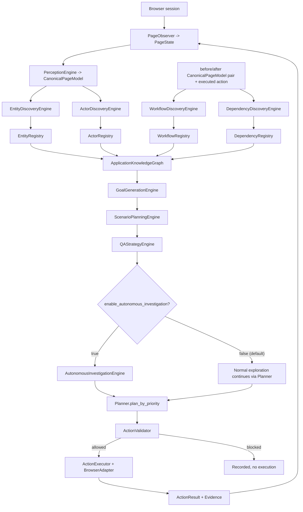
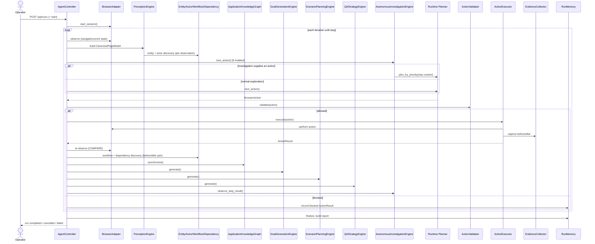
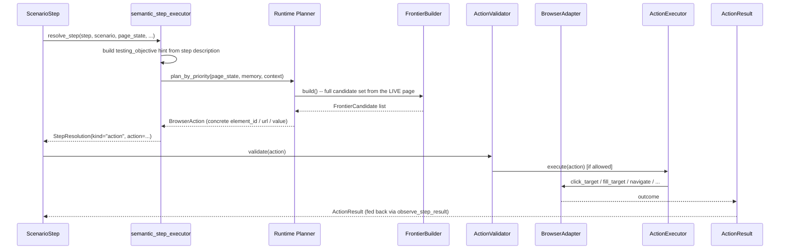
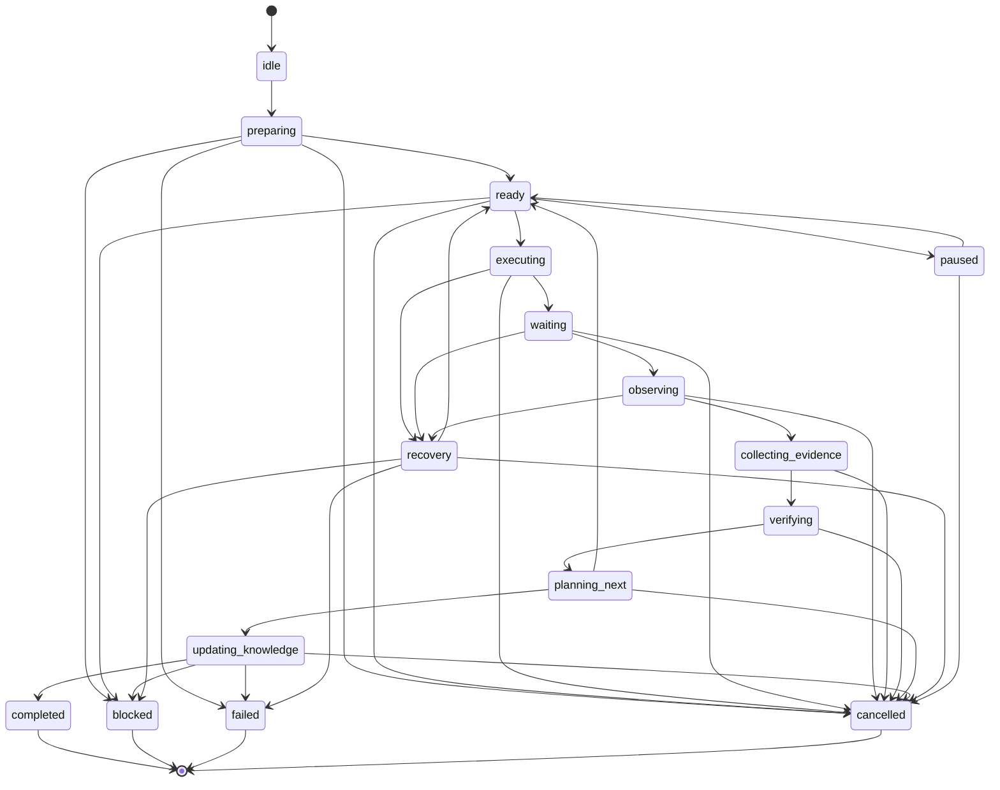

# GemmaQA Module and Engine Communication Flow

**Status:** Authoritative communication/pipeline document. Derived from direct repository inspection.
**Verified baseline:** 1133 passed, 1 skipped, 0 failed.

---

## 1. Component catalogue

| Component | Purpose | Input | Output | Called by | Calls | Browser access | State mutation | Failure behavior | Source path |
|---|---|---|---|---|---|---|---|---|---|
| `PageObserver` | Build structured `PageState` | live `Page`/adapter | `PageState` | `AgentController._observe` | `BrowserAdapter`, `ConsoleMonitor`, `NetworkMonitor`, `fingerprint_page_state` | Read | No | Retries once on transient context-destroyed error | `app/browser/observer.py` |
| `PerceptionEngine` | Build `CanonicalPageModel` | `PageState`/`Page` | `CanonicalPageModel` | `_run_perception_engine` | optionally `GemmaProvider` (visual only) | Read | No | Caught, logged, continues with `PageState` only | `app/perception/engine.py` |
| `EntityDiscoveryEngine` | Discover entities | `CanonicalPageModel` | `EntityRegistry` update | `_run_perception_engine` | none | No | No | Caught, logged | `app/intelligence/entity_discovery/` |
| `ActorDiscoveryEngine` | Discover actors | `CanonicalPageModel` | `ActorRegistry` update | `_run_perception_engine` | none | No | No | Caught, logged | `app/intelligence/actor_discovery/` |
| `WorkflowDiscoveryEngine` | Discover workflows | before/after `CanonicalPageModel` + action | `WorkflowRegistry` update | `_run_workflow_engine` | none | No | No | Caught, logged | `app/intelligence/workflow_discovery/` |
| `DependencyDiscoveryEngine` | Discover dependencies | before/after `CanonicalPageModel` + 3 registries | `DependencyRegistry` update | `_run_dependency_engine` | none | No | No | Caught, logged | `app/intelligence/dependency_discovery/` |
| `ApplicationKnowledgeGraph` | Unify registries into a graph | 4 registries | graph nodes/edges | `_run_knowledge_graph_sync` | none | No | No | Caught, logged | `app/intelligence/knowledge_graph/` |
| `GoalGenerationEngine` | Generate investigation goals | graph | `InvestigationGoal`s | `_run_goal_generation` | none | No | No | Caught, logged | `app/intelligence/goal_generation/` |
| `ScenarioPlanningEngine` | Plan semantic scenarios | goals + graph | `InvestigationScenario`s | `_run_scenario_planning` | none | No | No | Caught, logged | `app/intelligence/scenario_planning/` |
| `QAStrategyEngine` | Rank/queue/batch scenarios | scenarios + goals + graph | `StrategyResult` | `_run_qa_strategy` | none | No | No | Caught, logged | `app/intelligence/qa_strategy/` |
| `AutonomousInvestigationEngine` | Select + drive one investigation | strategy + scenarios + graph | `InvestigationResult` | controller PLAN phase + post-action hook | `Planner.plan_by_priority` | Indirect (via Planner) | Indirect (via validated action) | Caught, logged; per-step recovery internally | `app/intelligence/autonomous_investigation/` |
| `Planner` | Select next `BrowserAction` | `PageState`, `RunMemory`, context | `BrowserAction` | controller PLAN phase, `AutonomousInvestigationEngine` | `FrontierBuilder`, `PriorityEngine`, `AuthenticationStrategy`, optionally `GemmaProvider` | No | No | Falls back to deterministic path | `app/agent/planner.py` |
| `ActionValidator` | Safety-gate one action | `BrowserAction`, `PageState`, counters | `ValidationResult` | controller, before every execution | `action_levels`, `policies`, `sensitive`, `url_guard` | No | No | Returns `allowed=False`, never raises | `app/safety/validator.py` |
| `ActionExecutor` | Execute a validated action | `BrowserAction` | `ActionResult` | controller, after validation | `BrowserAdapter` | Yes | Yes | Returns `success=False`, never raises | `app/browser/executor.py` |
| `BrowserAdapter` (impl.) | Talk to a real browser | adapter method calls | raw browser state | `ActionExecutor`, `PageObserver`, `PerceptionEngine` | Playwright/MCP transport | Yes | Yes | Raises on unrecoverable connection failure (MCP: no silent fallback) | `app/browser/adapters/` |
| `EvidenceCollector` | Capture screenshots/metadata | action context | `EvidenceItem`s | `ActionExecutor`, controller | `BrowserAdapter` (for screenshots) | Read (screenshot) | Writes to disk | Falls back to placeholder note | `app/browser/evidence.py` |
| `RunMemory` | Authoritative run state | every engine's output | queryable state | everything | nothing (pure store) | No | Is the state | N/A (plain dataclass) | `app/agent/memory.py` |

---

## 2. Complete pipeline



This single loop is the entire system. Every reasoning-engine box (D1–D4, G, H, I, J, L) runs as a **non-fatal hook** — its failure never breaks the P→R→B execution cycle.

---

## 3. Controller orchestration sequence



---

## 4. Observation pipeline

```
Browser state (Playwright/MCP)
    → PageObserver.observe()/observe_adapter()      [PageState: headings, elements, forms, tables, console/network]
    → fingerprint_page_state()                       [de-noised SHA-256 fingerprint]
    → PerceptionEngine.observe()/observe_adapter()    [CanonicalPageModel: regions, nav, forms, tables, images, dialogs]
    → (optional) VisualObservationPolicy → VisualAnalyzer   [VisualEvidence, gated, bounded, non-blocking]
    → RunMemory.canonical_page_model / page_fingerprints    [stored for this iteration]
```

Every step above is read-only. No mutation, no browser action, occurs anywhere in this pipeline.

---

## 5. Discovery-engine communication

| Engine | Inputs | Outputs | Runs on |
|---|---|---|---|
| Entity Discovery | one `CanonicalPageModel` | `EntityRecord` (candidate/confirmed/incomplete/stale) | every observation |
| Actor Discovery | one `CanonicalPageModel` + `authenticated`/`login_method` + `EntityRegistry` | `ActorRecord` (candidate/unverified/confirmed/incomplete/stale) | every observation, right after entity discovery |
| Workflow Discovery | before/after `CanonicalPageModel` pair + executed action + `EntityRegistry`/`ActorRegistry` | `WorkflowDescriptor` (candidate/partial/confirmed/contradicted/stale) | every executed action |
| Dependency Discovery | before/after `CanonicalPageModel` pair + executed action + all three prior registries | `DependencyDescriptor` (observed/partially_observed/inferred/candidate/verified/contradicted/blocked/stale) | every executed action, right after workflow discovery |

**Reconciliation across engines:** later engines consume earlier engines' registries as read-only context (Actor reads Entity; Workflow reads Entity+Actor; Dependency reads Entity+Actor+Workflow) — there is no cyclic dependency and no engine writes to another engine's registry.

**Contradictions and confidence:** each engine handles contradiction/confidence independently, at its own layer:
- Entity/Actor: a term seen from only one evidence source stays `candidate`/`unverified`; promotion requires `MIN_DISTINCT_SOURCES_CONFIRMED` (2) independent sources and `CONFIRMED_MIN_CONFIDENCE` (0.4).
- Workflow: `STEP_STATUSES` never collapses `inferred` into `observed`; a `contradicted` workflow status is a first-class outcome, not silently overwritten.
- Dependency: `DependencyCorrelator` is the only path to `verified`; `DependencyContradiction` records are kept rather than resolved by guessing.
- These four independent confidence models are only unified once, downstream, by the Knowledge Graph's own consistency checker (Section 6) — no discovery engine reconciles another engine's contradictions itself.

---

## 6. Knowledge Graph communication

```
Entity/Actor/Workflow/Dependency registries
    → GraphSynchronizer.synchronize()      [projects registry records into nodes/edges]
    → GraphInferenceEngine.run_all()        [bounded inference rules over the fresh graph]
    → GraphConsistencyChecker.check_all()   [flags contradictions as GraphConsistencyIssue]
    → GraphGapAnalyzer.analyze()             [flags suspected-but-unconfirmed structure as GraphGap]
    → KnowledgeGraphMemory.end_pass()        [graph_version increments only if something changed]
    → GraphContextProjector / GraphQueryEngine   [downstream read API for every later engine]
```

All four sub-steps run inside **one** `synchronize()` call, wrapped by a single `begin_pass()`/`end_pass()` bracket — `graph_version` bumps at most once per controller iteration, never once per sub-step.

---

## 7. Goal Generation communication

```
ApplicationKnowledgeGraph (current statistics + queryable context)
    → goal candidate creation (per gap/node/edge pattern the graph currently exposes)
    → goal_priority.py: weighted-sum + penalty scoring (business_value, risk, coverage, ...)
    → goal_deduplicator.py: merge/dedupe by semantic signature
    → goal_grouping.py: group related goals (shared entity/actor/workflow)
    → GoalMemory: idempotent upsert (begin_pass/end_pass, content-diff)
    → GoalQueryEngine: downstream read API
    → Scenario Planning consumes goal_engine.query_engine.all_goals() next
```

---

## 8. Scenario Planning communication

```
InvestigationGoal (one at a time)
    → goal validation + bounded graph-context loading (GoalValidation)
    → scenario_template_registry.py: goal_type → scenario template
    → requirement resolution: actor / permission / entity / state / workflow / output / data
        (resolved by looking the term up in the KNOWLEDGE GRAPH, never the raw registries directly)
    → scenario_step_builder.py: semantic step decomposition (never a selector)
    → scenario_evidence_planner.py / scenario_comparison_planner.py: evidence + before/after comparison planning
    → scenario_branch_builder.py: branch discovery
    → scenario_feasibility_analyzer.py + scenario_risk_analyzer.py: feasibility + risk/cleanup/rollback
    → scenario_dependency_resolver.py / scenario_conflict_detector.py / scenario_gap_analyzer.py
    → scenario_deduplicator.py: dedupe by semantic signature
    → scenario_scoring.py: complexity + priority scoring
    → ScenarioMemory: idempotent upsert
    → ScenarioQueryEngine: downstream read API
    → QA Strategy consumes scenario_engine.query_engine.all_scenarios() next
```

---

## 9. QA Strategy communication

```
InvestigationScenario (all current scenarios)
    → strategy_candidate_builder.py: one ExecutionCandidate per scenario
        (derives 12 priority signals from goal + scenario + graph context)
    → strategy_dependency_graph.py: projects Scenario Planning's OWN dependency/conflict records
        (never rediscovers dependency structure)
    → strategy_candidate_builder.refine_actions(): cross-candidate redundancy + dependency-aware defer/block
    → strategy_queue_builder.py: first-match-wins assignment into 10 named queues
    → strategy_batch_builder.py: most-specific-dimension batching
    → strategy_forecaster.py: heuristic coverage/confidence/risk forecasts
    → strategy_recommendation_builder.py: one explainable recommendation per candidate
    → StrategyMemory: idempotent upsert
    → StrategyQueryEngine: downstream read API (ready(), next_execution(), etc.)
    → Autonomous Investigation consumes strategy_engine.query_engine.ready() next (if enabled)
```

---

## 10. Autonomous Investigation communication

```
ExecutionCandidate (from strategy_engine.query_engine.ready())
    → scenario lookup (scenario_engine.query_engine.scenario_by_id)
    → investigation_safety_gate.check_safety()         [reject if prohibited/blocked]
    → precondition_validator.check_preconditions()      [re-check against Knowledge Graph]
    → ActiveInvestigation created (state=ready)
    → semantic_step_executor.resolve_step() per step:
        - browser-driving  → Planner.plan_by_priority()  → BrowserAction returned to controller
        - observation-only → evaluated instantly from already-observed state
        - unresolvable     → deferred (bounded retry) or scenario blocked
    → [controller executes the returned action through the UNCHANGED Safety/Executor/Evidence pipeline]
    → observe_step_result(): advance step index, or classify+recover from failure
    → on scenario completion: assertion_verifier.summarize() → VerificationResult
    → evidence_bundle_builder.build_evidence_bundle()
    → coverage_confidence_updater.py: before/after graph+scenario statistics diff
    → knowledge_feedback.py: re-invoke GoalGenerationEngine.generate(), diff goal ids → NextGoals
    → InvestigationMemory.store_result()
    → back to strategy_engine.query_engine.ready() for the next candidate
```

---

## 11. Semantic-step-to-browser-action flow

**Why `ScenarioStep` has no selector:** Scenario Planning operates purely on the Knowledge Graph's semantic references (`entity_ids`, `workflow_id`, `permission_id`) — it has no live `PageState` to derive a selector from, and inventing one at planning time would immediately go stale the moment the real page differs even slightly. Concrete targeting is therefore always deferred to execution time, when a real, current `PageState` is actually available.



---

## 12. Post-action communication flow

```
ActionResult (from ActionExecutor)
    → COMPARE: re-observe (PageObserver + PerceptionEngine) → after CanonicalPageModel
    → _run_workflow_engine(before_model, action, result)     → WorkflowRegistry updated
    → _run_dependency_engine(before_model, action, result)    → DependencyRegistry updated
    → _run_knowledge_graph_sync()                              → graph re-synchronized
    → _run_goal_generation()                                    → goals re-generated
    → _run_scenario_planning()                                   → scenarios re-generated
    → _run_qa_strategy()                                          → strategy re-generated
    → _run_autonomous_investigation(before_state, after_state, action, result)  → investigation reconciled [if enabled]
```

Coverage and confidence updates (for an in-flight investigation) and follow-up goal generation happen as part of the LAST step above, only at investigation finalization — not every single action, since they require a stable before/after comparison spanning the whole investigation, not just one step.

---

## 13. Memory communication

| Engine | What it stores in `RunMemory` | How downstream code queries it |
|---|---|---|
| Entity/Actor/Workflow/Dependency Discovery | `entity_registry`, `actor_registry`, `workflow_registry`, `dependency_registry` | Directly by later discovery engines; by Knowledge Graph's `synchronize()`; by Autonomous Investigation's precondition validator |
| Knowledge Graph | `knowledge_graph` | By Goal Generation, Scenario Planning (requirement resolution), Autonomous Investigation (precondition re-check, before/after statistics) |
| Goal Generation | `goal_engine` | By Scenario Planning (`all_goals()`), by `RunMemory`'s own goal-query passthroughs, by Autonomous Investigation's `knowledge_feedback.py` |
| Scenario Planning | `scenario_engine` | By QA Strategy (`all_scenarios()`), by Autonomous Investigation (`scenario_by_id()`) |
| QA Strategy | `strategy_engine` | By Autonomous Investigation (`ready()`, `next_execution()`) |
| Autonomous Investigation | `investigation_engine` | By `RunMemory`'s own investigation-query passthroughs (API-facing); by nothing else internally (it is the terminal consumer of this chain) |

Every passthrough method on `RunMemory` degrades to `None`/`[]` if the corresponding engine field is `None` — confirmed for every engine, so no caller needs its own guard clause.

---

## 14. Failure communication

| Failure origin | Propagation | Recovery | Stored status | Effect on loop |
|---|---|---|---|---|
| Perception failure | Caught in `_run_perception_engine` | None needed — `PageState` alone still usable | Warning logged | Loop continues normally |
| Discovery engine failure (any of 4) | Caught in its own `try/except` | None needed | Warning logged | Loop continues; other 3 discovery engines unaffected |
| Graph sync failure | Caught in `_run_knowledge_graph_sync` | None needed | Warning logged | Downstream engines simply see the previous graph version |
| Goal generation failure | Caught in `_run_goal_generation` | None needed | Warning logged | Scenario Planning sees the previous goal set |
| Scenario planning failure | Caught in `_run_scenario_planning` | None needed | Warning logged | QA Strategy sees the previous scenario set |
| Strategy failure | Caught in `_run_qa_strategy` | None needed | Warning logged | Autonomous Investigation sees the previous strategy (or none) |
| Precondition failure (blocking) | Returned synchronously from `check_preconditions` | None — scenario immediately recorded `blocked` | `InvestigationResult(outcome="blocked")` | Candidate marked investigated, never retried |
| Precondition failure (deferred) | Returned synchronously | Retried on a later `next_action()` call, once satisfied | Not yet stored | Scan moves to the next ready candidate this call |
| Safety rejection (scenario-level) | Returned from `investigation_safety_gate.check_safety` | None — immediate block | `InvestigationResult(outcome="blocked")` | Candidate marked investigated |
| Safety rejection (action-level) | Returned from `ActionValidator.validate` | None — action never executes | Blocked `ActionResult` recorded | Loop continues to next PLAN iteration |
| Planner failure ("FINISH" / no viable candidate) | `StepResolution(kind="skip")` | Bounded defer-retry, then block/abort | Blocker appended | Step retried next call, or scenario finalized |
| Action execution failure | `ActionResult(success=False)` | Classified by `recovery.py`; bounded retry or skip/abort | `ExecutionTrace.recovery_action` recorded | Step retried, skipped, or scenario finalized `failed` |
| Timeout | Same as action execution failure | Bounded retry (`retry`/`retry_with_backoff`) | Same | Same |
| Assertion contradiction | `AssertionResult(outcome="contradicted")` | None — this is a genuine, valid finding | `VerificationResult.overall_outcome="contradicted"` | Investigation finalizes `outcome="failed"` |
| Inconclusive evidence | `AssertionResult(outcome="inconclusive")` | None — honest, not an error | `VerificationResult.overall_outcome` reflects it | Investigation still finalizes normally (typically `completed`) |
| Repeated failure (3+ consecutive) | `InvestigationMemory.consecutive_failures` | None — this IS the stop signal | N/A | `stop_reason()` returns `repeated_failures`; no new investigation starts |
| Exhausted queue | `stop_reason() == "no_executable_scenarios"` | None — clean stop | N/A | No new investigation starts; run's own stop policy proceeds independently |

---

## 15. State machine

`InvestigationStateMachine` (`app/intelligence/autonomous_investigation/state_machine.py`) — the exact implemented 16 states:



`transition()` returns `False` (never raises) for any edge not shown above; `completed`/`blocked`/`failed`/`cancelled` have no outgoing transitions (terminal).

---

## 16. Configuration-controlled communication

| Flow | Condition | Default |
|---|---|---|
| Autonomous Investigation's PLAN-phase hook and post-action hook | `RunConfiguration.enable_autonomous_investigation` | **Off** — hooks are simply never called; `investigation_engine` stays `None` |
| Visual perception layer (`VisualAnalyzer` call) | `Settings.gemma_supports_images` (or legacy `gemma_supports_vision`) | Off |
| Presentation-mode scripted flow (bypasses normal Planner/frontier entirely) | `RunConfiguration.presentation_mode` | Off |
| Safe test-data write candidates / `GenericFormWorkflow` | `RunConfiguration.allow_safe_test_data_creation` | Off |
| Authentication-write / registration candidates | `RunConfiguration.allow_login` / `allow_test_account_creation` | On (both) |
| Structured exploration trace event emission | `GEMMAQA_EXPLORATION_TRACE` env var | Off |
| MCP vs. direct Playwright browser communication | `Settings.browser_adapter` | `direct_playwright` |

---

## 17. End-to-end example

Using the same generic, application-neutral example as `HOW_GEMMAQA_WORKS.md` Section 13 (an item moving from State A to State B, with a dashboard count that may depend on it), walked through every module in communication terms:

1. **PageObserver/PerceptionEngine** observe the dashboard page → `CanonicalPageModel` includes the count as a candidate output region.
2. **EntityDiscoveryEngine** notices the item type as a candidate entity from repeated nav/heading text.
3. **ActorDiscoveryEngine** notices the actor role capable of changing the item's state.
4. **WorkflowDiscoveryEngine**, after a real state-changing action is executed elsewhere in the run, reconstructs the transition as an `observed` `WorkflowStep`.
5. **DependencyDiscoveryEngine**, from the same before/after pair, forms an unverified hypothesis connecting the count to the transition.
6. **ApplicationKnowledgeGraph** synchronizes all four registries; the entity, actor, workflow, and dependency now exist as connected nodes/edges.
7. **GoalGenerationEngine** sees the dependency is still unverified and creates a goal.
8. **ScenarioPlanningEngine** turns the goal into a semantic scenario: observe count → perform transition → observe count → compare.
9. **QAStrategyEngine** scores and queues the scenario (likely `read_only`-adjacent for the observation steps, `moderate` for the transition step).
10. **AutonomousInvestigationEngine** (if enabled) selects it, validates preconditions/safety, and steps through it — the transition step goes through `semantic_step_executor` → `Planner.plan_by_priority` → `ActionValidator` → `ActionExecutor` → `BrowserAdapter`; the observe/compare steps resolve instantly from already-captured `PageState`.
11. **assertion_verifier** reports `supported`/`contradicted`/`inconclusive` based on the actual before/after text comparison.
12. **coverage_confidence_updater** and **knowledge_feedback** close the loop: statistics diffed, `GoalGenerationEngine.generate()` re-invoked, new goal ids reported.
13. **InvestigationMemory** stores the result; the next `next_action()` call picks a different, not-yet-investigated candidate.

---

## 18. Communication invariants

Each verified directly against the current codebase (not assumed):

| Invariant | Verification |
|---|---|
| Scenario Planning never calls BrowserAdapter. | Zero `BrowserAdapter`/`ActionExecutor`/Playwright imports in `app/intelligence/scenario_planning/` (confirmed by search). |
| QA Strategy never executes scenarios. | Zero such imports in `app/intelligence/qa_strategy/`; package docstring states this explicitly. |
| Autonomous Investigation never issues raw Playwright calls. | Zero such imports in `app/intelligence/autonomous_investigation/`; every browser-driving step delegates to `Planner.plan_by_priority`. |
| Safety Validator is never bypassed. | Exactly one `ActionExecutor.execute()` call site in the entire backend (`controller.py`), reached only after `ActionValidator.validate()` returns `allowed=True` and only using the validator's own (possibly sanitized) action object. |
| RunMemory is authoritative for run state. | Every engine attaches to it; the report builder, API layer, and Planner all read through it rather than maintaining parallel state. |
| Evidence is referenced rather than fabricated. | `EvidenceBundle`/`EvidenceItem` store UUID + disk path, never an inline synthesized payload; `assertion_verifier` returns `inconclusive` rather than inventing a result when no real signal exists. |
| Failed intelligence hooks do not necessarily terminate the browser loop. | All seven `_run_*` hooks wrapped in their own `try/except Exception as exc: logger.warning(...)`. |
| Stable identities prevent duplicate objects. | Deterministic id derivation (`f"candidate:{scenario_id}"`, `f"investigation:{candidate_id}:{attempt}"`, etc.) across every reasoning engine after the Goal Generation milestone's random-id fix. |
| Completed candidates are not re-executed. | `InvestigationMemory.investigated_candidate_ids`, checked in `_try_start_next()`; live-verified zero duplicates across two real runs (SauceDemo, ServiceFlow). |
