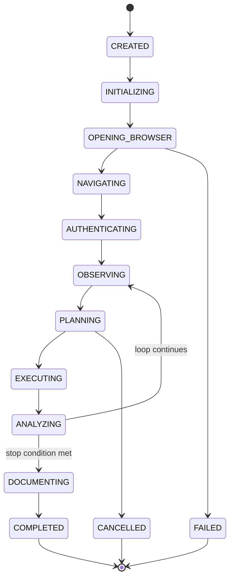
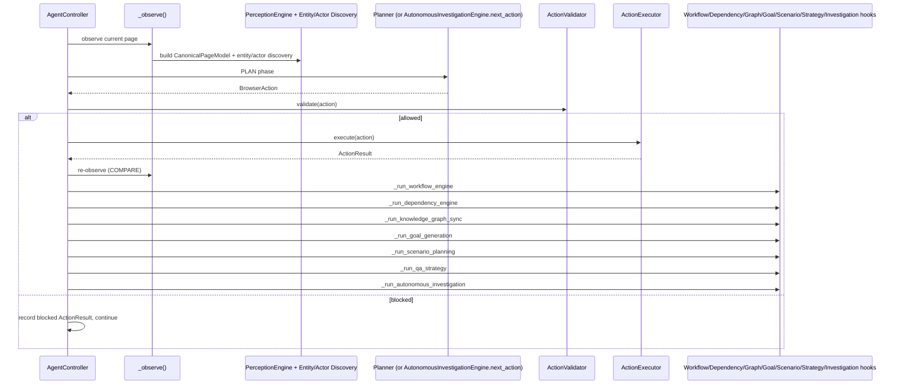

# GemmaQA Technical System Documentation

**Status:** Deepest implementation-oriented document in this suite. Derived from direct repository inspection, not prior summaries.
**Verified baseline:** 1133 passed, 1 skipped, 0 failed (rerun during this audit).

---

## 1. Repository map

```
gemmaqa/
├── backend/                     Python/FastAPI backend (this document's primary subject)
│   ├── app/
│   │   ├── agent/                Controller, planner, memory, auth, frontier, priority, tester, forms, presentation, etc.
│   │   ├── api/                  FastAPI routers (runs, reports, websocket, ai, health, presentation)
│   │   ├── application/          Legacy exploration data model + coverage computation + gap feedback
│   │   ├── browser/               BrowserAdapter contract + implementations, ActionExecutor, evidence, observer, monitors
│   │   ├── gemma/                 GemmaProvider abstraction + mock/openai_compatible/transformers implementations
│   │   ├── intelligence/          The ten reasoning/discovery engines (see Section 5)
│   │   ├── perception/            Universal Page Perception Engine
│   │   ├── reporting/             ReportBuilder, exporters, Mermaid diagram builder
│   │   ├── safety/                ActionValidator, policies, sensitive-pattern matching, url_guard, audit
│   │   ├── utils/                 ids, sanitization, structured tracing (exploration_trace, auth_trace)
│   │   ├── config.py               Settings (env-var backed)
│   │   ├── database.py             Async SQLAlchemy engine/session setup
│   │   ├── main.py                  FastAPI app entry point
│   │   ├── models.py                SQLAlchemy ORM tables
│   │   └── schemas.py                Core Pydantic schemas (ActionType, RunConfiguration, PageState, etc.)
│   └── scripts/                   Live-capture/verification harnesses + dev utilities
├── docs/                          Per-engine documentation (pre-existing)
│   └── system/                    This documentation suite
├── evidence/                      Live-run capture outputs (JSON) + per-run screenshots/traces
├── frontend/                      React/TypeScript UI (not covered in depth here)
├── tests/                         38 top-level test files (~1133 collected tests)
└── pytest.ini                     Test configuration (asyncio_mode=auto)
```

---

## 2. Technology stack

Derived directly from code, not assumed:

- **Language/runtime:** Python (backend), TypeScript/React (frontend).
- **Web framework:** FastAPI (`app/main.py`, `app/api/*`).
- **ORM/database:** SQLAlchemy 2.0 async (`create_async_engine`, `async_sessionmaker`), SQLite by default (`sqlite+aiosqlite:///./gemmaqa.db`); no Alembic — lightweight hand-rolled column/index migrations in `database.py`.
- **Browser automation:** Playwright (`playwright.async_api`), either in-process (`DirectPlaywrightAdapter`) or via the Playwright MCP protocol (`PlaywrightMCPAdapter`, stdio or HTTP transport).
- **Schema/validation:** Pydantic (`BaseModel`, `field_validator`) throughout every reasoning engine and core schema.
- **Testing:** pytest 8.3+ (`tests/requirements.txt`), `pytest-asyncio` mode `auto` (`pytest.ini`).
- **LLM integration:** a provider-abstraction layer (`GemmaProvider`) supporting a deterministic `mock` provider (default), an `openai_compatible` HTTP client (Ollama/LM Studio/vLLM/hosted APIs), and a `transformers`-based local-weights provider.
- **Image processing:** Pillow (`app/perception/screenshot_utils.py`, bounding-box cropping only — no image-generation dependency).
- **Default test target:** `https://thinking-tester-contact-list.herokuapp.com/` (configurable per run).

---

## 3. Runtime entry points

| Entry point | Path | Purpose |
|---|---|---|
| FastAPI app | `backend/app/main.py` | Registers all routers, CORS, exception handlers; serves `GET /`, `GET /health`. |
| Run creation | `POST /api/runs` (`app/api/runs.py`) | The primary way a run begins. |
| Controller | `backend/app/agent/controller.py` (`AgentController.run()`) | The actual orchestration loop, spawned as an `asyncio.create_task` by `RunManager.start_run()`. |
| Test suite | `tests/` (run via `pytest` from repo root; `pytest.ini` at root) | 38 files, ~1133 collected tests. |
| Live-capture scripts | `backend/scripts/*_live_capture.py` | One per major reasoning engine — run a full `AgentController` against a real URL (LLM mocked) and write a JSON evidence file. |
| Dev utilities | `backend/scripts/observe_demo.py`, `run_autonomous_demo.py` | Ad-hoc manual exploration/demo tools, not formal verification harnesses. |
| WebSocket | `GET /ws/runs/{run_id}` (`app/api/websocket.py`) | Live event streaming with history replay + 20s heartbeat. |

---

## 4. Core domain schemas

### Perception
- **`CanonicalPageModel`** (`app/perception/models.py`) — the central structured representation of one observed page: `regions`, `navigation_regions`, `headings`, `forms`, `tables`, `images`, `dialogs`, `alerts`, `visual_regions`, `interactive_elements`, `unknown_components`, `visual_evidence`, `screenshot_reference`, `state_fingerprint`. Class methods `from_page_state()` (deterministic degrade from a plain `PageState`), `from_dict`/`from_json`.
- **`VisualEvidence`** — `element_id` (required), `visual_semantic_type`, `confidence: ConfidenceScore` (`basis` one of `direct_observation|heuristic|inferred|llm_hypothesis`).

### Discovery registries (Entity/Actor/Workflow/Dependency)
Each engine's central record shares a common shape: a canonical name, aliases, a clamped `[0,1]` confidence, a validated closed-vocabulary `status`, an evidence list with typed source kinds, and first/last-seen bookkeeping.

- **`EntityRecord`** (`app/intelligence/entity_discovery/schemas.py`) — `status ∈ {candidate, confirmed, incomplete, stale}`; `operations`, `known_states`, `relationships`.
- **`ActorRecord`** (`app/intelligence/actor_discovery/schemas.py`) — `status ∈ {candidate, unverified, confirmed, incomplete, stale}` (the `unverified` state is unique to actors — a named-but-not-yet-observed role); `known_permissions: list[PermissionCandidate]`, `session: Optional[ActorSession]`.
- **`WorkflowDescriptor`** (`app/intelligence/workflow_discovery/schemas.py`) — `status ∈ {candidate, partial, confirmed, contradicted, stale}`; `steps: list[WorkflowStep]` (each step's own `status` never collapses `inferred` into `observed`); `actors`, `entities`, `transitions`, `branches`, `outcomes`.
- **`DependencyDescriptor`** (`app/intelligence/dependency_discovery/schemas.py`) — `status ∈ {observed, partially_observed, inferred, candidate, verified, contradicted, blocked, stale}`; five separate confidence sub-scores (`relationship_confidence`, `formula_confidence`, `scope_confidence`, `effect_direction_confidence`, `verification_confidence`); `aggregation_rule`, `inclusion_rules`/`exclusion_rules`, `scope_dimensions`.

### Knowledge Graph
`app/intelligence/knowledge_graph/schemas.py` — `KnowledgeNode`/`KnowledgeEdge` (stable ids, `graph_version`, confidence, `stale` flag), `GraphStatistics` (node/edge counts by type, gap/contradiction/consistency-issue counts), `GraphVersion` (per-pass change summary).

### Goal Generation
`app/intelligence/goal_generation/schemas.py` — `InvestigationGoal` (goal_id, goal_type, priority_score, business_value, risk_score, coverage_value, confidence, required_actors/entities/workflows, `depends_on_goal_ids`, `goal_status`, `supporting_graph_nodes/edges`, `blocking_gaps`), `GoalStatistics`.

### Scenario Planning
`app/intelligence/scenario_planning/schemas.py` (30+ schemas) — `InvestigationScenario` (the durable record: requirements, `steps: list[ScenarioStep]`, `branches`, `checkpoints`, `assertions`, `comparisons`, `cleanup_plan`, `rollback_plan`, `risk_assessment`, `feasibility_assessment`, `dependencies`/`conflicts`/`gaps` as id references). `ScenarioStep` deliberately contains **only** semantic fields (`step_type`, `semantic_action`, `entity_ids`, `workflow_id`, `permission_id`, `source_state_id`/`target_state_id`, `safety_class`, `mutation_type`) — never a selector.

### QA Strategy
`app/intelligence/qa_strategy/schemas.py` — `ExecutionCandidate` (one per scenario; `priority_score`, `priority_breakdown`, `applied_penalties`, `recommended_action ∈ {execute, defer, block, skip}`, `queue_type` — one of 10 named queues, `batch_id`), `ExecutionQueue`, `ExecutionBatch`, `ExecutionDependency`, `ExecutionConflict`, `ExecutionForecast`, `ExecutionPolicy`, `StrategyResult`.

### Autonomous Investigation
`app/intelligence/autonomous_investigation/schemas.py` — `InvestigationResult` (outcome ∈ `{completed, blocked, failed, cancelled, paused}`), `ExecutionTrace`, `AssertionResult` (outcome ∈ `{supported, contradicted, inconclusive}`), `VerificationResult`, `EvidenceBundle`, `KnowledgeUpdates`/`CoverageUpdates`/`ConfidenceUpdates`/`NextGoals`, `ActiveInvestigation` (the one mutable in-flight record).

### Evidence, actions, results (`app/schemas.py`)
- **`BrowserAction`** — `action: ActionType`, `element_id`, `value`, `reason`, `expected_result`, `risk: RiskLevel`, `category: ActionCategory`, `url`, `key`, `wait_ms`, `metadata: dict`.
- **`ActionResult`** — `action_id`, `run_id`, `action`, `success`, `message`, `before_url`/`after_url`, `before_screenshot`/`after_screenshot`, `before_fingerprint`/`after_fingerprint`, `page_state_changed`, `new_console_errors`/`new_network_errors`, `evidence_ids`, `inspected`, `error`, `duration_ms`.
- **`PageState`** — `page_id`, `url`, `title`, `headings`, `visible_text_summary`, `interactive_elements`, `forms`, `tables`, `dialogs`/`modals`/`toasts`/`alerts`, `console_errors`/`network_failures`, `screenshot_path`, `state_fingerprint`, `classification`.

### Memory
`app/agent/memory.py` (`RunMemory`) — a large dataclass holding legacy exploration state (`goals`, `gaps`, `app_store`, `auth_strategy`, budgets) plus one `Any`-typed field per reasoning engine (`entity_registry`, `actor_registry`, `workflow_registry`, `dependency_registry`, `knowledge_graph`, `goal_engine`, `scenario_engine`, `strategy_engine`, `investigation_engine`).

---

## 5. Package-by-package technical description

### `backend/app/perception/`
- **Public classes:** `PerceptionEngine`.
- **Main functions:** `observe(page, *, screenshot_path, known_role, network_entries)`, `observe_adapter(adapter, page_state, *, known_role)`.
- **Inputs:** live Playwright `Page` or an adapter + `PageState`. **Outputs:** `CanonicalPageModel`.
- **Dependencies:** `dom_extractor.py` (the one in-page JS pass), 12 specialized extractor modules, optionally `GemmaProvider` for the visual layer.
- **Error handling:** perception failures are caught by the controller's own wrapper (`_run_perception_engine`); a visual-analysis failure is caught separately and never breaks the deterministic result.
- **Determinism:** the core extraction is fully deterministic; only the optional visual layer can vary run-to-run (bounded by `VisualObservationPolicy`, gated on/off).
- **Versioning:** none (one model per observation, not accumulated).
- **Tests:** `tests/test_perception_engine.py` (78), `tests/test_canonical_page_model.py` (41), `tests/test_visual_observation.py` (49).

### `backend/app/intelligence/entity_discovery/`, `actor_discovery/`, `workflow_discovery/`, `dependency_discovery/`
- **Public classes:** `EntityDiscoveryEngine`/`ActorDiscoveryEngine`/`WorkflowDiscoveryEngine`/`DependencyDiscoveryEngine` (each the sole orchestrator), plus their respective `*Registry` (the Planner-facing query surface).
- **Main functions:** each engine's `observe(...)` method (see Section 4 for exact signatures).
- **Inputs:** `CanonicalPageModel` (entity/actor: single observation; workflow/dependency: before/after pair + the executed action).
- **Outputs:** a change-summary dict; persistent updates to the engine's own registry.
- **Dependencies:** entity/actor consume only `CanonicalPageModel`; workflow additionally consumes entity/actor registries; dependency additionally consumes all three prior registries.
- **Error handling:** each wired via its own `try/except` in the controller — one engine's failure never blocks another.
- **Determinism strategy:** confidence computed from named `SOURCE_KIND_WEIGHTS` tables, never a model call; `MIN_DISTINCT_SOURCES_CONFIRMED`/`CONFIRMED_MIN_CONFIDENCE` thresholds are fixed constants.
- **Versioning strategy:** no explicit version counter at this layer — merging is continuous (`*Memory` classes merge findings into persistent records keyed by canonical/anchor identity across observations).
- **Tests:** `test_entity_discovery.py` (35), `test_actor_discovery.py` (48), `test_workflow_discovery.py` (50), `test_dependency_discovery.py` (72) — each containing an AST-walking application-neutrality contract test.

### `backend/app/intelligence/knowledge_graph/`
- **Public class:** `ApplicationKnowledgeGraph` (the sole cross-package entry point; internal collaborators — `GraphSynchronizer`, `GraphInferenceEngine`, `GraphConsistencyChecker`, `GraphGapAnalyzer`, `GraphQueryEngine`, `GraphContextProjector`, `GraphSerializer` — are private implementation detail).
- **Main function:** `synchronize(*, entity_registry, actor_registry, workflow_registry, dependency_registry, iteration)`.
- **Inputs:** the four registries. **Outputs:** an updated graph + `dict` summary (`graph_version`, `version_bumped`, inference/consistency counts, `gap_count`).
- **Error handling:** wrapped by `_run_knowledge_graph_sync` in the controller.
- **Determinism/versioning:** `begin_pass()`/`end_pass()` bracket the whole pipeline; `graph_version` increments at most once per call, only if something changed anywhere in sync/inference/consistency/gaps.
- **Tests:** `tests/test_knowledge_graph.py` (105 — the largest single test file in the repository).

### `backend/app/intelligence/goal_generation/`
- **Public class:** `GoalGenerationEngine`.
- **Main function:** `generate(graph, *, iteration)`.
- **Inputs:** `ApplicationKnowledgeGraph`. **Outputs:** `GoalGenerationResult`-equivalent (goals + statistics), stored in `GoalMemory`.
- **Determinism/versioning:** same `begin_pass()`/`end_pass()` idempotent pattern; priority scoring is a weighted-sum-plus-penalty model (never a raw multiplicative collapse of all signals).
- **Tests:** `tests/test_goal_generation.py` (53).

### `backend/app/intelligence/scenario_planning/`
- **Public class:** `ScenarioPlanningEngine`.
- **Main function:** `generate(goal_engine, graph, *, iteration)`.
- **Inputs:** `GoalGenerationEngine`, `ApplicationKnowledgeGraph`. **Outputs:** `ScenarioPlanningResult`, stored in `ScenarioMemory`.
- **Internal pipeline (per goal):** template selection → requirement resolution (actor/permission/entity/state/workflow/output/data) → step/checkpoint/evidence/comparison/branch decomposition → feasibility/risk/cleanup/rollback assessment → dependency/conflict/gap detection → deduplication → scoring.
- **Tests:** `tests/test_scenario_planning.py` (107 — the second-largest test file).

### `backend/app/intelligence/qa_strategy/`
- **Public class:** `QAStrategyEngine`.
- **Main function:** `generate(scenario_engine, goal_engine, graph, *, policy_id="balanced", weight_overrides=None)`.
- **Internal pipeline:** candidate building (per scenario) → queue assignment (10 named queues, first-match-wins priority order) → batch generation (most-specific-dimension grouping) → dependency/conflict projection (from Scenario Planning's own records, never rediscovered) → forecasting → recommendation building.
- **Tests:** `tests/test_qa_strategy.py` (34).

### `backend/app/intelligence/autonomous_investigation/`
- **Public class:** `AutonomousInvestigationEngine`.
- **Main functions:** `next_action(page_state, run_memory, context, *, planner)`, `observe_step_result(*, before_state, after_state, result, run_memory, action)`.
- **Internal collaborators:** `precondition_validator.py`, `investigation_safety_gate.py`, `semantic_step_executor.py`, `recovery.py`, `assertion_verifier.py`, `evidence_bundle_builder.py`, `knowledge_feedback.py`, `coverage_confidence_updater.py`, `investigation_memory.py`, `investigation_query_engine.py`, `state_machine.py`.
- **Tests:** `tests/test_autonomous_investigation.py` (48).

---

## 6. Controller lifecycle

`AgentController` (`backend/app/agent/controller.py`) drives the whole run via `run()`. High-level state flow (`AgentPhase`, `backend/app/agent/state_machine.py`):



Per-iteration sequence (simplified; exact method names from `controller.py`):



Every box under "Post" is wrapped in its own `try/except Exception as exc: logger.warning(...)` — confirmed directly in `controller.py` for all seven hooks — so a failure in, say, dependency discovery never prevents the knowledge graph sync (or the browser loop) from continuing.

---

## 7. Planner integration

- **Frontier creation:** `FrontierBuilder(auth).build(page_state, ...)` is the single generator of every candidate (auth, safe-write, form/table inspection, navigation, images, dialogs, unknown components, candidate URLs) — nothing downstream derives a competing candidate set.
- **Plan selection:** `PriorityEngine.build_decision(candidates, *, memory, page, active_goal)` scores every candidate via 11 positive + 10 negative named weight factors and returns an ordered `PriorityDecision`.
- **Semantic objective hints:** when called by the Autonomous Investigation Engine, the `context` dict passed to `Planner.plan_by_priority()` includes `testing_objective`, a short string built from the current scenario's title and step description — the only "hint" the Planner receives; it never receives a target element id or selector.
- **Priority planning:** `plan_by_priority()` is the fully deterministic fallback used both when the LLM path is unavailable/repeats, and as the entire decision path when the Autonomous Investigation Engine calls it.
- **Fallback behavior:** an LLM-proposed action that repeats a signature already seen, or fails too often for its target element, is replaced by the deterministic `plan_by_priority()` result.
- **How Autonomous Investigation reuses the Planner:** `semantic_step_executor.resolve_step()` calls `planner.plan_by_priority(page_state, memory, step_context)` directly for every browser-driving step type — confirmed as the *only* way this package ever causes a browser action, with zero `BrowserAdapter`/`ActionExecutor`/Playwright imports anywhere in `app/intelligence/autonomous_investigation/`.

---

## 8. Browser architecture

- **`BrowserAdapter` contract** (`app/browser/adapters/base.py`, an `ABC`): `start_session`, `close_session`, `navigate`, `go_back`, `reload`, `click_target`, `fill_target`, `select_target`, `check_target`, `hover_target`, `press_target`, `take_screenshot`, `get_current_url`, `get_page_title`, `get_accessibility_snapshot`, `get_observation_payload`, `get_console_events`, `get_network_events`, `wait_for_page_stable`, `wait`, `element_exists`, `resolve_target`, `list_tabs`, `switch_tab`, `health_check` — all abstract. `submit_target` and `capabilities()` have concrete defaults.
- **Concrete implementations:**
  - `DirectPlaywrightAdapter` (`name="direct_playwright"`) — in-process Chromium via `BrowserManager`; `capabilities()` only overrides `tabs=True` (everything else at base defaults, i.e. fully capable).
  - `PlaywrightMCPAdapter` (`name="playwright_mcp"`) — Playwright MCP protocol (stdio or HTTP transport via `McpTransport`/`StdioMcpTransport`/`HttpMcpTransport`); `capabilities()` explicitly disables `console_events`/`network_events` by default; refuses silent fallback to Direct Playwright on connection failure.
- **Action execution:** `ActionExecutor.execute()` dispatches to `_execute_via_adapter()` (preferred, works without a native `Page`) or `_execute_via_page()` (legacy, requires a real Playwright `Page`). The `ACTION_CAPABILITY` map gates each `ActionType` against the active adapter's declared capabilities before attempting it.
- **Observation:** `PageObserver.observe`/`observe_adapter` build a `PageState` via `build_page_state()`, capping list sizes (`MAX_HEADINGS=20`, `MAX_FORMS=10`, `MAX_TABLES=8`, etc.) and normalizing interactive elements.
- **Screenshots:** `EvidenceCollector` captures before/after screenshots per action (masking password field contents first), enforces a screenshot budget (writes a placeholder note instead of failing once exceeded).
- **Network information:** `NetworkMonitor` tracks only failed/4xx/5xx responses (capped at 200 entries), redacting sensitive query parameters (tokens, keys, secrets, passwords, auth, cookies, JWTs) via `sanitize_network_url`.
- **Error handling:** every executor action is wrapped in a per-action try/except returning `ActionResult(success=False, error=str(exc))` rather than raising; `BrowserManager.stop()` tears down tracing/context/browser/Playwright each in its own try/except so one failure never blocks the rest of cleanup.

---

## 9. Safety architecture

- **Scenario-level safety gate** (opt-in, Autonomous Investigation only): `investigation_safety_gate.check_safety()` rejects a scenario outright if `risk_class=="prohibited"`, `feasibility_status=="blocked"`, or any step's `safety_class=="prohibited"` — before any step is even attempted.
- **Action-level Safety Validator** (always active, every action, every mode): `ActionValidator.validate()` — see Section 8/9/11 of `GEMMAQA_ARCHITECTURE.md` for the full check order. Structurally guaranteed to run before `ActionExecutor.execute()` (single call site in the codebase).
- **Prohibited actions:** `PROHIBITED_INTENT_PATTERNS` (29 patterns) + `DEFAULT_SENSITIVE_PATTERNS` (23 patterns), matched against action reason/value/expected-result text and nearby form context.
- **Mutation policies:** `safe_mode` (default `True`) blocks all writes unless `allow_controlled_writes`/`allow_safe_test_data_creation` is set; approved safe writes have their fill value prefixed with `GemmaQA_TEST_` unless a `credential_ref` is present (never rewrites credential-looking values).
- **Retry restrictions:** `SafetyPolicy.max_retries` (default 3, exploration level); `MAX_RETRIES_PER_STEP=2` (Autonomous Investigation level) — both hard-bounded, never infinite.
- **Execution budgets:** `max_actions` (50), `max_pages` (20), `max_runtime_seconds` (900), `max_screenshots` (200) — all enforced inside `ActionValidator.validate()`.
- **Stop conditions:** `RunMemory.should_stop()` (run-level) and `AutonomousInvestigationEngine.stop_reason()` (investigation-level, independent) — see Section 9 of `GEMMAQA_ARCHITECTURE.md`.

---

## 10. Memory architecture

- **`RunMemory`** (`app/agent/memory.py`) is the single dataclass every engine attaches to. Each reasoning engine gets one `Any`-typed field (to avoid a `memory.py → intelligence` import dependency) plus a battery of query-passthrough methods that degrade to `None`/`[]` when the engine was never attached.
- **Engine state attachment:** performed once, in `AgentController.__init__` (e.g. `self.memory.knowledge_graph = ApplicationKnowledgeGraph()`), conditioned on `enable_autonomous_investigation` only for the investigation engine.
- **Snapshots:** `RunMemory.memory_snapshot()` aggregates a compact dict from every attached engine's own `statistics()`, wrapped in individual `try/except: pass` blocks so one engine's snapshot failure doesn't blank the others.
- **Query passthroughs:** each engine's dedicated query-engine object (`GoalQueryEngine`, `ScenarioQueryEngine`, `StrategyQueryEngine`, `InvestigationQueryEngine`, plus the four discovery registries) is the only thing `RunMemory`'s passthrough methods call — never independent logic.
- **Idempotency:** enforced at the *engine* level (`begin_pass()`/`end_pass()` + content-diff), not by `RunMemory` itself — `RunMemory` simply holds whatever the engine's own idempotent store produces.
- **Retention during a run:** entirely in-process; nothing is written to SQLite except legacy exploration data (see Section 13).
- **Serialisation boundaries:** `GraphSerializer`/`ScenarioSerializer`/report exporters convert engine memory to JSON at the API/report boundary; the reasoning engines' own internal memory objects are never serialized directly to the database.

---

## 11. Knowledge architecture

- **Registry-to-graph synchronization:** `ApplicationKnowledgeGraph.synchronize()` reads the four registries and produces/updates graph nodes and edges — a one-directional projection; the graph never writes back into a registry.
- **Nodes/edges:** each carries a stable id (deterministic, never a random UUID after the Goal Generation milestone's fix — see Section 2 of `GEMMAQA_ARCHITECTURE.md`), a `graph_version`, a confidence score, and a `stale` flag rather than deletion.
- **Confidence:** propagated from the originating registry record's own confidence, combined via the graph's own inference rules where applicable.
- **Provenance:** every node/edge traces back to `source_registry`/`source_record_id` (via `ScenarioProvenance`-equivalent structures at the graph layer).
- **Contradictions:** `GraphConsistencyChecker` records a `GraphConsistencyIssue` rather than silently picking one of two disagreeing facts.
- **Gaps:** `GraphGapAnalyzer` records a `GraphGap` for a suspected-but-unconfirmed structure.
- **Graph versions:** `GraphVersion` history entries record exactly what changed (`added_node_ids`, `updated_node_ids`, `stale_node_ids`, same for edges) per version bump.
- **Graph queries:** `GraphQueryEngine` (bounded traversal, node/edge lookup by type/canonical name) and `GraphContextProjector` (assembles a focused context dict for one node) are the only reader APIs; nothing outside the package walks `memory.nodes`/`memory.edges` directly.

---

## 12. Investigation architecture

- **Strategy candidate selection:** `_try_start_next()` scans `strategy_engine.query_engine.ready()` (bounded, `MAX_CANDIDATE_SCAN=5`), skipping candidates in `investigated_candidate_ids`/`blocked_candidate_ids`.
- **Investigated-candidate tracking:** `InvestigationMemory.investigated_candidate_ids`, populated on every terminal outcome (`completed`/`failed`/`blocked`) — this is the fix for a real duplicate-execution bug found during development (see Section 12 below and `docs/AUTONOMOUS_INVESTIGATION_ENGINE.md`).
- **State machine:** `InvestigationStateMachine` (`state_machine.py`) — 16 states, a fixed `ALLOWED_TRANSITIONS` allow-list; `transition()` returns `False` (never raises) on an invalid transition. See Section 15 of `MODULE_AND_ENGINE_COMMUNICATION_FLOW.md` for the full diagram.
- **Precondition validation:** `precondition_validator.check_preconditions()` re-checks against the **Knowledge Graph** (the same source Scenario Planning used at resolution time) rather than the raw registries' own stricter `known_*()` filters — a deliberate fix after the stricter check was found to falsely reject already-accepted scenarios.
- **Semantic step resolution:** `semantic_step_executor.resolve_step()` classifies each `ScenarioStep` into one of three resolution kinds: `action` (delegate to Planner or construct a direct WAIT/SCREENSHOT), `instant` (pure observation, evaluated immediately), or `skip` (unresolvable this attempt).
- **Action delegation:** exclusively `planner.plan_by_priority()` — see Section 7.
- **Evidence bundling:** `evidence_bundle_builder.build_evidence_bundle()` — reference aggregation only.
- **Assertion evaluation:** `assertion_verifier.py` — see Section 11 of `GEMMAQA_ARCHITECTURE.md`.
- **Recovery:** `recovery.py` — see Section 9 above.
- **Result storage:** `InvestigationMemory.store_result()` — append-only, keyed by deterministic `investigation_id = f"investigation:{candidate_id}:{attempt}"`.
- **Follow-up goal generation:** `knowledge_feedback.regenerate_goals()` + `build_next_goals()` — re-invokes `GoalGenerationEngine.generate()`, diffs goal-id sets; never fabricates a goal record.

---

## 13. Configuration reference

### `RunConfiguration` (`backend/app/schemas.py`) — every field, exact default

| Field | Type | Default | Purpose | Safety implication |
|---|---|---|---|---|
| `max_pages` | int | 20 | Page-visit budget | Enforced by `ActionValidator` |
| `max_actions` | int | 50 | Action budget | Enforced by `ActionValidator` |
| `max_runtime_seconds` | int | 900 | Wall-clock budget | Enforced by `ActionValidator` |
| `max_screenshots` | int | 200 | Screenshot budget | Enforced by `ActionValidator`/`EvidenceCollector` |
| `max_retries` | int | 3 | Per-action retry cap | Enforced by `ActionValidator` |
| `safe_mode` | bool | `True` | Blocks all writes unless explicitly allowed | Central write gate |
| `allow_controlled_writes` | bool | `False` | Permits general write actions when combined with `safe_mode=False` | Loosens write gate |
| `allow_login` | bool | `True` | Permits authentication-write actions (login) | Auth-specific write exception |
| `allow_test_account_creation` | bool | `True` | Permits registration-write actions | Auth-specific write exception |
| `allow_safe_test_data_creation` | bool | `False` | Permits prefixed (`GemmaQA_TEST_`) test-data writes | Narrow, marked write exception |
| `allow_destructive_actions` | bool | `False` | Governs `destructive_actions_disabled` derivation | Never loosens delete/destroy/purge/wipe blocking directly |
| `allow_financial_actions` | bool | `False` | Removes payment/purchase/checkout vocabulary from blocked patterns | Narrow, verified not to touch destructive patterns |
| `headless` | bool | `True` | Browser visibility | None |
| `allow_cross_domain` | bool | `False` | Widens URL scope check | Loosens scope enforcement |
| `allow_subdomains` | bool | `False` | Widens URL scope check to subdomains | Loosens scope enforcement |
| `login_url` | Optional[str] | `None` | Explicit login page override | None |
| `username_selector` | Optional[str] | `None` | Manual login selector override | None |
| `password_selector` | Optional[str] | `None` | Manual login selector override | None |
| `submit_selector` | Optional[str] | `None` | Manual login selector override | None |
| `wait_after_login_ms` | int | 2000 | Post-login settle delay | None |
| `presentation_mode` | bool | `False` | Enables the scripted demo orchestrator | Forces `safe_mode=False` when active |
| `enable_autonomous_investigation` | bool | **`False`** | Enables the Autonomous Investigation Engine | Adds an additional scenario-level safety gate on top of, never instead of, `ActionValidator` |

*(21 fields total, confirmed directly against `backend/app/schemas.py` in source order.)*

### `Settings` (`backend/app/config.py`) — selected fields (not exhaustive; full list in source)

| Field | Default | Purpose |
|---|---|---|
| `database_url` | `sqlite+aiosqlite:///./gemmaqa.db` | DB connection string |
| `gemma_provider` | `mock` | LLM provider selection (`mock`/`openai_compatible`/`transformers`) |
| `gemma_supports_images` | `False` | Enables the optional visual-perception layer |
| `browser_adapter` | `direct_playwright` | Browser execution mode (`direct_playwright`/`playwright_mcp`) |
| `playwright_headless` | `True` | Browser visibility default |
| `no_progress_limit` | 5 | Navigation/modal-loop detection threshold |
| `allow_local_targets` | `False` | Permits local/internal hosts as a test target |
| `require_https_credentials` | `True` | Requires HTTPS when credentials are supplied |

### `GEMMAQA_EXPLORATION_TRACE` / `GEMMAQA_AUTH_TRACE`
Read directly via `os.environ.get(...)` in `app/utils/exploration_trace.py`/`auth_trace.py` — **not** part of `Settings`/`RunConfiguration`. Truthy values: `1`, `true`, `yes`, `on` (case-insensitive). Default: unset (tracing off).

---

## 14. Logging and observability

- **Structured exploration trace** (`GEMMAQA_EXPLORATION_TRACE=1`): emits named events — `perception.observation`, `perception.visual_decision`, `iteration.plan`, `iteration.stop_policy`, `knowledge_graph.synchronization`, `goal_generation.*`, `scenario_planning.*`, `qa_strategy.generation`, `autonomous_investigation.started`/`immediate_outcome`/`finalized` — via `app/utils/exploration_trace.record()`.
- **Auth trace** (`GEMMAQA_AUTH_TRACE`): separate, narrower tracing specific to authentication-flow decisions.
- **Event store:** `EventStore` (`app/agent/events.py`) — per-run sequenced, redacted (`sanitize_dict`) event buffer, capped at 2000 entries, surfaced via `GET /api/runs/{id}/events` and the WebSocket endpoint.
- **Safety audit trail:** `safety_audit` (`app/safety/audit.py`) — every validation decision recorded (`SafetyAuditRecord`), capped at 2000 entries per run, secrets stripped via `sanitize_dict`.

---

## 15. Error and recovery model

| Failure class | Fatal or non-fatal | Retryable | Notes |
|---|---|---|---|
| Perception/discovery/graph/goal/scenario/strategy/investigation hook failure | Non-fatal | N/A | Caught per-hook, logged as a warning, loop continues |
| Safety rejection | Non-fatal (to the run) | N/A | Action never executes; recorded as a blocked `ActionResult` |
| Action execution failure (browser-level) | Non-fatal | Depends on failure class | `ActionResult(success=False, error=...)`; exploration-level retry via `PriorityEngine`'s `failed_attempt_penalty`; investigation-level retry via `recovery.decide_recovery()` |
| Timeout/network interruption/stale DOM (investigation) | Non-fatal | Yes, bounded (`MAX_RETRIES_PER_STEP=2`) | `recovery.py` |
| Session expiry (investigation) | Non-fatal | **No** — never retried by this engine | Re-authentication happens on a later attempt via `AuthenticationStrategy`, not reinvented |
| Blocked scenario (safety gate or precondition) | Non-fatal | No (candidate marked investigated) | Recorded immediately as `InvestigationResult(outcome="blocked")` |
| Inconclusive assertion result | Not a failure | N/A | An honest, valid outcome — never treated as an error |
| Browser crash | Potentially fatal to the run | No | `BrowserManager._on_page_crash` sets a flag; `require_page()` raises if subsequently accessed |
| MCP adapter connection failure | Fatal (to adapter startup) | No — explicit refusal to silently fall back | `RuntimeError` raised |

---

## 16. Testing architecture

- **Structure:** 38 files under top-level `tests/`, run via `pytest` from the repo root (`pytest.ini`: `asyncio_mode = auto`).
- **Fixture strategy:** each reasoning engine's test file builds minimal synthetic Entity/Actor/Workflow/Dependency registry fixtures in-process, then runs the REAL pipeline (not mocked engine internals) end-to-end — e.g. `_single_transition_fixture()`/`_multi_actor_fixture()` patterns repeated (with local variations) across `test_goal_generation.py`, `test_scenario_planning.py`, `test_qa_strategy.py`, `test_autonomous_investigation.py`.
- **Deterministic tests:** every engine has an explicit determinism/idempotency test class (re-run `generate()`/`synchronize()` against unchanged input, assert no spurious version bump).
- **Integration tests:** `test_agent_orchestration.py`, `test_frontier_canonical_integration.py`, `test_api_layer.py`.
- **Live verification:** `backend/scripts/*_live_capture.py` harnesses, run manually against authorized public targets; outputs captured under `evidence/live_*.json`. Historical captures may mention ServiceFlow.
- **Regression-test expectations:** every bug found during live verification (across all engines, this session's own development history) was paired with a named regression test before being considered resolved — e.g. `test_every_ready_candidate_investigated_exactly_once` (duplicate-execution bug), `test_no_scenario_in_real_pipeline_is_falsely_rejected_for_permission_wording` (false-prohibited safety-class bug).
- **Neutrality tests:** an AST-walking contract test in each discovery engine's test file asserts zero application-specific string literals exist in that engine's own source.

---

## 17. Performance bounds

Implemented caps (not aspirational targets):

- `max_actions=50`, `max_pages=20`, `max_runtime_seconds=900`, `max_screenshots=200`, `max_retries=3` (exploration level, `SafetyPolicy`).
- `MAX_RETRIES_PER_STEP=2`, `MAX_CANDIDATE_SCAN=5`, `MAX_STEP_ADVANCE_PER_CALL=40` (Autonomous Investigation level — the last one bounds how many purely-instant steps can resolve within a single `next_action()` call before yielding control back to the controller loop).
- `max_prompt_chars=24000`, `max_evidence_bytes=209715200` (~200 MiB) (`Settings`).
- Observation-level caps: `MAX_HEADINGS=20`, `MAX_FORMS=10`, `MAX_TABLES=8`, `observe_max_elements=100`, `observe_text_max_chars=800`.
- Event/audit buffers capped at 2000 entries per run (`EventStore`, `SafetyAuditLog`), trimmed to the most recent half when exceeded.
- **Scaling constraint:** one run = one in-process `asyncio` task inside a single backend process (`RunManager`); no distributed/multi-worker execution model exists in this codebase.

---

## 18. Security and privacy

Only controls actually present in code:

- Credentials held only in an ephemeral, run-scoped `CredentialVault`; never logged, never included in an LLM prompt, never included in a report (`public_flags()` exposes only non-secret flags).
- `sanitize_dict`/`mask_secret` strip headers/cookies/body/storage fields and mask secret-like strings before any persistence or audit recording.
- `sanitize_network_url` redacts token/key/secret/password/auth/session/cookie/JWT query parameters before a network entry is ever stored.
- URL scope enforcement (`url_guard.py`) blocks forbidden schemes, cloud-metadata hosts, and local/internal targets by default.
- Evidence file serving (`GET /api/runs/{id}/evidence/file/{path}`) is path-traversal guarded.
- No authentication/authorization system exists for GemmaQA's own API in this codebase (i.e., no login system protecting the FastAPI endpoints themselves) — this is an operational deployment consideration, not a feature gap in the QA logic.

---

## 19. Extension guide

How to safely extend each layer, consistent with the established conventions in this codebase:

- **New discovery signal:** add a new `EVIDENCE_SOURCE_KINDS`-equivalent value to the relevant engine's closed vocabulary, add a weight entry to its `SOURCE_KIND_WEIGHTS` table, and extract the signal in the corresponding candidate-builder module. Never add a business-vocabulary string literal directly (the AST neutrality test will fail).
- **New graph relationship:** add an edge type to the Knowledge Graph's closed edge-type vocabulary and a factory function in `graph_node_factory.py`/the edge-equivalent, then wire it into `GraphSynchronizer`.
- **New goal type:** add to `GOAL_TYPES` in `goal_generation/schemas.py`, add a candidate-building rule in `goal_candidate_builder.py`, and a weight entry in `goal_priority.py`.
- **New scenario template:** register it in `scenario_template_registry.py`, mapping a goal type to a step blueprint.
- **New strategy policy:** add a named weight profile to `POLICY_WEIGHTS` in `strategy_scoring.py` (must sum to 1.0 across the 12 fixed signals — verified by a dedicated test).
- **New assertion type:** extend `_evaluate_operator()` in `assertion_verifier.py`, adding the new operator to `COMPARISON_OPERATORS` in `scenario_planning/schemas.py` first (shared vocabulary).
- **New `BrowserAdapter` implementation:** subclass `BrowserAdapter`, implement all abstract methods, declare accurate `capabilities()`, and register it in `create_browser_adapter()`'s factory dispatch.
- **New evidence type:** extend `SCENARIO_EVIDENCE_TYPES` (Scenario Planning) if it's a new kind of evidence a scenario can require; extend `EvidenceCollector` only if it requires a genuinely new capture mechanism (screenshot/trace/metadata are the three that exist today).

In every case: extend the closed vocabulary first (so validation catches misuse immediately), then the scoring/weight table, then the logic — never skip straight to logic with an ad hoc string.

---

## 20. Known technical debt and limitations

Directly observed, not inferred:

- `docs/PERCEPTION_ENGINE.md`'s architecture file list predates the optional visual layer (`visual_analyzer.py`, `visual_policy.py`, `screenshot_utils.py` are undocumented there; `docs/VISUAL_OBSERVATION_POLICY.md` is the current source for that sub-layer).
- Root `README.md`'s API route table is incomplete relative to the real route set (missing `/start`, `/events`, `/modules`, `/application`, `/navigation`, `/forms`, `/coverage`, `/workflows`, `/tests`, `DELETE`, CSV exports, `/evidence*`, all of `/api/reports/*`, the WebSocket endpoint, `/api/ai/health`, `/api/health/*`, `/api/config/runtime`).
- The five newer reasoning engines' output (goals, scenarios, strategy, investigations) is not yet wired into `ReportBuilder`/`FinalReport` or persisted to the database — confirmed via a repository-wide search of `app/reporting/` for any reference to these engines (zero matches).
- InsightBoard and ServiceFlow appear in older documentation, tests, and `evidence/live_*.json` captures as historical live-verification targets. Neither application is bundled in this repository.
- Assertion verification in the Autonomous Investigation Engine is heuristic (before/after visible-text comparison, or last-action success/failure) — there is no structured metric-value extraction subsystem; this is documented as an explicit, accepted limitation in `docs/AUTONOMOUS_INVESTIGATION_ENGINE.md`, not a defect to silently work around.
- Cross-run learning does not exist — every `RunMemory` and every reasoning engine's own memory is per-run, in-process only.
- No human-in-the-loop approval workflow exists for high-risk actions — safety enforcement is entirely automatic/deterministic.
