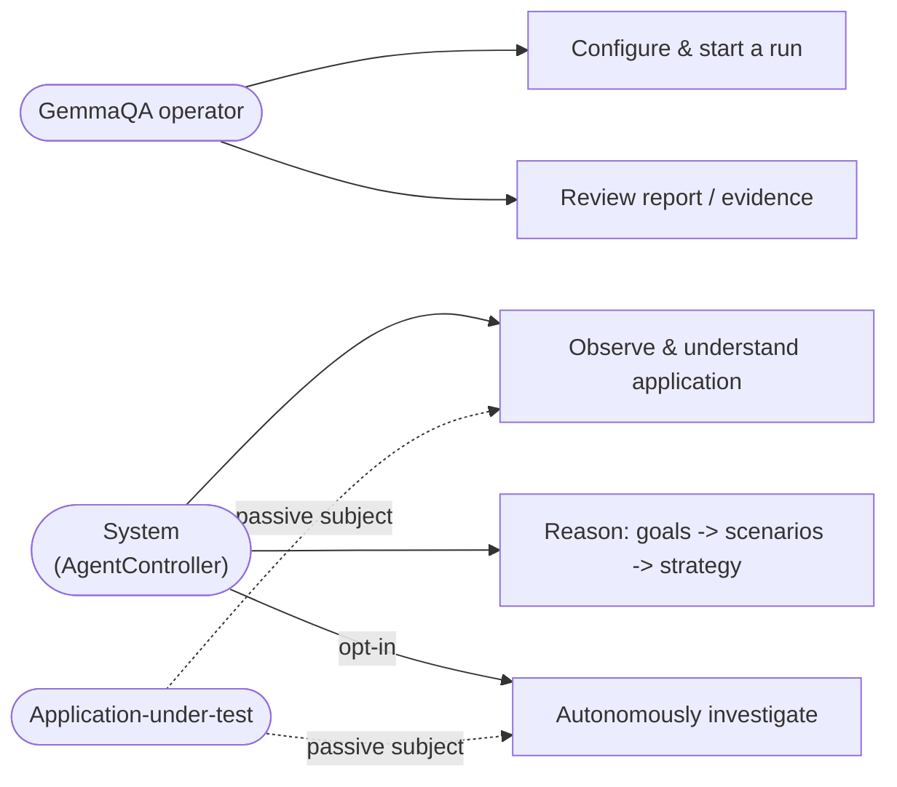

# GemmaQA Use Cases

**Status:** Derived from direct repository inspection. **Baseline:** 1133 passed, 1 skipped, 0 failed.

Each use case is tagged with an **Implementation status**: **Implemented**, **Implemented (opt-in)**, or **Not implemented** (future possibility only — none exist in this document, since only implemented behavior is documented as a use case; where a described capability is only partly automated, this is stated explicitly in the flow).

**Actor legend** (never conflate these three categories):
- **GemmaQA operator** — the human or system configuring/reviewing runs (QA engineer, developer, administrator).
- **Application-under-test actor** — a role/identity *discovered inside* the target application (e.g. "admin"). Appears only as data, never as a use-case actor performing GemmaQA actions.
- **Internal engine component** — a GemmaQA subsystem acting as a *supporting actor* (e.g. Runtime Planner, Safety Validator) within a use case initiated by the operator or by the system itself.

---

## A. System setup

### UC-001 — Configure a GemmaQA run
- **Objective:** Establish the parameters of a new run before any browser activity begins.
- **Primary actor:** GemmaQA operator.
- **Supporting actors:** `RunManager`, `CreateRunRequest`/`RunConfiguration` schemas.
- **Trigger:** Operator submits `POST /api/runs`.
- **Preconditions:** Operator has an authorized target URL and has acknowledged authorization (`authorization_ack=true`).
- **Inputs:** `url`, optional `username`/`password`, `configuration: RunConfiguration`, optional `notes`, `auto_start`.
- **Main success flow:** `RunManager.create_run()` validates the request, persists a `QARun` row (`status=created`), returns `run_id`.
- **Alternative flows:** `auto_start=true` immediately calls `start_run()` afterward.
- **Exception flows:** Missing `authorization_ack` or invalid URL scheme rejected by request validation before any DB write.
- **Postconditions:** A prepared, not-yet-running `QARun` record exists.
- **Evidence produced:** None yet (pre-execution).
- **Safety considerations:** No browser/network activity has occurred yet; this step is pure configuration.
- **Related components:** `app/api/runs.py`, `app/agent/run_manager.py`, `app/schemas.py`.
- **Related requirements:** FR-CONFGR-001.
- **Status:** Implemented.

### UC-002 — Provide the application URL
- **Objective:** Scope every safety check (URL guard, host-in-scope) to one authorized target.
- **Primary actor:** GemmaQA operator.
- **Supporting actors:** `url_guard.validate_target_url`, `host_in_scope`.
- **Trigger:** Part of UC-001's request payload.
- **Preconditions:** URL uses `http`/`https`, has a hostname, contains no embedded credentials.
- **Inputs:** `CreateRunRequest.url`.
- **Main success flow:** URL is validated against `FORBIDDEN_SCHEMES`, cloud-metadata hosts, and local/internal-host restrictions (unless `allow_local_targets`); becomes `self.authorized_domain` for the run.
- **Alternative flows:** `allow_subdomains`/`allow_cross_domain` widen scope explicitly.
- **Exception flows:** Forbidden scheme, embedded credentials, or disallowed local/internal host rejected before the run starts.
- **Postconditions:** Every subsequent navigation/click is scope-checked against this one authorized domain.
- **Evidence produced:** None (validation-only step).
- **Safety considerations:** This is the primary defense against accidentally testing an unauthorized target.
- **Related components:** `app/safety/url_guard.py`.
- **Related requirements:** FR-SAFE-001.
- **Status:** Implemented.

### UC-003 — Provide credentials where permitted
- **Objective:** Allow GemmaQA to authenticate into the target application without ever exposing secrets downstream.
- **Primary actor:** GemmaQA operator.
- **Supporting actors:** `CredentialVault`, `AuthenticationStrategy`.
- **Trigger:** `username`/`password` supplied on `CreateRunRequest`, or discovered on-page and auto-captured.
- **Preconditions:** `RunConfiguration.allow_login=true` (default).
- **Inputs:** `username`, `password`.
- **Main success flow:** Credentials stored as a `CredentialProfile` in the in-memory `CredentialVault`; `AuthenticationStrategy` builds a login `AuthWorkflow` from detected form fields, referencing the vault only by `profile_id.field_name`.
- **Alternative flows:** No credentials supplied and `allow_test_account_creation=true` → a generated registration profile (`QA_TEST_...@example.com`) is used instead.
- **Exception flows:** No credentials and registration disallowed → run reports `credentials_missing`/`authentication_required` as a truthful stop reason.
- **Postconditions:** `RunMemory.auth_strategy.authenticated` becomes `True` once success signals are observed.
- **Evidence produced:** None of the secret value itself; only masked/flag-level data (`public_flags()`).
- **Safety considerations:** Secrets never enter LLM prompts, logs, or reports (`mask_secret`, `sanitize_dict`).
- **Related components:** `app/agent/credentials.py`, `app/agent/auth_strategy.py`.
- **Related requirements:** NFR-PRIV-001.
- **Status:** Implemented.

### UC-004 — Select browser/runtime mode
- **Objective:** Choose how the browser is driven and how actions are generated.
- **Primary actor:** GemmaQA operator (or deployment-level administrator via `.env`).
- **Supporting actors:** `create_browser_adapter()`, `get_gemma_provider()`.
- **Trigger:** `Settings.browser_adapter` (`direct_playwright` default, or `playwright_mcp`) and `Settings.gemma_provider` (`mock` default, `openai_compatible`, or `transformers`).
- **Preconditions:** For `playwright_mcp`, an MCP-compatible transport must be reachable; for `openai_compatible`/`transformers`, the endpoint/weights must be configured.
- **Inputs:** Environment variables (`BROWSER_ADAPTER`, `GEMMA_PROVIDER`, etc.).
- **Main success flow:** Factories select and construct the concrete adapter/provider at controller-construction time.
- **Alternative flows:** None — this is a deployment-time choice, not adjustable mid-run.
- **Exception flows:** Misconfigured `openai_compatible`/`transformers` raises `RuntimeError` rather than silently degrading to mock; MCP connection failure raises rather than silently falling back to direct Playwright.
- **Postconditions:** All subsequent execution/generation calls use the selected implementation.
- **Evidence produced:** None directly.
- **Safety considerations:** No mode changes safety enforcement — `ActionValidator` runs identically regardless of adapter/provider choice.
- **Related components:** `app/browser/adapters/__init__.py`, `app/gemma/__init__.py`, `app/config.py`.
- **Related requirements:** NFR-PORT-001.
- **Status:** Implemented.

### UC-005 — Enable or disable autonomous investigation
- **Objective:** Opt into (or remain safely excluded from) the execution brain that drives scenarios autonomously.
- **Primary actor:** GemmaQA operator.
- **Supporting actors:** `AutonomousInvestigationEngine`.
- **Trigger:** `RunConfiguration.enable_autonomous_investigation` set on `POST /api/runs`.
- **Preconditions:** None beyond a valid run configuration.
- **Inputs:** `enable_autonomous_investigation: bool` (default `False`).
- **Main success flow:** If `true`, `AgentController.__init__` constructs `AutonomousInvestigationEngine()` and attaches it to `RunMemory.investigation_engine`; the PLAN-phase hook and post-action hook become active.
- **Alternative flows:** If `false` (default), `RunMemory.investigation_engine` stays `None` and every investigation query degrades to `None`/`[]`; the run behaves exactly as ordinary exploration.
- **Exception flows:** None — this is a pure boolean gate, no failure mode.
- **Postconditions:** The run either does or does not include investigation-driven execution.
- **Evidence produced:** None directly (governs whether later use cases in Group D can occur at all).
- **Safety considerations:** Enabling this flag does not weaken any safety check — the same `ActionValidator` still gates every action it produces.
- **Related components:** `backend/app/schemas.py` (`RunConfiguration`), `backend/app/agent/controller.py`.
- **Related requirements:** FR-CONFGR-002, FR-INV-001.
- **Status:** Implemented (opt-in).

### UC-006 — Define safety restrictions
- **Objective:** Tune how permissive the run is with respect to writes, destructive actions, and domain scope.
- **Primary actor:** GemmaQA operator.
- **Supporting actors:** `SafetyPolicy`, `ActionValidator`.
- **Trigger:** `RunConfiguration` fields (`safe_mode`, `allow_controlled_writes`, `allow_safe_test_data_creation`, `allow_destructive_actions`, `allow_financial_actions`, `allow_cross_domain`, `allow_subdomains`).
- **Preconditions:** None.
- **Inputs:** The above boolean flags plus budget fields (`max_actions`, `max_pages`, `max_runtime_seconds`, `max_retries`, `max_screenshots`).
- **Main success flow:** `SafetyPolicy` is constructed from these values; `allow_destructive_actions=false` (default) forces `destructive_actions_disabled=True` regardless of other flags.
- **Alternative flows:** `allow_financial_actions=true` narrowly lifts financial-vocabulary blocking (payment/purchase/checkout/etc.) without ever lifting destructive-pattern blocking.
- **Exception flows:** None — invalid combinations simply resolve to the safer default via `__post_init__` logic.
- **Postconditions:** Every action this run proposes is validated against this specific policy instance.
- **Evidence produced:** Safety decisions are recorded in the audit trail (see UC-039 equivalent under evidence review).
- **Safety considerations:** This IS the safety-configuration surface; there is no other path to loosen restrictions.
- **Related components:** `backend/app/safety/policies.py`.
- **Related requirements:** FR-SAFE-001..004, SAFE-REQ-002..004.
- **Status:** Implemented.

---

## B. Application understanding

### UC-007 — Observe a page
- **Objective:** Capture the live browser's current state as structured data.
- **Primary actor:** System (`AgentController`).
- **Supporting actors:** `BrowserAdapter`, `PageObserver`, `ConsoleMonitor`, `NetworkMonitor`.
- **Trigger:** Initial load, or immediately after any executed action.
- **Preconditions:** An active browser session exists.
- **Inputs:** Live DOM/console/network state via the adapter.
- **Main success flow:** `PageObserver.observe`/`observe_adapter` builds a `PageState`; `fingerprint_page_state` computes a de-noised fingerprint.
- **Alternative flows:** Adapter-agnostic path used when no native Playwright `Page` is available (MCP mode).
- **Exception flows:** Transient "execution context destroyed" errors (auto-redirects) are retried once after a settle delay.
- **Postconditions:** `RunMemory` reflects the freshest `PageState`.
- **Evidence produced:** Screenshot (via `EvidenceCollector`), console/network snapshots.
- **Safety considerations:** Read-only; no mutation occurs during observation itself.
- **Related components:** `backend/app/browser/observer.py`, `fingerprint.py`.
- **Related requirements:** FR-OBS-001, FR-OBS-002.
- **Status:** Implemented.

### UC-008 — Create a Canonical Page Model
- **Objective:** Enrich the raw `PageState` into a structured model suitable for discovery reasoning.
- **Primary actor:** System.
- **Supporting actors:** `PerceptionEngine`.
- **Trigger:** Immediately after every UC-007 observation, via `_run_perception_engine`.
- **Preconditions:** A `PageState` (or native `Page`) is available.
- **Inputs:** `PageState`/`Page`, prior screenshot path.
- **Main success flow:** `PerceptionEngine.observe`/`observe_adapter` builds regions, navigation, forms, tables, images, dialogs, interactive elements, unknown components into a `CanonicalPageModel`.
- **Alternative flows:** Optional bounded visual-model pass (UC-continued below) when `gemma_supports_images=true`.
- **Exception flows:** Perception failure is caught and logged; the run continues using `PageState` alone (Planner/FrontierBuilder do not depend on perception succeeding).
- **Postconditions:** `RunMemory.canonical_page_model` updated.
- **Evidence produced:** None beyond the model itself (not a persisted artifact).
- **Safety considerations:** Read-only; no browser mutation.
- **Related components:** `backend/app/perception/engine.py`.
- **Related requirements:** FR-OBS-003.
- **Status:** Implemented.

### UC-009 — Discover an entity
- **Objective:** Identify a candidate business entity term from the current page.
- **Primary actor:** System.
- **Supporting actors:** `EntityDiscoveryEngine`, `EntityRegistry`.
- **Trigger:** Called from within UC-008's perception cycle.
- **Preconditions:** A `CanonicalPageModel` exists.
- **Inputs:** `CanonicalPageModel`, iteration counter.
- **Main success flow:** `EntityCandidateBuilder` extracts candidate terms; `EntityClassifier` groups/attaches operations; `entity_confidence.score_confidence` assigns a status (`candidate`/`confirmed`/`incomplete`/`stale`).
- **Alternative flows:** A term seen from only one evidence source stays `candidate`, never auto-promoted.
- **Exception flows:** Failure logged, does not block actor discovery (separate `try/except`).
- **Postconditions:** `EntityRegistry` updated (new/merged `EntityRecord`).
- **Evidence produced:** `EntityEvidence` entries referencing the exact source (nav item, heading, table column, etc.).
- **Safety considerations:** Read-only, no browser mutation, no LLM call.
- **Related components:** `backend/app/intelligence/entity_discovery/`.
- **Related requirements:** FR-ENT-001, FR-ENT-002.
- **Status:** Implemented.

### UC-010 — Discover an actor
- **Objective:** Identify a candidate role/identity and its permissions.
- **Primary actor:** System.
- **Supporting actors:** `ActorDiscoveryEngine`, `ActorRegistry`.
- **Trigger:** Called from within UC-008's perception cycle, immediately after UC-009.
- **Preconditions:** A `CanonicalPageModel` exists.
- **Inputs:** `CanonicalPageModel`, `authenticated` flag, `login_method`, `EntityRegistry`.
- **Main success flow:** Candidate role terms + permission signals (`can_<verb>`) collected; `status_for()` distinguishes an actually-observed session (`confirmed`/`incomplete`) from a merely-named role (`unverified`).
- **Alternative flows:** Session richness (known pages/permissions/dashboards) upgrades status faster than name-only evidence.
- **Exception flows:** Failure logged, does not block entity discovery or the rest of the loop.
- **Postconditions:** `ActorRegistry` updated (`ActorRecord`, `PermissionCandidate`, `ActorSession`).
- **Evidence produced:** `ActorEvidence` entries (25 possible source kinds, e.g. `role_dropdown_option`, `network_403`, `jwt_claim`).
- **Safety considerations:** Read-only, no browser mutation, no LLM call.
- **Related components:** `backend/app/intelligence/actor_discovery/`.
- **Related requirements:** FR-ACT-001, FR-ACT-002.
- **Status:** Implemented.

### UC-011 — Discover a workflow
- **Objective:** Reconstruct actor → action → entity → state-transition → outcome from an executed action.
- **Primary actor:** System.
- **Supporting actors:** `WorkflowDiscoveryEngine`, `WorkflowRegistry`.
- **Trigger:** `_run_workflow_engine`, called directly from the main controller loop right after the post-action re-observation (needs a before/after pair, unlike UC-009/UC-010).
- **Preconditions:** A before-action `CanonicalPageModel` was captured; an action has just executed.
- **Inputs:** Before/after `CanonicalPageModel`, executed `element_id`, `action_succeeded`, `EntityRegistry`/`ActorRegistry`.
- **Main success flow:** `StateTransitionDetector` diffs the two models; `WorkflowStepExtractor` builds a `WorkflowStep`; `WorkflowReconstructor` assembles/merges into a `WorkflowDescriptor`.
- **Alternative flows:** Cross-role hand-offs and branch points (approve/reject) detected when evidence supports them.
- **Exception flows:** Failure logged; never blocks dependency discovery or the rest of the loop.
- **Postconditions:** `WorkflowRegistry` updated.
- **Evidence produced:** `WorkflowEvidence` entries (30 possible source kinds).
- **Safety considerations:** Read-only over already-executed action's result; does not itself decide to act.
- **Related components:** `backend/app/intelligence/workflow_discovery/`.
- **Related requirements:** FR-WFL-001, FR-WFL-002.
- **Status:** Implemented.

### UC-012 — Discover a business dependency
- **Objective:** Connect a visible KPI/counter/chart/report/queue to the entity/workflow/actor believed to affect it.
- **Primary actor:** System.
- **Supporting actors:** `DependencyDiscoveryEngine`, `DependencyRegistry`.
- **Trigger:** `_run_dependency_engine`, called immediately after UC-011, same before/after pair.
- **Preconditions:** Same as UC-011.
- **Inputs:** Before/after `CanonicalPageModel`, `EntityRegistry`/`ActorRegistry`/`WorkflowRegistry`.
- **Main success flow:** `OutputCandidateBuilder` finds candidate outputs; `DependencyRelationshipBuilder`/`AggregationRuleInferer` connect them to a source with an effect direction; `DependencyCorrelator` may upgrade status to `verified` only via real before/after correlation with a scope-compatibility check.
- **Alternative flows:** Competing aggregation-rule hypotheses retained rather than collapsed to one guess.
- **Exception flows:** Failure logged; never blocks the knowledge-graph sync that follows.
- **Postconditions:** `DependencyRegistry` updated.
- **Evidence produced:** `DependencyEvidence` entries.
- **Safety considerations:** Never auto-switches actors to validate a cross-role dependency (explicit non-goal).
- **Related components:** `backend/app/intelligence/dependency_discovery/`.
- **Related requirements:** FR-DEP-001..004.
- **Status:** Implemented.

### UC-013 — Update the Application Knowledge Graph
- **Objective:** Project the four registries into one unified, versioned graph.
- **Primary actor:** System.
- **Supporting actors:** `ApplicationKnowledgeGraph`.
- **Trigger:** `_run_knowledge_graph_sync`, runs last in the per-action intelligence pipeline (after UC-009 through UC-012 for this iteration).
- **Preconditions:** All four registries reflect the current iteration's findings.
- **Inputs:** `EntityRegistry`, `ActorRegistry`, `WorkflowRegistry`, `DependencyRegistry`.
- **Main success flow:** `synchronize()` runs sync → bounded inference → consistency checks → gap analysis as one pass; `graph_version` increments only if something genuinely changed.
- **Alternative flows:** None — this is a single deterministic pass, always the same shape.
- **Exception flows:** Failure logged; never blocks goal generation (which simply reasons over the graph as it last stood).
- **Postconditions:** `RunMemory.knowledge_graph` reflects the latest synchronized state.
- **Evidence produced:** `GraphVersion` history entry (added/updated/stale node/edge ids).
- **Safety considerations:** Pure projection — never an independent rediscovery of facts.
- **Related components:** `backend/app/intelligence/knowledge_graph/`.
- **Related requirements:** FR-KG-001..003.
- **Status:** Implemented.

---

## C. Investigation reasoning

### UC-014 — Generate investigation goals
- **Objective:** Turn graph gaps/hypotheses into prioritized `InvestigationGoal` records.
- **Primary actor:** System.
- **Supporting actors:** `GoalGenerationEngine`.
- **Trigger:** `_run_goal_generation`, immediately after UC-013.
- **Preconditions:** A `knowledge_graph` exists.
- **Inputs:** `ApplicationKnowledgeGraph`, iteration counter.
- **Main success flow:** Candidate goals built from graph gaps/nodes; deduplicated; scored via a transparent weighted-sum-plus-penalty model; grouped and explained.
- **Alternative flows:** Re-running against an unchanged graph leaves goal `created_at`/version untouched (idempotent).
- **Exception flows:** Failure logged; never blocks scenario planning (which simply sees the previous goal set).
- **Postconditions:** `RunMemory.goal_engine` reflects the current goal set.
- **Evidence produced:** Each goal's `supporting_graph_nodes`/`supporting_graph_edges`.
- **Safety considerations:** Never executes a browser action.
- **Related components:** `backend/app/intelligence/goal_generation/`.
- **Related requirements:** FR-GOAL-001..003.
- **Status:** Implemented.

### UC-015 — Generate scenario plans
- **Objective:** Convert a goal into one or more declarative, semantic investigation scenarios.
- **Primary actor:** System.
- **Supporting actors:** `ScenarioPlanningEngine`.
- **Trigger:** `_run_scenario_planning`, immediately after UC-014.
- **Preconditions:** At least one `InvestigationGoal` exists.
- **Inputs:** `GoalGenerationEngine`, `ApplicationKnowledgeGraph`.
- **Main success flow:** Template selected per goal type; actor/permission/entity/state/workflow/output/data requirements resolved from the graph; semantic steps (never selectors) decomposed with checkpoints/evidence requirements.
- **Alternative flows:** Observational/reduced-scope alternative variants generated alongside the primary scenario where meaningfully distinct.
- **Exception flows:** Failure logged; QA Strategy simply sees the previous scenario set.
- **Postconditions:** `RunMemory.scenario_engine` reflects the current scenario set.
- **Evidence produced:** None yet (planning only; evidence comes from later execution).
- **Safety considerations:** Never invokes `BrowserAdapter`/`ActionExecutor`.
- **Related components:** `backend/app/intelligence/scenario_planning/`.
- **Related requirements:** FR-SCN-001, FR-SCN-004.
- **Status:** Implemented.

### UC-016 — Evaluate scenario feasibility
- **Objective:** Determine whether a scenario's requirements can plausibly be satisfied right now.
- **Primary actor:** System.
- **Supporting actors:** `scenario_feasibility_analyzer.py`.
- **Trigger:** Part of UC-015's per-scenario build.
- **Preconditions:** Requirement resolution has run.
- **Inputs:** Resolved actor/entity/workflow/permission/data requirements.
- **Main success flow:** `feasibility_status` (`feasible`/`conditionally_feasible`/`blocked`/`incomplete`) assigned with explicit blocking/conditional reasons.
- **Alternative flows:** Conditionally-feasible scenarios are retained (not discarded) with their conditions stated.
- **Exception flows:** None distinct from UC-015's own failure handling.
- **Postconditions:** `InvestigationScenario.feasibility_assessment` populated.
- **Evidence produced:** `blocking_reasons`/`conditional_reasons` lists.
- **Safety considerations:** Feeds directly into the Autonomous Investigation Engine's own precondition re-check (UC-020) — never bypassed.
- **Related components:** `backend/app/intelligence/scenario_planning/scenario_feasibility_analyzer.py`.
- **Related requirements:** FR-SCN-002.
- **Status:** Implemented.

### UC-017 — Calculate scenario risk
- **Objective:** Assign a named-component, explainable risk score and class to a scenario.
- **Primary actor:** System.
- **Supporting actors:** `scenario_risk_analyzer.py`.
- **Trigger:** Part of UC-015's per-scenario build.
- **Preconditions:** Steps have been decomposed.
- **Inputs:** Steps' `mutation_type`/`safety_class`, cross-actor count, cleanup/rollback feasibility.
- **Main success flow:** `risk_class` (`read_only`/`low`/`moderate`/`high`/`prohibited`) computed with named component breakdown; cleanup/rollback plans attached.
- **Alternative flows:** A scenario whose steps are all mutation-free is scored `read_only` regardless of goal type.
- **Exception flows:** None distinct.
- **Postconditions:** `InvestigationScenario.risk_assessment` populated.
- **Evidence produced:** `applied_flags`/`explanation` on the risk assessment.
- **Safety considerations:** A `prohibited` risk class here is one of the two conditions the Autonomous Investigation Engine's safety gate rejects outright (see UC-022).
- **Related components:** `backend/app/intelligence/scenario_planning/scenario_risk_analyzer.py`.
- **Related requirements:** FR-SCN-002.
- **Status:** Implemented.

### UC-018 — Create an execution strategy
- **Objective:** Turn the current scenario set into a prioritized, queued, batched plan.
- **Primary actor:** System.
- **Supporting actors:** `QAStrategyEngine`.
- **Trigger:** `_run_qa_strategy`, immediately after UC-015.
- **Preconditions:** At least one scenario exists.
- **Inputs:** `ScenarioPlanningEngine`, `GoalGenerationEngine`, `ApplicationKnowledgeGraph`, a named policy id (default `balanced`).
- **Main success flow:** One `ExecutionCandidate` built per scenario; queue/batch/dependency/conflict/forecast/recommendation records generated; results stored, versioned idempotently.
- **Alternative flows:** A different named policy (e.g. `read_only_first`, `dependency_first`) re-weights the same 12 signals without changing what is measured.
- **Exception flows:** Failure logged; Autonomous Investigation simply sees the previous strategy snapshot (or none).
- **Postconditions:** `RunMemory.strategy_engine` reflects the current strategy.
- **Evidence produced:** None directly (strategy is a ranking artifact, not evidence).
- **Safety considerations:** Never executes a scenario itself.
- **Related components:** `backend/app/intelligence/qa_strategy/`.
- **Related requirements:** FR-STR-001, FR-STR-004.
- **Status:** Implemented.

### UC-019 — Prioritise candidate scenarios
- **Objective:** Assign an explainable priority score to every candidate.
- **Primary actor:** System.
- **Supporting actors:** `strategy_scoring.py`.
- **Trigger:** Part of UC-018.
- **Preconditions:** Candidates built.
- **Inputs:** 12 named signals (business value, knowledge gain, coverage gain, confidence gain, risk reduction, workflow centrality, blocking impact, goal priority, feasibility, speed, safety, read-only value).
- **Main success flow:** Weighted sum under the active policy, then explicit multiplicative penalties (risk class, cleanup feasibility, actor/data unresolved, dismissed/already-completed) — never a single opaque score.
- **Alternative flows:** `custom_weighted` policy applies caller-supplied overrides on top of the `balanced` baseline.
- **Exception flows:** None distinct.
- **Postconditions:** `ExecutionCandidate.priority_score`/`priority_breakdown`/`applied_penalties` populated.
- **Evidence produced:** None (a score, not evidence).
- **Safety considerations:** `blocking_impact` is computed from Scenario Planning's own already-computed dependency graph, never rediscovered.
- **Related components:** `backend/app/intelligence/qa_strategy/strategy_scoring.py`.
- **Related requirements:** FR-STR-001.
- **Status:** Implemented.

### UC-020 — Batch scenarios by actor or workflow
- **Objective:** Group executable candidates to minimize actor switching and navigation.
- **Primary actor:** System.
- **Supporting actors:** `strategy_batch_builder.py`.
- **Trigger:** Part of UC-018.
- **Preconditions:** Candidates queued.
- **Inputs:** Each candidate's primary actor/workflow/entity/output.
- **Main success flow:** Most-specific-first grouping: actor+workflow → actor+entity → actor+output → actor alone → ungrouped; `estimated_actor_switches` computed per batch.
- **Alternative flows:** A candidate with no resolvable actor falls to the `ungrouped` batch type rather than blocking batching entirely.
- **Exception flows:** None distinct.
- **Postconditions:** `ExecutionBatch` records created; each candidate's `batch_id` back-filled.
- **Evidence produced:** None.
- **Safety considerations:** Batching is advisory ordering only — it never itself triggers execution.
- **Related components:** `backend/app/intelligence/qa_strategy/strategy_batch_builder.py`.
- **Related requirements:** FR-STR-003.
- **Status:** Implemented.

---

## D. Autonomous investigation
*(All use cases in this group require `enable_autonomous_investigation=true`; every one is Implemented (opt-in).)*

### UC-021 — Select the next candidate
- **Objective:** Choose which `ExecutionCandidate` to investigate next.
- **Primary actor:** System (`AutonomousInvestigationEngine`).
- **Supporting actors:** `QAStrategyEngine.query_engine.ready()`.
- **Trigger:** `next_action()` called from the controller's PLAN phase when idle.
- **Preconditions:** `enable_autonomous_investigation=true`; at least one ready, not-yet-investigated candidate exists.
- **Inputs:** The strategy engine's `ready()` list.
- **Main success flow:** Iterates `ready()` (bounded scan, `MAX_CANDIDATE_SCAN=5`), skipping candidates already in `investigated_candidate_ids`/`blocked_candidate_ids`, and starts the first one whose precondition/safety checks pass.
- **Alternative flows:** If none of the scanned candidates qualify (all deferred), returns without starting anything this call — normal exploration continues.
- **Exception flows:** Scenario missing from `ScenarioPlanningEngine` mid-lookup → treated as a failed investigation, scan continues to the next candidate.
- **Postconditions:** `InvestigationMemory.active` is set (or remains `None`).
- **Evidence produced:** None yet.
- **Safety considerations:** Never re-selects a candidate that already reached a terminal outcome (see UC-033).
- **Related components:** `backend/app/intelligence/autonomous_investigation/autonomous_investigation_engine.py`.
- **Related requirements:** FR-INV-001.
- **Status:** Implemented (opt-in).

### UC-022 — Validate scenario preconditions
- **Objective:** Re-check, against the CURRENT run state, requirements Scenario Planning resolved earlier.
- **Primary actor:** System.
- **Supporting actors:** `precondition_validator.py`.
- **Trigger:** Part of UC-021, before a candidate is accepted.
- **Preconditions:** A candidate scenario has been selected for evaluation.
- **Inputs:** `InvestigationScenario`, `RunMemory` (actor/entity/workflow presence via the Knowledge Graph — the same source Scenario Planning itself used).
- **Main success flow:** Blocking requirement statuses (`contradicted`/`blocked`) reject; deferrable statuses (`unresolved`/`unavailable`/`stale`/`unknown`, or a required-but-not-yet-authenticated session) mark the scenario deferred, tried again later.
- **Alternative flows:** A satisfied scenario proceeds immediately to UC-023.
- **Exception flows:** None distinct.
- **Postconditions:** `PreconditionCheckResult` computed (not persisted independently — feeds the accept/reject decision).
- **Evidence produced:** None.
- **Safety considerations:** Deliberately checks the SAME source (Knowledge Graph) Scenario Planning used, avoiding a stricter, inconsistent re-check that would silently reject already-accepted scenarios (a real bug found and fixed during development — see `docs/AUTONOMOUS_INVESTIGATION_ENGINE.md`).
- **Related components:** `backend/app/intelligence/autonomous_investigation/precondition_validator.py`.
- **Related requirements:** FR-INV-002.
- **Status:** Implemented (opt-in).

### UC-023 — Reject an unsafe scenario
- **Objective:** Refuse to even attempt a fundamentally unsafe scenario.
- **Primary actor:** System.
- **Supporting actors:** `investigation_safety_gate.py`.
- **Trigger:** Part of UC-021, alongside UC-022.
- **Preconditions:** A candidate scenario has passed to this check.
- **Inputs:** `InvestigationScenario.risk_assessment`, `feasibility_status`, each step's `safety_class`.
- **Main success flow:** `risk_class=="prohibited"`, `feasibility_status=="blocked"`, or any step's `safety_class=="prohibited"` → immediate `blocked` outcome recorded (0 steps executed), candidate marked investigated so it is never retried.
- **Alternative flows:** A scenario with a merely `moderate`/`high` risk class but `feasible` status is allowed to proceed (this gate is a floor, not a substitute for per-action validation).
- **Exception flows:** None distinct.
- **Postconditions:** An `InvestigationResult(outcome="blocked")` is stored immediately.
- **Evidence produced:** `blockers` list explaining the rejection reason.
- **Safety considerations:** This is a defense-in-depth layer ON TOP OF, never a replacement for, the per-action `ActionValidator` gate every subsequent step still passes through.
- **Related components:** `backend/app/intelligence/autonomous_investigation/investigation_safety_gate.py`.
- **Related requirements:** FR-INV-003.
- **Status:** Implemented (opt-in).

### UC-024 — Delegate a semantic step to the Runtime Planner
- **Objective:** Resolve one `ScenarioStep` into a concrete action without ever inventing a selector-matching heuristic.
- **Primary actor:** System.
- **Supporting actors:** `semantic_step_executor.py`, `Planner.plan_by_priority`.
- **Trigger:** Part of `next_action()`, once a scenario is active and ready for its current step.
- **Preconditions:** An `ActiveInvestigation` exists and has a pending step.
- **Inputs:** The current `ScenarioStep`, current `PageState`, `RunMemory`.
- **Main success flow:** Browser-driving step types (`navigate`, `perform_operation`, etc.) call `planner.plan_by_priority(page_state, memory, context)` with `context["testing_objective"]` set from the step's own description — the SAME deterministic frontier-based path Gemma's own fallback uses.
- **Alternative flows:** Pure observation step types (`verify_state`, `compare`, etc.) resolve instantly without any Planner call; `wait_for_effect`/`capture_evidence` construct a direct `WAIT`/`TAKE_SCREENSHOT` action.
- **Exception flows:** If the Planner returns `FINISH` (nothing viable), the step is treated as unresolvable this attempt — deferred (bounded retries) or the scenario is blocked.
- **Postconditions:** A `BrowserAction` is returned to the controller for the normal VALIDATE→EXECUTE→COMPARE cycle, or the step defers/fails.
- **Evidence produced:** None yet (the action hasn't executed).
- **Safety considerations:** This package never imports `BrowserAdapter`/`ActionExecutor`/Playwright — confirmed by repository search.
- **Related components:** `backend/app/intelligence/autonomous_investigation/semantic_step_executor.py`, `backend/app/agent/planner.py`.
- **Related requirements:** FR-INV-005.
- **Status:** Implemented (opt-in).

### UC-025 — Execute a safe browser action
- **Objective:** Actually perform the action the Planner selected, exactly as any normal exploration action would be.
- **Primary actor:** System (`AgentController`'s unchanged execution pipeline).
- **Supporting actors:** `ActionValidator`, `ActionExecutor`, `BrowserAdapter`.
- **Trigger:** The `BrowserAction` returned by UC-024.
- **Preconditions:** None beyond a valid action object.
- **Inputs:** `BrowserAction`.
- **Main success flow:** `ActionValidator.validate()` → (if allowed) `ActionExecutor.execute()` → `ActionResult`.
- **Alternative flows:** None — this is the same single execution path used for every action in the system, investigation-driven or not.
- **Exception flows:** Validator rejection → recorded as a blocked action, no execution; execution-time error → `ActionResult(success=False, error=...)`.
- **Postconditions:** Registries/graph update as usual via the existing post-action hooks (UC-009 through UC-013 run again, unconditionally).
- **Evidence produced:** Before/after screenshots, console/network diffs, `evidence_ids`.
- **Safety considerations:** Identical enforcement to any other action — this is the whole point of reuse over reinvention.
- **Related components:** `backend/app/safety/validator.py`, `backend/app/browser/executor.py`.
- **Related requirements:** FR-SAFE-001, FR-SAFE-002.
- **Status:** Implemented (opt-in path; the execution mechanism itself is always Implemented).

### UC-026 — Collect evidence
- **Objective:** Aggregate an investigation's evidence by reference.
- **Primary actor:** System.
- **Supporting actors:** `evidence_bundle_builder.py`, `EvidenceCollector`.
- **Trigger:** Investigation finalization (success or terminal failure).
- **Preconditions:** At least one step executed.
- **Inputs:** The investigation's own `ExecutionTrace` list (each carrying `evidence_ids` from its `ActionResult`).
- **Main success flow:** `build_evidence_bundle()` aggregates evidence ids, screenshot paths, visited URLs, console/network errors — references only, never a copy of a raw payload.
- **Alternative flows:** None.
- **Exception flows:** None distinct.
- **Postconditions:** `InvestigationResult.evidence_bundle` populated.
- **Evidence produced:** The `EvidenceBundle` itself (a structured reference list).
- **Safety considerations:** No new capture logic — reuses whatever `ActionExecutor`/`EvidenceCollector` already captured.
- **Related components:** `backend/app/intelligence/autonomous_investigation/evidence_bundle_builder.py`.
- **Related requirements:** FR-EVD-002.
- **Status:** Implemented (opt-in).

### UC-027 — Verify an assertion
- **Objective:** Evaluate a `ScenarioAssertion`/`ScenarioComparison` against genuinely observed evidence.
- **Primary actor:** System.
- **Supporting actors:** `assertion_verifier.py`.
- **Trigger:** Reaching an observation-type step (UC-024's "instant" branch).
- **Preconditions:** Prior steps have produced before/after `PageState` and/or an `ActionResult`.
- **Inputs:** The assertion's `operator`, before/after state, last result.
- **Main success flow:** Permission operators read the last action's success/error directly; text-comparable operators compare before/after `visible_text_summary` heuristically.
- **Alternative flows:** No reliable signal available → outcome is honestly `inconclusive`, never guessed.
- **Exception flows:** None distinct.
- **Postconditions:** An `AssertionResult` appended to the active investigation.
- **Evidence produced:** The assertion's own `observed_value`/`explanation`.
- **Safety considerations:** Never fabricates `supported` without a real signal (explicitly tested).
- **Related components:** `backend/app/intelligence/autonomous_investigation/assertion_verifier.py`.
- **Related requirements:** FR-INV-006.
- **Status:** Implemented (opt-in).

### UC-028 — Mark an investigation supported
- **Objective:** Record that evidence corroborated the scenario's hypothesis.
- **Primary actor:** System.
- **Trigger:** All of an investigation's assertions evaluate `supported` (and none `contradicted`).
- **Preconditions:** UC-027 has run at least once.
- **Inputs:** Accumulated `AssertionResult` list.
- **Main success flow:** `VerificationResult.overall_outcome = "supported"`; investigation finalizes with `outcome="completed"`.
- **Postconditions:** Stored in `InvestigationMemory`, queryable via `completed()`.
- **Related requirements:** FR-INV-006. **Status:** Implemented (opt-in).

### UC-029 — Mark an investigation contradicted
- **Objective:** Record that evidence disproved the scenario's hypothesis.
- **Primary actor:** System.
- **Trigger:** Any assertion evaluates `contradicted`.
- **Main success flow:** `VerificationResult.overall_outcome = "contradicted"`; investigation finalizes with `outcome="failed"`, `failure_reason` set.
- **Postconditions:** Stored, queryable via `failed()`.
- **Related requirements:** FR-INV-006. **Status:** Implemented (opt-in).

### UC-030 — Mark an investigation inconclusive
- **Objective:** Honestly report that no reliable signal existed to confirm or deny the hypothesis.
- **Primary actor:** System.
- **Trigger:** All evaluated assertions are `inconclusive` (or no assertions exist for the scenario).
- **Main success flow:** `VerificationResult.overall_outcome = "inconclusive"`; investigation still finalizes as `outcome="completed"` (ran fully, just without a confirmable signal) unless steps themselves failed/blocked.
- **Postconditions:** Stored, distinguishable from `supported`/`contradicted` in `VerificationResult`.
- **Related requirements:** FR-INV-006. **Status:** Implemented (opt-in).

### UC-031 — Recover from an execution failure
- **Objective:** Classify a failed step and apply a bounded, appropriate recovery.
- **Primary actor:** System.
- **Supporting actors:** `recovery.py`.
- **Trigger:** `observe_step_result()` receives `ActionResult(success=False)`.
- **Preconditions:** A step's action just failed.
- **Inputs:** `ActionResult.error`/`message`, the step's retry count so far.
- **Main success flow:** `classify_failure()` names the failure class (`timeout`, `navigation_failure`, `missing_element`, `session_expiry`, `network_interruption`, `stale_dom`, etc.); `decide_recovery()` returns `retry`/`retry_with_backoff` (bounded, `MAX_RETRIES_PER_STEP=2`), `skip_step` (non-blocking step), or `abort_scenario`.
- **Alternative flows:** `session_expiry` is never retried by this engine — re-authentication is `AuthenticationStrategy`'s job on a future attempt, not reinvented here.
- **Exception flows:** Retries exhausted → scenario finalizes `outcome="failed"`.
- **Postconditions:** `ExecutionTrace.recovery_action` recorded.
- **Evidence produced:** The failure classification itself, retained on the trace.
- **Safety considerations:** Recovery is always bounded — never an infinite retry loop.
- **Related components:** `backend/app/intelligence/autonomous_investigation/recovery.py`.
- **Related requirements:** FR-INV-007.
- **Status:** Implemented (opt-in).

### UC-032 — Stop after exhausting executable scenarios
- **Objective:** End autonomous investigation cleanly once nothing further is ready.
- **Primary actor:** System.
- **Trigger:** Every call to `next_action()` when idle.
- **Main success flow:** `stop_reason()` returns `no_executable_scenarios` when every `ready()` candidate has already reached a terminal outcome or remains deferred; also returns `budget_exceeded`, `repeated_failures` (3+ consecutive), or `user_cancellation` as appropriate.
- **Postconditions:** No new investigation starts; normal exploration (if any candidates remain unresolved for other reasons) or the run itself continues/stops per its own separate policy.
- **Evidence produced:** None (a control decision, not evidence).
- **Related components:** `backend/app/intelligence/autonomous_investigation/autonomous_investigation_engine.py` (`stop_reason`).
- **Related requirements:** FR-INV-008.
- **Status:** Implemented (opt-in).

### UC-033 — Prevent duplicate execution
- **Objective:** Guarantee a candidate that already reached a terminal outcome is never investigated again in the same run.
- **Primary actor:** System.
- **Trigger:** Every candidate-selection attempt (UC-021).
- **Main success flow:** `InvestigationMemory.investigated_candidate_ids` (populated on every `completed`/`failed`/`blocked` outcome) is checked before a candidate is even considered.
- **Postconditions:** Live-verified: both the SauceDemo and ServiceFlow live runs completed with zero duplicate executions across all ready candidates.
- **Safety considerations:** This was a real bug found during development (the engine originally kept re-selecting the same highest-priority candidate forever) — fixed and regression-tested (`test_every_ready_candidate_investigated_exactly_once`).
- **Related components:** `backend/app/intelligence/autonomous_investigation/investigation_memory.py`.
- **Related requirements:** FR-INV-004.
- **Status:** Implemented (opt-in).

---

## E. QA outcomes

### UC-034 — Discover a functional defect
- **Objective:** Detect a genuine application defect from observed evidence.
- **Primary actor:** System.
- **Supporting actors:** `BugAnalyzer`.
- **Trigger:** After any page observation or action result.
- **Main success flow:** Deterministic signals (HTTP 5xx, uncaught console exceptions, error-page classification, required-field-accepted-empty, invalid-email-accepted, submit timeout) detected first; an optional LLM pass may add detail but can never upgrade an unclear case to "confirmed" without deterministic evidence.
- **Postconditions:** A `Defect` recorded, deduplicated by `(title, page_url)`.
- **Evidence produced:** Screenshot + console/network context at time of detection.
- **Related components:** `backend/app/agent/bug_analyzer.py`.
- **Related requirements:** FR-REP-001 (defects feed the report).
- **Status:** Implemented.

### UC-035 — Identify a permission inconsistency
- **Objective:** Surface a case where an actor's observed access contradicts an expected permission model.
- **Primary actor:** System.
- **Supporting actors:** Actor Discovery's `role_relationships.py` (`compare_actors`), Dependency Discovery's contradiction tracking.
- **Trigger:** Two or more actors compared, or a permission's positive/negative evidence conflicts.
- **Main success flow:** `PermissionCandidate.granted` reflects net standing (positive vs. negative evidence count); `ActorDifference` records where two actors diverge.
- **Postconditions:** Recorded as part of the actor registry / dependency contradiction list, surfaced via query APIs (Group F).
- **Related components:** `backend/app/intelligence/actor_discovery/role_relationships.py`.
- **Status:** Implemented.

### UC-036 — Verify a workflow transition
- **Objective:** Confirm (or contradict) that a specific state transition genuinely occurs.
- **Primary actor:** System (via Autonomous Investigation, when enabled) or passive discovery (always).
- **Main success flow:** Passive: `WorkflowDiscoveryEngine` records the transition as `observed` from a real before/after diff. Active (opt-in): a `workflow_verification`-type scenario's `verify_state` step (UC-027) evaluates it explicitly.
- **Postconditions:** `WorkflowStep.status` reflects `observed`/`inferred`/`contradicted` honestly — never collapsed.
- **Related components:** `backend/app/intelligence/workflow_discovery/`, `backend/app/intelligence/autonomous_investigation/assertion_verifier.py`.
- **Status:** Implemented (passive discovery); Implemented (opt-in) for active verification.

### UC-037 — Verify a KPI or counter dependency
- **Objective:** Confirm a visible metric genuinely responds to a specific workflow/entity change.
- **Primary actor:** System.
- **Main success flow:** Passive: `DependencyCorrelator` upgrades a dependency to `verified` only via real before/after correlation with scope compatibility. Active (opt-in): a `dependency_verification`/`metric_verification`-type scenario executes and its `compare`/`observe_output` steps are evaluated by UC-027.
- **Postconditions:** `DependencyDescriptor.status`/`AssertionResult.outcome` reflects the real, heuristic-limited signal (never a guaranteed structured extraction — see limitations).
- **Related components:** `backend/app/intelligence/dependency_discovery/dependency_correlator.py`.
- **Status:** Implemented (passive); Implemented (opt-in) for active verification, with the heuristic-verification limitation noted in Section 13 of the Architecture document.

### UC-038 — Verify a validation message
- **Objective:** Confirm a form's client/server validation behaves as expected for invalid input.
- **Primary actor:** System.
- **Main success flow:** Deterministic negative-test specs (`Tester._deterministic_specs`) submit boundary/invalid values (via `test_data.py`'s safe catalog) and `BugAnalyzer` checks whether the expected validation message/rejection occurred.
- **Postconditions:** A `TestExecution` record with pass/fail and, if the validation was skipped, a suspected-bug `Defect`.
- **Related components:** `backend/app/agent/tester.py`, `backend/app/agent/test_data.py`, `backend/app/agent/bug_analyzer.py`.
- **Status:** Implemented.

### UC-039 — Record a blocker
- **Objective:** Note that something prevented progress, without silently discarding the fact.
- **Primary actor:** System.
- **Main success flow:** Multiple mechanisms record blockers at their own layer: `AuthenticationStrategy.unresolved_auth_blocker` (run-level), `ScenarioGap`/`ScenarioConflict` (planning-level), `InvestigationResult.blockers` (investigation-level, opt-in).
- **Postconditions:** Blocker text is truthful and specific (e.g. `credentials_missing`, `registration_not_permitted`) rather than a generic failure message.
- **Related components:** `backend/app/agent/auth_strategy.py`, `backend/app/intelligence/scenario_planning/schemas.py`, `backend/app/intelligence/autonomous_investigation/schemas.py`.
- **Status:** Implemented.

### UC-040 — Generate a follow-up investigation goal
- **Objective:** Close the loop from "what did we just learn" back to "what should we investigate next."
- **Primary actor:** System.
- **Supporting actors:** `knowledge_feedback.py`.
- **Trigger:** An investigation finalizes (opt-in path only).
- **Main success flow:** `regenerate_goals()` re-invokes `GoalGenerationEngine.generate()` against the now-updated graph; `build_next_goals()` reports which goal ids are new — never fabricating a goal record itself.
- **Postconditions:** `InvestigationResult.next_goals.new_goal_ids` populated. Live-verified: a SauceDemo run produced 5 new follow-up goals from one investigation; a ServiceFlow run produced 44.
- **Related components:** `backend/app/intelligence/autonomous_investigation/knowledge_feedback.py`.
- **Related requirements:** FR-INV-009.
- **Status:** Implemented (opt-in).

### UC-041 — Update coverage and confidence
- **Objective:** Report how much an investigation changed what is known.
- **Primary actor:** System.
- **Supporting actors:** `coverage_confidence_updater.py`.
- **Trigger:** Investigation finalization.
- **Main success flow:** Before/after `GraphStatistics`/`ScenarioStatistics` diffed into `CoverageUpdates` (gap counts, feasible-scenario counts) and `ConfidenceUpdates` (consistency issues, average scenario confidence).
- **Postconditions:** `InvestigationResult.coverage_updates`/`confidence_updates` populated. Live-verified: a ServiceFlow investigation grew the graph from 17 to 66 nodes in one pass.
- **Related components:** `backend/app/intelligence/autonomous_investigation/coverage_confidence_updater.py`.
- **Related requirements:** FR-COV-002, FR-CONF-002.
- **Status:** Implemented (opt-in).

### UC-042 — Generate an investigation summary
- **Objective:** Provide an aggregate view across all investigations in a run.
- **Primary actor:** System / GemmaQA operator (via query).
- **Main success flow:** `InvestigationQueryEngine.statistics()` aggregates totals by outcome, steps executed, assertions by outcome, recovery attempts.
- **Postconditions:** `InvestigationStatistics` available via `RunMemory.investigation_statistics()`.
- **Related components:** `backend/app/intelligence/autonomous_investigation/investigation_query_engine.py`.
- **Status:** Implemented (opt-in).

---

## F. Administration and review

### UC-043 — Inspect memory
- **Objective:** See the current authoritative run state.
- **Primary actor:** GemmaQA operator.
- **Main success flow:** `RunMemory.memory_snapshot()` returns a dict covering every attached engine's current statistics (knowledge graph, goals, scenarios, strategy, autonomous investigation).
- **Related components:** `backend/app/agent/memory.py`.
- **Status:** Implemented.

### UC-044 — Inspect graph state
- **Objective:** Review the Knowledge Graph's current nodes/edges/statistics/gaps.
- **Primary actor:** GemmaQA operator.
- **Main success flow:** `ApplicationKnowledgeGraph.statistics()`/`snapshot()`/`compact_snapshot()`/`gaps()`/`consistency_issues()`.
- **Related components:** `backend/app/intelligence/knowledge_graph/knowledge_graph.py`.
- **Status:** Implemented.

### UC-045 — Query goals
- **Objective:** Retrieve goals by status/actor/entity/workflow/priority.
- **Primary actor:** GemmaQA operator.
- **Main success flow:** `GoalQueryEngine` methods exposed via `RunMemory` passthroughs (`goals_for_actor`, `blocked_goals`, `highest_priority_goals`, etc.).
- **Related components:** `backend/app/intelligence/goal_generation/goal_query_engine.py`.
- **Status:** Implemented.

### UC-046 — Query scenarios
- **Objective:** Retrieve scenarios by feasibility/risk/actor/entity/workflow.
- **Primary actor:** GemmaQA operator.
- **Main success flow:** `ScenarioQueryEngine` methods (`feasible_scenarios`, `blocked_scenarios`, `high_risk_scenarios`, `scenarios_for_actor`, etc.) via `RunMemory`.
- **Related components:** `backend/app/intelligence/scenario_planning/scenario_query_engine.py`.
- **Status:** Implemented.

### UC-047 — Query strategy
- **Objective:** Retrieve the current execution queues/batches/forecasts.
- **Primary actor:** GemmaQA operator.
- **Main success flow:** `StrategyQueryEngine` methods (`next_execution`, `ready`, `blocked`, `batch_for_actor`, `coverage_forecast`, etc.) via `RunMemory`.
- **Related components:** `backend/app/intelligence/qa_strategy/strategy_query_engine.py`.
- **Status:** Implemented.

### UC-048 — Query investigation history
- **Objective:** Retrieve past investigations by outcome, or the currently active one.
- **Primary actor:** GemmaQA operator.
- **Main success flow:** `InvestigationQueryEngine` methods (`current_investigation`, `completed`, `failed`, `blocked`, `paused`, `history`) via `RunMemory`.
- **Related components:** `backend/app/intelligence/autonomous_investigation/investigation_query_engine.py`.
- **Status:** Implemented (opt-in).

### UC-049 — Review evidence references and structured traces
- **Objective:** Audit exactly what was observed/decided and why.
- **Primary actor:** GemmaQA operator.
- **Main success flow:** `GET /api/runs/{id}/evidence` lists captured files; `GET /api/runs/{id}/evidence/file/{path}` serves one (path-traversal guarded); `GEMMAQA_EXPLORATION_TRACE=1` emits structured per-iteration trace events (`perception.observation`, `iteration.plan`, `iteration.stop_policy`, `knowledge_graph.synchronization`, `goal_generation.*`, `scenario_planning.*`, `qa_strategy.generation`, `autonomous_investigation.*`); `safety_audit.for_run(run_id)` retrieves the redacted safety-decision audit trail.
- **Related components:** `backend/app/api/runs.py`, `backend/app/utils/exploration_trace.py`, `backend/app/safety/audit.py`.
- **Status:** Implemented (trace emission is env-var gated, off by default; evidence/audit review is always available for any run that has executed).
