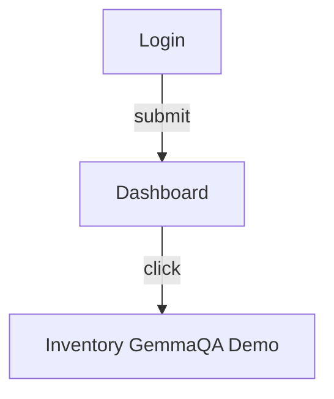

# GemmaQA Synchronized QA Report

**Run ID:** `sample-run-001`  
**Target:** `https://demo.gemmaqa.local/`  
**Generated:** 2026-08-31T12:14:33.284051  

## Executive Summary

Exploratory QA of **Demo** at `https://demo.gemmaqa.local/` visited 3 unique page(s), explored 3, executed 1 action(s), generated 2 scenario(s), and recorded 1 confirmed bug(s) and 1 suspected issue(s). Observed exploratory coverage 100.0% (not complete application coverage). Stop reason: action_budget_sample.

## Run Environment

- **Provider:** Mock
- **Model:** None
- **Browser adapter:** Direct Playwright
- **Adapter connection:** unknown
- **Screenshots:** supported
- **Console capture:** supported
- **Network capture:** supported
- **Adapter execution failures:** 0
- **Run mode:** Mock / deterministic
- **Validated decisions:** 0
- **Rejected decisions:** 0
- **Executed actions:** 1
- **Stop reason:** action_budget_sample

## Configuration and Capability Disclosure

- **Provider:** Mock
- **Model:** None
- **Provider capability mode:** exploration_only
- **Browser adapter:** Direct Playwright
- **Autonomous investigation:** disabled
- **Controlled writes:** disabled
- **Safe mode:** on
- **Destructive actions:** blocked
- **Actor switching:** unavailable (0 credential profile(s))
- **Visual perception:** disabled
- **Test-data generation:** disabled

> **Provider is Mock: exploration-only. Mock can navigate, inspect forms/tables, and generate/classify scenarios, but it CANNOT make the general semantic CRUD decisions needed to autonomously drive scenarios to completion for an arbitrary target application. Generated-scenario counts under this provider are not a claim of autonomous CRUD testing capability.**

## Product Overview

**Name:** Demo

Exploratory QA of https://demo.gemmaqa.local/

**Purpose:** A web application with user registration and/or login flows.

**Features observed:** Authentication, Dashboard, Inventory

## Inferred Business Domain

Authentication

## Application Purpose

A web application with user registration and/or login flows.

## Modules

- **Authentication**: Authentication area of the application (1 pages)
- **Dashboard**: Dashboard area of the application (1 pages)
- **Inventory**: Inventory area of the application (1 pages)

## Navigation Structure

## Page Inventory

| Title | URL | Type |
| --- | --- | --- |
| Login | https://demo.gemmaqa.local/login | authentication |
| Dashboard | https://demo.gemmaqa.local/dashboard | dashboard |
| Inventory / GemmaQA Demo | https://demo.gemmaqa.local/inventory | list |

## Forms Inventory

| Form ID | Page URL | Fields | Method |
| --- | --- | --- | --- |
| 56f308a0-f896-4ab0-88d2-d865f5a55887 | https://demo.gemmaqa.local/login | 2 | POST |
| 94b25886-2c2d-45c4-af8b-362421d583db | https://demo.gemmaqa.local/inventory | 1 | GET |

## Form Lifecycle

- Forms discovered: 2

**By lifecycle state:**
- discovered: 2

## Tables Inventory

| Table ID | Page URL | Headers | Rows |
| --- | --- | --- | --- |
| tbl-tickets | https://demo.gemmaqa.local/dashboard | ID, Subject, Status | 3 |

## Collection/Grid Coverage

_No record-collection (grid/table/card-list) surfaces detected this run._

## Role and Permission Observations

- **operator**: view dashboard, search inventory

## Workflow Catalog

**Login to dashboard**
- Start: `https://demo.gemmaqa.local/login`
  1. fill — Enter email
  2. fill — Enter password
  3. click — Submit login

## User Journeys

- https://demo.gemmaqa.local/login -- submit --> https://demo.gemmaqa.local/dashboard
- https://demo.gemmaqa.local/dashboard -- click --> https://demo.gemmaqa.local/inventory

## Business Rule Observations

- Form form-login marks required fields: Email, Password
- Authentication surface observed at https://demo.gemmaqa.local/login

## Knowledge Graph Summary

_No Knowledge Graph attached this run._

## Generated Goals

_No Goal Generation Engine attached this run._

## Scenario Planning Summary

_No Scenario Planning Engine attached this run._

## QA Strategy Summary

_No QA Strategy Engine attached this run._

## Autonomous Investigation Summary

_Autonomous Investigation is disabled this run._

## CRUD Workflow Coverage

- **Create:** discovered=0, executed=0
- **Read:** discovered=0, executed=0
- **Update:** discovered=0, executed=0
- **Delete:** discovered=0, executed=0
  _Read coverage reads record-collection discovery/inspection — see 'Collection/Grid Coverage'._

## Test Scenarios

- **Login with valid credentials** (smoke) — passed
- **Search inventory** (functional) — failed

## Test Execution Results

- failed: 1
- passed: 1

## Executed Assertions

_No autonomous-investigation assertions were evaluated this run._

## Blocked Scenarios

_No scenarios are currently blocked._

## Unexecuted Scenarios

_Every generated scenario reached a terminal executed outcome._

## Confirmed Bugs

**HTTP 500 on session endpoint**
- **Bug ID:** `BUG-001`
- **Module:** Authentication
- **Page / URL:** Login / `https://demo.gemmaqa.local/login`
- **Classification:** confirmed_bug
- **Severity / Priority:** critical / medium
- **Expected:** 200 OK
- **Actual:** 500 with Authorization: ***REDACTED***
- **Possible root cause (hypothesis only):** Unhandled exception in session service
- **Confidence:** 0.95
- **Steps:**
  1. Open login
  2. Submit credentials

## Suspected Bugs

**Console TypeError on login**
- **Bug ID:** `analysis-4754888`
- **Module:** Authentication
- **Page / URL:** n/a / `https://demo.gemmaqa.local/login`
- **Classification:** suspected_bug
- **Severity / Priority:** medium / medium
- **Expected:** No console errors
- **Actual:** TypeError: x is undefined
- **Possible root cause (hypothesis only):** Hypothesis only — not verified
- **Confidence:** 0.6

## UX and Quality Observations

- Inventory list has no breadcrumb trail

## Coverage Summary

- Pages discovered: 3
- Pages explored: 3
- Observed anonymous surface coverage: none (0 anonymous page(s))
- Authenticated exploration coverage: none (0 authenticated page(s))
- Known-application coverage confidence: exploratory / incomplete
- Overall discovery completeness: not complete application coverage
- Observed coverage (visited/discovered ratio): 100.0%
- Explored coverage: 100.0%
- Executed coverage: 100.0%
- Authentication status: unknown
- Authentication method: n/a
- Authentication blocker: none
- Forms discovered/inspected/tested: 2/0/0
- Tables discovered/inspected: 1/0
- Tests generated/executed (legacy Tester): 2/2 (passed=1, failed=1)
- Local-control coverage: 0/0 (0.0%)
- Collections/grids discovered/inspected: 0/0 (0.0%)
- Goals generated: 0
- Scenario Planning scenarios generated/executable/executed: 0/0/0 (passed=0, failed=0, blocked=0)
- CRUD create discovered/executed: 0/0
- CRUD read (collection) discovered/executed: 0/0
- CRUD update discovered/executed: 0/0
- CRUD delete discovered/executed: 0/0
- Verification coverage (assertions evaluated/supported): 0/0 (contradicted=0, inconclusive=0)
- Cleanup coverage (succeeded/pending/manual): 0/0/0 (0.0%)
- Bugs / suspected / observations: 1/1/1
- Actions executed: 1

_Coverage percentages reflect observed exploratory activity only and do not claim complete application coverage. Exploration coverage (pages visited/discovered) is NOT test coverage: see generated vs. executed scenario counts, CRUD-operation discovered/executed/verified counts, and assertion verification counts for what was actually tested and confirmed._

## Temporary Records

_No temporary test records were created this run._

## Cleanup Status

- Succeeded: 0
- Pending: 0
- Manual cleanup required: 0
- Cleanup coverage: 0.0%

## Regression Checklist

- [ ] Critical navigation paths remain reachable
- [ ] Primary forms render without console errors
- [ ] No new network 5xx on core pages
- [ ] Page titles remain present on explored pages
- [ ] Required fields reject empty submission

## Console Errors

- `TypeError: x is undefined`

## Network Errors

- `500 GET /api/session Authorization: ***REDACTED***`

## Evidence Index

| ID | Kind | Relative path | URL |
| --- | --- | --- | --- |
| ev-shot | screenshot | screenshots/login.png | /api/runs/sample-run-001/evidence/file/screenshots/login.png |

## Stop Reason

- **Why did the run stop?** action_budget_sample
- **Last meaningful operation:** click on el_020
- **What remained untested?** 0 scenario(s), 2 form(s), 0 CRUD operation(s)
- **What prevented execution?** n/a
- **Temporary records left behind:** 0

**Recommended configuration changes for the next run:**
- No configuration changes indicated — nothing left blocked this run.

## Known Limitations

- Exploration is budget-limited and does not claim complete coverage.
- Single authenticated role unless multiple credentials were provided.
- Destructive, payment, invite, and messaging actions remain blocked.
- Gemma wording assistance must not invent pages, bugs, or evidence.
- Provider: Mock | Browser adapter: Direct Playwright
- Run stop reason: action_budget_sample

## Recommended Next Testing Areas

- Explore unvisited application URL: https://demo.gemmaqa.local/settings
- Increase controlled-write tests on remaining forms (safe test data only).
- Triage suspected bugs with targeted reproduction.
